# AWS EC2 —回归基础

> 原文：<https://medium.com/geekculture/aws-back-to-basics-23645e0a6109?source=collection_archive---------14----------------------->

## 01.创建您的第一个 AWS EC2 实例

你好。欢迎来到**AWS——基础知识回顾**系列，在这里，我将向您解释和指导任何人都应该知道的关于 AWS 资源及其特性的基础知识。在今天的文章中，我们将讨论 AWS 上最常用的资源之一，Amazon EC2。

如果你是亚马逊网络服务(AWS)的新手，你可能会有很多问题。在本教程中，您将对 AWS 和 EC2 服务有所了解，了解如何创建 EC2 实例，如何连接到实例，以及如何在创建后编辑服务器。任何从未使用过 AWS 的人都应该阅读这篇文章，我相信这是值得的。


Photo by [An Tran](https://unsplash.com/@vinhan?utm_source=unsplash&utm_medium=referral&utm_content=creditCopyText) on [Unsplash](https://unsplash.com/s/photos/cloud?utm_source=unsplash&utm_medium=referral&utm_content=creditCopyText)

# 什么是 AWS？

Amazon Web Services 成立于 2006 年，为政府机构、企业、教育机构和个人提供按需付费的云计算服务。它拥有公共云市场 41.5%的份额，超过了微软、谷歌、Rackspace 和 IBM 的总和。AWS 部署的云资源数量是接下来的 14 个竞争对手总和的 5 倍。亚马逊网络服务拥有超过 100 万活跃用户。AWS 最常用的服务有 AWS EC2、AWS S3、AWS Route53、AWS Lambda、AWS RDS 等。


AWS logo by [logos-download](https://logos-download.com/)

# 什么是 AWS EC2？

EC2 实例是亚马逊弹性计算云(EC2)中的虚拟服务器，用于在亚马逊 Web 服务(AWS)基础设施上运行应用程序。EC2 服务将托管几乎无限数量的虚拟机。AWS EC2 服务提供了许多优势。

*   它们高度可伸缩，允许用户根据需要选择具有更多 RAM 和 CPU 的实例。
*   启动和停止它们很容易。
*   它们允许您从各种平台(操作系统)中进行选择
*   它们易于管理

没有进一步的讨论，让我们看看如何在实践中使用 AWS EC2 实例。

# 启动您的第一个 EC2 实例

为此，您需要访问 AWS 免费层帐户。我将指导您如何创建一个免费的 AWS 帐户，并启动您的第一个 EC2 实例。

## 创建免费 AWS 帐户

要创建一个新的 AWS 帐户，请通过此链接打开 AWS 主页—【https://aws.amazon.com/】T2。点击**创建一个 AWS 账户**按钮。

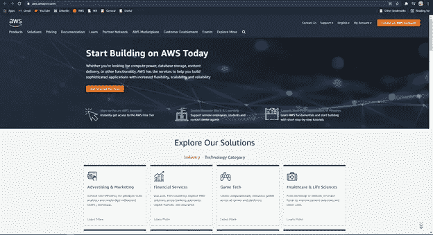

您将被导航到注册 AWS 页面。在接下来的步骤中提供注册详细信息。检查您是否有以下信息:

*   **确认邮件将发送到的电子邮件地址**。
*   **不收费的信用卡**，因为设置总是免费的(一年)。
*   **自动系统将拨打电话号码**来识别客户。

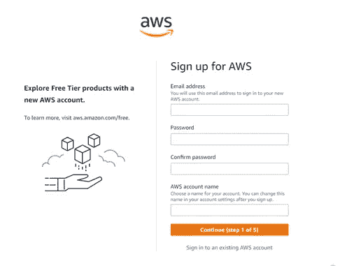

如果您正确提供了所有信息，您现在将拥有一个 AWS 帐户。有许多方法可以访问 AWS 服务。

1.  管理控制台
2.  软件开发工具包(Software Development Kit)
3.  AWS 命令行界面
4.  REST APIs

您将导航到的页面称为“AWS 管理控制台”。在本教程中，我将使用控制台来访问 AWS 资源。您将看到如下屏幕。

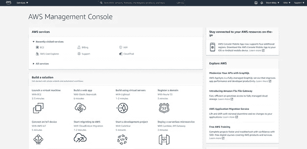

正如你所看到的，这个页面包含了最近访问的 AWS 服务，几个 AWS 服务的简单和自动化的工作流程，简单的教程等等。AWS 在世界各地有许多数据中心。您可以选择在哪里创建您喜欢的资源。这些被称为 AWS 区域。最好选择一个离你所在地近的地区，以防止任何连接延迟。

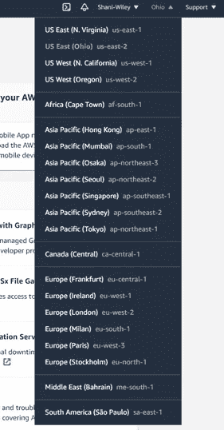

现在您已经了解了管理控制台，让我们转到 AWS EC2 部分来创建一个实例。

## 创建实例

在搜索栏中搜索“ **ec2** ，点击 **EC2。**

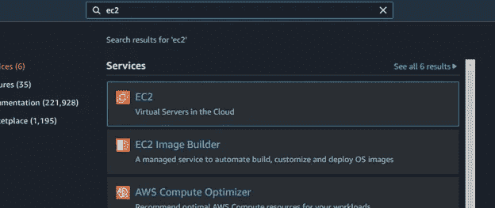

您将被引导至 EC2 控制台。它包含许多不同的信息，例如正在使用的 EC2 资源、启动实例选项、所选区域中可用性区域的服务健康状况、预定事件等。


要创建一个新的 EC2 实例，点击“**启动实例**按钮。

步骤 01 将选择一个 AMI。AMI 是包含启动实例所需的软件配置(操作系统、应用服务器和应用程序)的模板。简单地说，这就是你选择操作系统的地方。既然你是 AWS 新手，我推荐你从 Amazon Linux 开始，它使用 **yum** 来管理包。

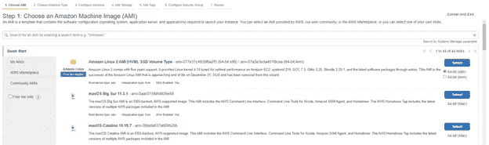

步骤 02-选择实例类型。AWS 为不同的目的和用例引入了许多不同的实例类型。选择 **t2.micro** ，在第一年，你将获得这个实例每月 750 小时的免费使用。

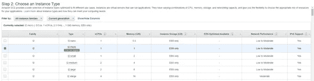

下一步是配置实例细节。在此页面上，您将能够选择网络、网络中的首选子网、分配即使重启服务器也不会改变的 IP、添加文件系统、添加用户数据(服务器启动时将安装的脚本)等。因为这是您第一次使用，所以保留默认值。

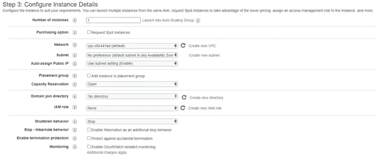

步骤 04 是向实例添加存储。一个 t2.micro 实例有 8 GiB 存储空间。在此阶段，您还可以选择向实例添加新卷。在这一步中，您可以配置“终止时删除”按钮，该按钮将在您终止实例后将其从 AWS 中删除。

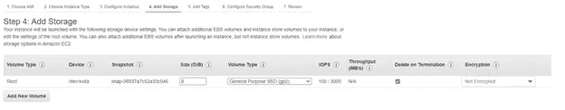

在下一步中，您可以将作为密钥对值的标记添加到实例中。这些是为实例提供的，以便于识别它们。

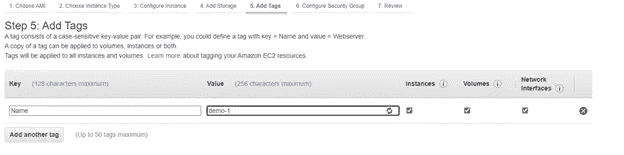

步骤 06 是为您的实例附加一个安全组。安全组是一组控制实例流量的防火墙规则。因为我们需要使用 SSH 协议连接到这个实例，所以我们可以添加一个端口 22 规则。如果您想要访问网页或互联网，您需要将 HTTP 和 HTTPS 添加到您的安全组中。

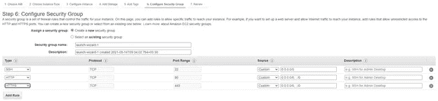

最后一步是检查并启动您的服务器。单击“ **Launch** 按钮后，系统会提示您为 ec2 实例创建一个密钥对。请确保将该密钥对保存在安全的地方。稍后通过 SSH 连接到服务器时需要这个密钥。

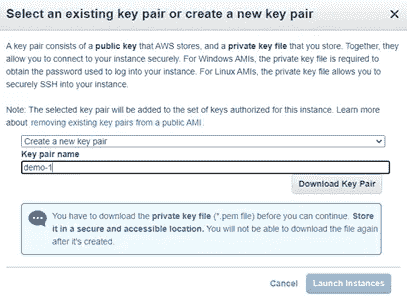

启动实例后，您将能够在 EC2 管理控制台页面上看到该实例。

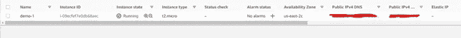

正如您所看到的，您现在已经成功地创建了您的第一个 EC2 实例。请注意，您的实例将附加有，

*   公共 DNS 名称
*   公共 IP 地址
*   专用 DNS 名称
*   私有 IP 地址

## 如何连接到实例

可以使用几种方法连接到实例。选择服务器后，点击**连接**按钮查看可用选项。有四个选项可用。

1.  EC2 实例连接—使用 AWS EC2 连接选项连接到实例
2.  会话管理器—不使用 SSH 密钥连接到实例
3.  EC2 串行控制台—使用串行端口连接到实例
4.  SSH 客户端—使用 SSH 协议连接到实例

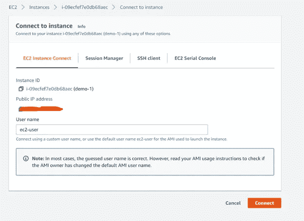

在本教程中，我将演示第四个选项。导航到“ **SSH 客户端**”选项卡，并按照说明进行操作。前进到上一节中保存密钥对的位置。我用 Ubuntu 作为我的操作系统。如果您是 Windows 用户，请使用 Putty SSH 管理器连接到该实例。

为了确保您的密钥不被公开，请执行以下命令。

```
chmod 400 “your-keypair-name.pem”
```

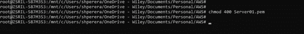

现在您可以使用这些命令 SSH 到您的实例中。

```
ssh -i “Server01.pem” ec2-user@<public-ip-address>ssh -i “Server01.pem” ec2-user@<public-DNS-name>
```

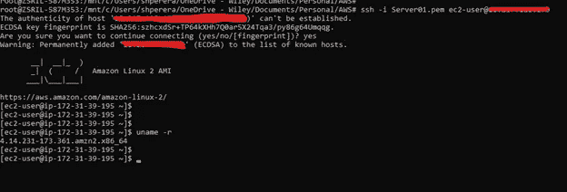

上面的过程应该不到五分钟，这就是你设置虚拟服务器并连接到它的速度。

## 编辑您的实例

启动后，您可以编辑实例的几个特征。

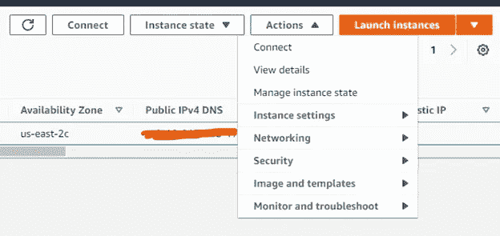

从“**管理实例状态**按钮，您可以控制实例的状态。当实例运行时，您可以停止、重新启动或终止实例。Stop 和 Terminate 的区别在于 Stop 相当于关闭 PC。您可以再次启动服务器。但是，除非您将弹性 IP 附加到您的服务器，否则服务器每次重新启动时都会被分配一个新的 IP。终止实例意味着从 AWS 端删除实例。一旦终止实例，您将无法检索它。

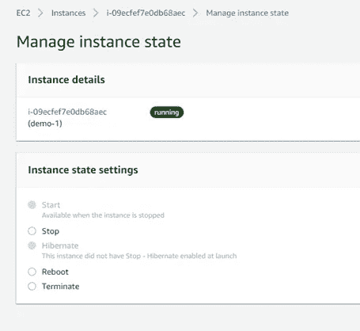

您还可以编辑您在启动阶段提供的实例类型。如果您决定需要更多的 CPU 和 RAM，您可以更改实例的类型。要更改类型，您需要首先停止实例，然后分配新类型并再次启动实例。

检查可用的实例类型—[https://aws.amazon.com/ec2/instance-types/](https://aws.amazon.com/ec2/instance-types/)

停止实例并转到**操作- >实例设置- >更改实例类型。**

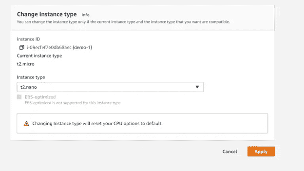

选择所需的实例类型，应用并再次启动服务器。

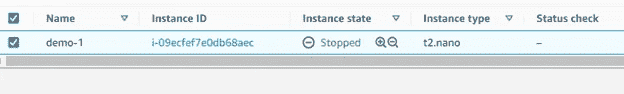

从“**映像和模板**”部分，您可以创建服务器的映像、创建模板，并像现有服务器一样启动。图像就像实例的快照。如果您想创建更多像您现有的服务器配置，您可以创建一个映像并在以后使用它们。

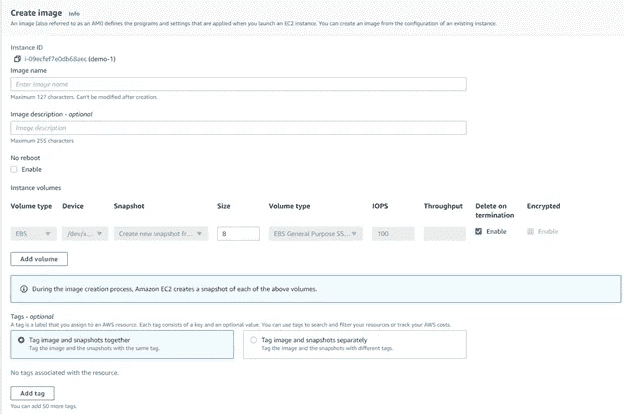

可用图像可以在“**阿米**下的**图像**选项卡中找到。

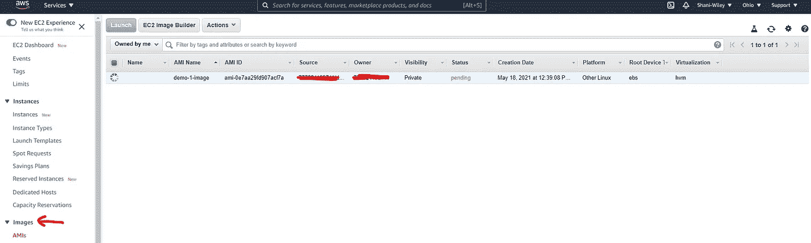

希望你对亚马逊 EC2 及其工作原理有一个基本的了解。这只是对 EC2 服务器的基本概述。有许多可用的功能。我将在接下来的“ **AWS —** **回到基础知识**”文章中更深入地讨论它们。我错过了什么？请在评论中告诉我，我会添加进去的。保持联系，获取更多精彩内容！