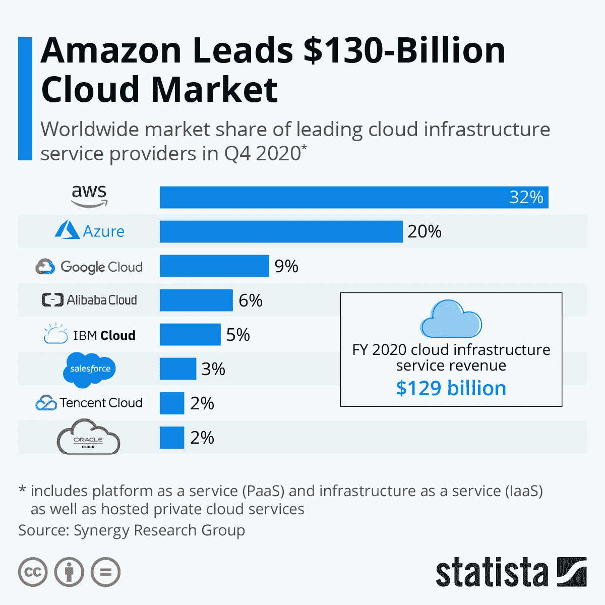
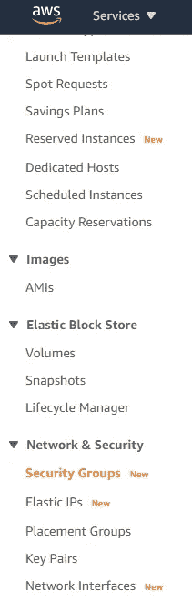
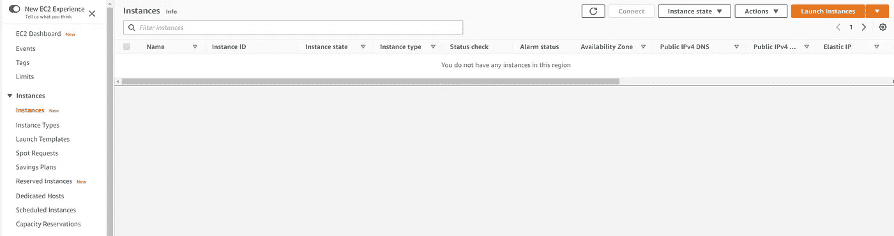

# AWS 云计算:EC2 指南

> 原文：<https://medium.com/geekculture/aws-cloud-computing-ec2-guide-62b6e8b795f1?source=collection_archive---------19----------------------->


## 什么是云计算？

云计算是在由他人维护的服务器上进行的计算。它基本上是按需提供从应用程序到存储和处理能力的计算服务。在技术领域，有时我们需要计算能力或存储来让我们的数据或代码存在和运行。因此，与其拥有一台昂贵的计算机或存储设备，我们可以在互联网上使用云计算作为租金来执行我们的计算机无法处理的任务。

**云计算的优势**

*   功能强大的计算机价格昂贵
*   容易接近
*   拥有和维护服务器并不复杂

**云计算服务**

有很多公司提供大规模的云计算服务。主要有亚马逊网络服务(AWS)、谷歌云平台、微软 Azure 云计算。目前，AWS 拥有云计算的大部分市场，因为它是云基础设施市场的早期领导者之一，许多大公司的数据已经在 AWS 服务器上运行。



因此，在这篇博客中，我将从创建服务器和在其上运行程序开始，一步一步地讲述如何从 AWS 运行 EC2 服务器。

# EC2

Amazon EC2 服务器基本上是一个虚拟计算环境，也称为实例。因此，通过使用 EC2，您可以使用更强大的计算机，根据您的需求访问各种配置的 CPU、内存、存储和网络容量，从而更快地开发和部署应用程序。我将指导您完成从创建安全性、运行服务器到在虚拟计算环境中执行程序的所有步骤。在此之前，使用这个[链接](https://aws.amazon.com/console/)创建一个帐户。然后单击服务部分的 EC2。

**第一步:安全**

在运行任何东西之前，我们需要一个安全密钥来运行任何东西。在网站的左侧选项卡中，您将按下网络和安全中的安全组。之后，创建一个安全组，然后为它添加一个名称和描述，在入站规则中，您需要在 type info 中单击 SSH，然后 source 是 anywhere。然后单击创建安全组。



之后，在网络与安全中，单击密钥对并创建一个密钥对。您可以将其命名为任何名称，但要确保文件格式是. pem。pem 文件放在您以后可以访问的位置。

## **第二步:启动服务器**



首先，单击 Instances 选项卡中的实例并启动一个实例。然后你可以有一堆你可以使用的服务器。对于这个博客，我们将选择最新的 64 位(x86)的免费 Ubuntu 服务器。选择空闲的第一层，然后单击下一步，直到配置安全组。在配置安全组中，选择现有的安全组，并选择您在步骤 1 中创建的安全组，然后在接下来的几个步骤中启动它。现在您有了一个运行在 AWS 中的服务器。在实例中，单击实例 id 并复制公共 IPv4 地址。我们稍后将需要它来连接到服务器。

**第三步:连接服务器**

打开 git bash 并为 mac 键入`chmod 700 ‘path to the pem file’`或`sudo chmod 700 ‘path to the pem file’`。那么你需要使用

```
ssh -i 'path to the pem file' ubuntu@"Public IPv4 address"
```

**步骤 4:在您的服务器上安装 Anaconda**

```
wget [http://repo.continuum.io/archive/Anaconda3-4.1.1-Linux-x86_64.sh](http://repo.continuum.io/archive/Anaconda3-4.1.1-Linux-x86_64.sh)
```

这将在您的服务器上下载 anaconda。要安装 Anaconda，可以使用

```
bash Anaconda3–4.1.1-Linux-x86_64.sh
```

之后，点击回车，按 q 退出许可，并键入 yes，并按回车，这将需要一段时间来安装，键入 yes，它就完成了安装 anaconda。然后你需要使用`source ~/.bashrc`来激活你的 bash 配置文件。你可以通过使用`which python3`和`which conda`来检查你的 python 和 conda。

**第五步:安全复制协议(SCP)**

SCP 基本上意味着它在本地主机和远程主机之间安全地传输计算机文件。打开一个新的 git bash，然后进入程序所在的路径并使用

```
scp -i “path to pem file” practice.py ubuntu@”Public IPv4 address”:~
```

尝试使用 ls 来查看 practice.py 或您拥有的文件。

**第六步:执行你的代码**

你可以像普通命令行一样运行你的模型，这基本上就是云计算。如果您的文件有错误，您可以根据需要使用 nano model.py 来修复它。

**第七步:将结果拉回你的电脑**

在本地命令行中，您可以键入

```
scp -i ‘path to pem file’ ubunut@”address from the aws”:”path to file from the server” .## include the . as well,it means from the current directory in the server
```

在那之后，它应该在你的计算机上。如果您想再次使用该服务器，那么您可以停止该实例或者终止它。通过单击“实例”选项卡中的实例来终止实例，然后在“实例”中，声明终止实例并删除键。在终端，它应该说连接丢失或关闭。

[](https://www.linkedin.com/in/tenzin-wangdu/) [## 丹津·王度-大会数据科学研究员| LinkedIn

### 我是一名数据科学家，拥有应用数学学士学位，专业是计算机科学。我擅长数据…

www.linkedin.com](https://www.linkedin.com/in/tenzin-wangdu/)