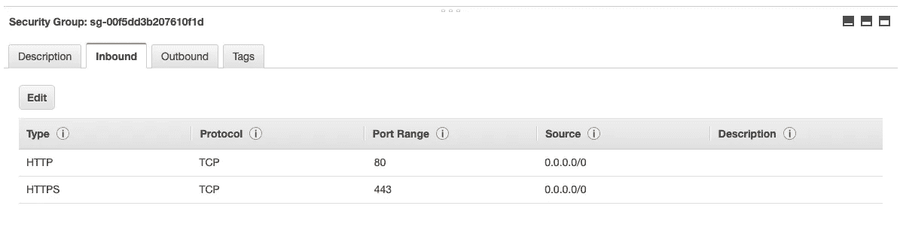
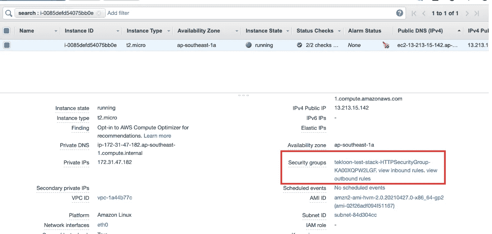

# AWS CloudFormation 101-如何使用！参考组装每个 AWS 资源之间的关系(第 2 部分)

> 原文：<https://medium.com/geekculture/aws-cloudformation-101-how-to-use-ref-to-assemble-relationship-between-each-aws-resource-part2-9142a9d626e3?source=collection_archive---------24----------------------->

Photo by [Jerry Zhang](https://unsplash.com/@z734923105?utm_source=medium&utm_medium=referral) on [Unsplash](https://unsplash.com?utm_source=medium&utm_medium=referral)

# 介绍

在之前的[帖子](/geekculture/aws-cloudformation-101-what-is-cloudformation-and-do-i-need-to-know-about-it-part-1-b56e3d7a4294)中，我分享了什么是云的形成，以及我们是否应该了解它。如果你来自前一篇文章，我很高兴你“找到你的原因”来学习 AWS CloudFormation。

然而，如果你仍然不知道你是否需要学习它，看看这个帖子并“找到你的原因”。

此外，我还分享了云形成的模板结构以及如何使用云形成模板启动 EC2 实例。所以在这篇文章中，我将采取另一个最小的步骤——在现有的 EC2 实例中添加一个安全组。

事不宜迟，我们开始吧。

# 教程—向 EC2 实例添加安全组

在上一篇文章中，我们使用云形成模板创建了一个 EC2 实例。模板代码请参考下面的要点。

在本教程中，我们将向 **TestInstance (EC2 实例)添加一个安全组。**以下是本教程的**要求**。

*   允许端口 80 的安全组
*   允许端口 443 的安全组
*   将上述安全组分配给 **EC2 实例**

## AWS 安全组的云形成模板

下面是我们将用于安全组的结构。以下是对配置中每个字段的解释。

*   **组描述** : —必填字段，用于描述该安全组正在做什么。(简单但**重要**
*   **security grouping press**:—我们在其中定义所有传入网络流量规则的部分。默认情况下，如果没有为 EC2 实例定义任何内容，EC2 实例将无法接收任何传入流量。
*   **CidrIp** : —传入 Ip 地址—例如，您可以设置接受来自 IP**220.16.116.228**的流量
*   **从端口** : —进入端口
*   **IpProtocol** : —什么互联网协议，常见的有`TCP`和`UDP`
*   **ToPort** : —到 EC2 实例的哪个端口

## 利用！参考分配安全组功能简写

此时，您可能已经编写了创建安全组资源的部分。接下来，我们需要将安全组分配给 EC2 实例。

您可以使用 yaml 中的简写语法`!Ref`将安全组分配给 EC2 实例。下面是一个如何使用`!Ref.`的例子

> *！ref logicalidforteresource*

我们将获取我们在模板中命名的资源的 LogicalID。所以在这个场景中，会是`!Ref HTTPSecurityGroup`。

# 动手时间👨‍💻👩‍💻

这是我们应该动手实践和加强学习的时候了。

您可以在这里找到现有的 CloudFormation 代码[，添加安全组资源并继续本教程。](https://www.notion.so/c00d27a8d7318d4608a78a037a8ee475)

如果你卡住了，你可以参考最后的答案[这里](https://www.notion.so/b88b5a65dcaaa57e4303c082fc4c3f35)。

# 预期产出

这是预期的输出。根据下面的截图，我们创建了一个安全组，它允许**端口 80 (HTTP)** 和**端口 443 (HTTPS)** 。

最后但同样重要的是，您还必须确保分配给 EC2 实例的安全组。您可以从您的 EC2 实例仪表板中找到它。参考下面的截图。

# 结论

在这篇文章中，我分享了如何通过 CloudFormation 提供安全组，最重要的是如何使用`!Ref`来组装资源之间的关系，例如

*   ！在 EC2 实例中引用安全组。

这就是本文的全部内容

## 支持我

你现在可以给我买一杯咖啡来支持我，这样我就可以在没有付费墙的情况下保留这篇文章。感谢您的支持！