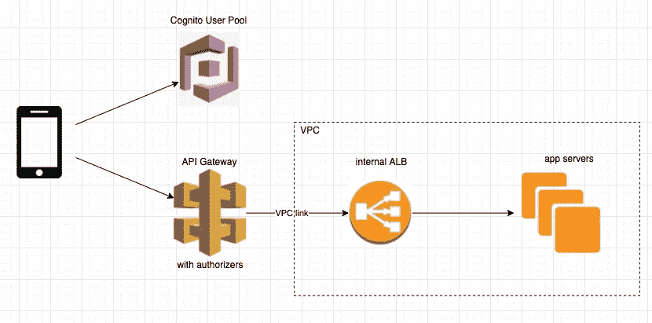
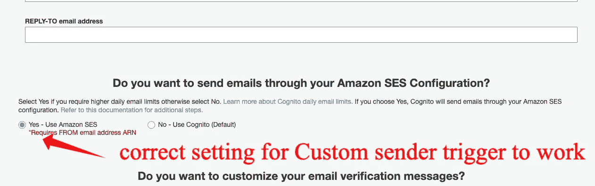

# AWS 认知用户池之旅

> 原文：<https://medium.com/geekculture/aws-cognito-user-pool-journey-61ffb5f2750c?source=collection_archive---------21----------------------->


Cognito

一个 lmighty AWS 为我们提供了一个庞大的云服务生态系统。Cognito 是 AWS 针对 web 服务的认证和授权问题的解决方案。以下是我在体验了 Cognito 用户池后的一些想法。

# 用户池与身份池

AWS Cognito 有两种风格:用户池和身份池。起初，它们有些相似和令人困惑，但它们实际上是两种不同的服务。

用户池靠近用户表。假设您需要一个登录/注册功能，而不是在您的 rails/laravel/whatever 应用程序中实现一个身份验证系统，您可以使用 Cognito 用户池作为一个集中式身份验证系统，并让用户根据它进行身份验证。

身份池主要用于控制对 AWS 服务的访问。假设一个用户需要访问一个私人 S3 桶，他可以通过一个应用服务器认证并通过该服务器访问 S3，或者他可以向 Cognito identity pool 请求一个访客身份并直接访问 S3。

在我的例子中，我需要一个认证系统，所以我选择了用户池。

# 建筑

经过一些研究，我是这样将 Cognito 用户池投入使用的:



the architecture

移动应用程序使用用户池进行身份验证，以获得一个 id 令牌，然后将该令牌附加到每个传出请求的头部。API gateway 检查请求头中的 id 令牌，如果令牌过期或无效，则返回 401。授权的请求将被发送到应用服务器，在这里再次检查 id 令牌以确保它没有被篡改。

这是一个标准的设置，对我们来说很好，尽管我们在这个过程中遇到了一些小问题。

# 打嗝

## 更新-用户-池

为了更新用户池配置，我们使用了`update-user-pool` api。然而，我们发现每次我们更新一个设置时，其他设置都会回滚到默认设置。这很令人困惑，直到我们在文档中发现了这个:

```
update-user-pool
Updates the specified user pool with the specified attributes. You can get a list of the current user pool settings using DescribeUserPool . If you don't provide a value for an attribute, it will be set to the default value.
```

就是这样。更新一个设置还需要指定其他设置。干得好 AWS。

## 使用 Sendgrid 发送确认邮件

Cognito 与 SES 集成，用于发送电子邮件。这太神奇了，直到我们意识到我们想使用 Sendgrid 而不是 SES 发送确认电子邮件。

一开始我们以为`Custom message lambda trigger`就可以了，顾名思义。遗憾的是，这个触发器是用于定制消息内容，而不是电子邮件发送者。

经过更多的研究，我们发现`Custom sender lambda trigger`正是我们想要的。这个 lambda 触发器在控制台中是不可见的，所以我们设法使用 CLI 来设置它。我们非常高兴。

唯一的问题是，我们不能让它工作！出于某种原因，lambda 没有得到应有的触发。经过广泛的研究，原因变成了这个家伙:



cannot trust the console

为了让`Custom sender`工作，上面的设置必须设置在`Yes — Use Amazon SES`，这没有任何意义，因为我们根本就没想用 SES。

在我们调换了选项后，它非常有效。有时你不能信任 AWS 控制台。

## SDK 和超额问题

我们需要在移动设备上实现该解决方案。iOS 和 Android 的移动 SDK 已经在我们的掌控之中，但是它的文档却没有。可用的似乎是 AWS Amplify，这是一个完全成熟的移动框架，使用 Cognito 进行身份验证。我们不想放大，我们想认知！

文档的缺乏不能阻止我们实施我们心爱的 Cognito。我们还是实现了，应用程序通过了测试并发布了，耶！

然而，我们一发布，麻烦就来了。一个错误实现的方法产生了如此多的`initiate-auth`请求，超过了 Cognito 的用户认证配额，导致 Cognito 抑制所有认证请求，包括真正的刷新令牌请求。令牌无法刷新，这意味着没有人可以使用该应用程序。应用程序宕机了 2 天，数据受到影响，我们花了几天的时间进行持续调查以解决问题。我们当初的决心事与愿违！

回过头来看，如果我们更加小心，我们可以在实现 SDK 方面做得更好，如果我们更加关注配额警报，我们可以做得更好。然而，我们确实认为，一个更好的文件毕竟可以把我们从所有这些麻烦中拯救出来。

# 结论

Cognito 是一项相对较新的服务，并且正在发展成为更好的服务，值得一试。小心对待它，就像对待 AWS 未来的任何其他新东西一样。