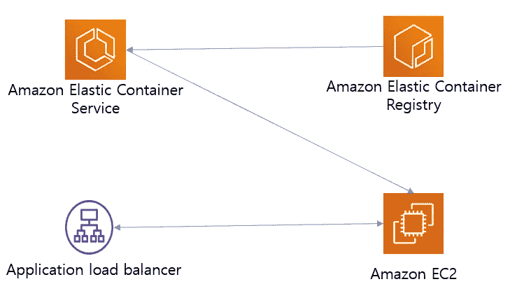

# AWS 容器服务

> 原文：<https://medium.com/geekculture/aws-container-services-part-1-b147e974c745?source=collection_archive---------0----------------------->

## 创建一个简单的 flask Rest API，使用 docker 对其进行容器化，并将其作为服务部署在弹性容器服务中

Architecutre

AWS 提供容器服务来部署和运行容器应用程序。服务之一是弹性容器服务，即 ECS。在本文中，我们将看到如何创建一个样本 flask RestAPI，用 docker 封装它并…