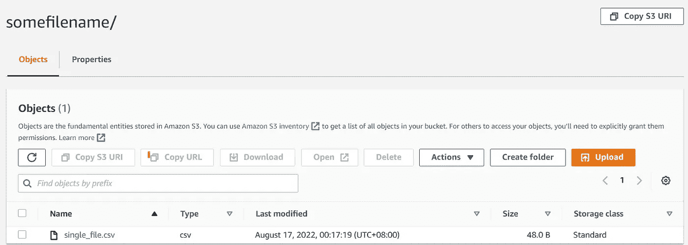

# 将 csv 零件文件写入单个 csv 文件的简单粘合作业

> 原文：<https://medium.com/geekculture/aws-glue-simple-job-to-write-part-csv-files-to-a-single-file-d805eddbe641?source=collection_archive---------1----------------------->

**问题**

有几个在 s3 位置生成的 CSV 零件文件，需要创建为具有相同命名约定的单个 CSV 文件。

**解决方案**

```
import sys
from awsglue.utils import getResolvedOptions
from pyspark.context import SparkContext
from awsglue.context import GlueContext
from awsglue.job import Job
from awsglue.transforms import *args = getResolvedOptions(sys.argv, ["JOB_NAME"])
sc = SparkContext()
glueContext = GlueContext(sc)
spark = glueContext.spark_session
job = Job(glueContext)# Read CSV Part Files
S3bucket_node1 = glueContext.create_dynamic_frame.from_options(
    format_options={
        "quoteChar": '"',
        "withHeader": True,
        "separator": ",",
        "multiline": False,
    },
    connection_type="s3",
    format="csv",
    connection_options={
        "paths": ["s3://bkt-part-files/val/20220708/"],
    },
    transformation_ctx="S3bucket_node1",
)# Repartition to collate the files as a single data frameS3bucket_node2 = S3bucket_node1.toDF().repartition(1)#Be careful of the path location , the folder 'somefilename' gets overwrittenS3bucket_node2.write.mode('overwrite').csv('s3://bkt-part-files/output/somefilename',header = 'true')#The above line of code writes a single part fileimport boto3
client = boto3.client('s3')BUCKET_NAME= 'bkt-part-files'
PREFIX ='output/somefilename/'
response = client.list_objects(
    Bucket=BUCKET_NAME, Prefix=PREFIX,)#Helps to fetch the file name of the file created in this glue job
name = response['Contents'][0]['Key']client.copy_object(Bucket=BUCKET_NAME, #The csv file generated can be renamed with a name as desired !CopySource=BUCKET_NAME+'/'+name, Key=PREFIX+'single_file.csv')
client.delete_object(Bucket=BUCKET_NAME ,Key=name)job.commit()
```

