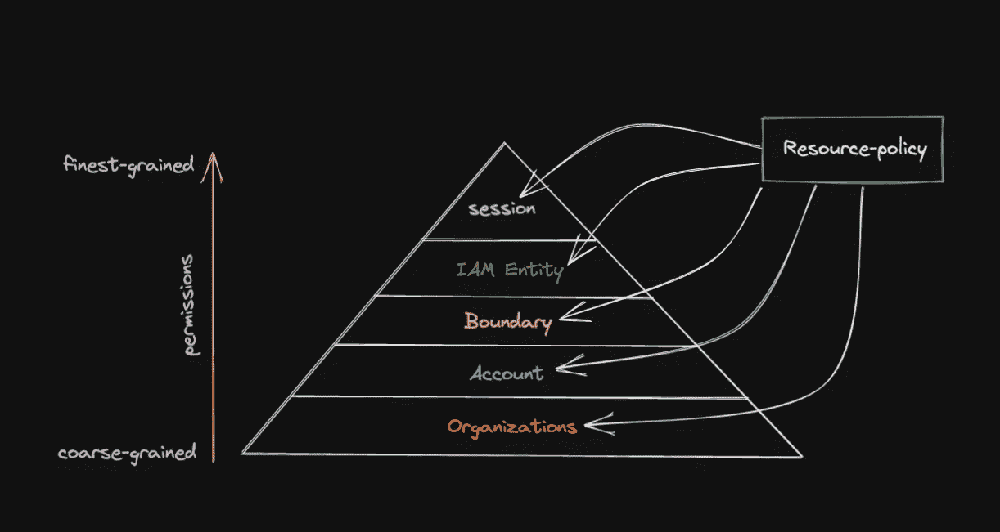

# AWS IAM 策略评估顺序

> 原文：<https://medium.com/geekculture/aws-iam-policy-evaluation-order-eb0ab4a41934?source=collection_archive---------10----------------------->

## 将权限范围从组织级别缩小到会话级别

你好，世界！如果您已经设置了 AWS 允许的一个或多个策略，您可能会对理解不同 AWS 策略类型的评估顺序感兴趣。在我的[上一篇博文](/geekculture/aws-iam-policy-types-c26d8d45eb95)中，我谈到了在 AWS 中可以利用的不同类型的访问策略…