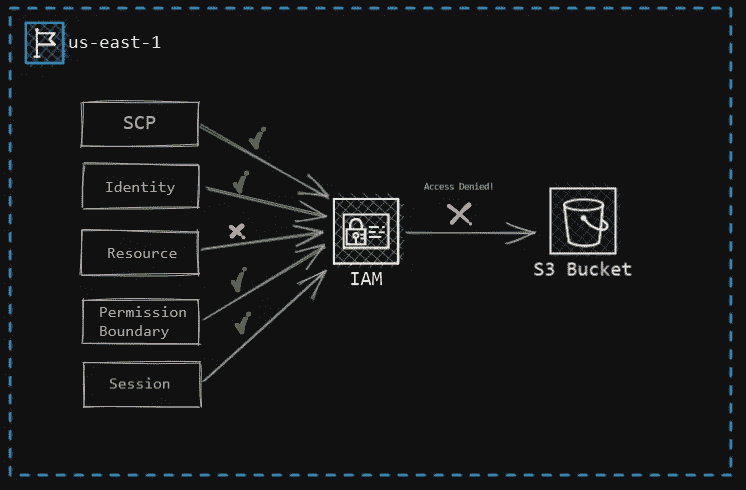

# AWS IAM 策略类型

> 原文：<https://medium.com/geekculture/aws-iam-policy-types-c26d8d45eb95?source=collection_archive---------7----------------------->

## 针对更细粒度权限的灵活访问控制

你好，世界！AWS IAM 是 AWS 最重要的服务；所有 AWS 服务都依赖于 AWS IAM。AWS IAM 支持具有特定用例的各种类型的访问策略，从管理大量 AWS 帐户的访问到管理单个资源的访问， **AWS IAM 提供了多种方式来获得访问控制权**。那又怎样…