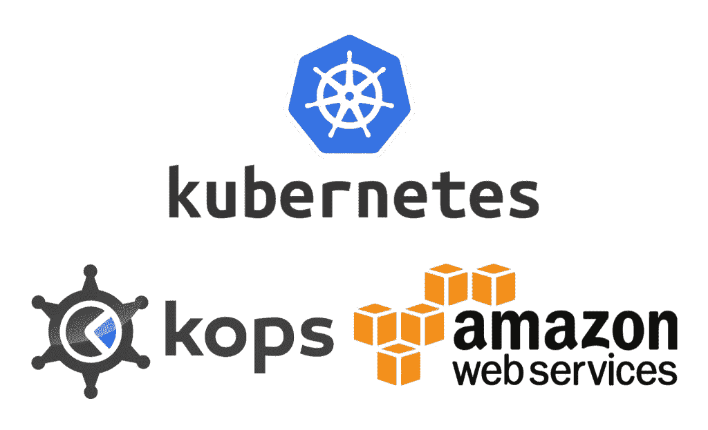

# Kops Kuberenetes 集群的亚马逊 KMS

> 原文：<https://medium.com/geekculture/aws-kms-for-a-kops-kuberenetes-cluster-4f5716cccf7d?source=collection_archive---------22----------------------->



使用亚马逊 EKS 时，您可以配置一个 AWS KMS 密钥来加密 etcd。对于使用 [kops](https://github.com/kubernetes/kops) 创建的集群，如何做到这一点？我花了几个小时才明白整个流程。所以，开始了。

## Kops 是什么？

kops 帮助您创建、更新和维护生产质量、高可用性的 Kubernetes 集群，同时负责提供必要的云基础设施。它目前正式支持亚马逊 AWS(其余的云提供商处于 alpha & beta 模式)

## 先决条件

*   在 Amazon AWS 上使用 Kops 创建的有效 Kubernetes 集群
*   用于创建集群的 AWS CLI Amazon AWS 用户应被授予管理 Amazon KMS 密钥的权限。我给了我的 kops 亚马逊 AWS 用户*AWSKeyManagementServicePowerUser*权限。(我确信给予如此高的权限是不安全的，但是我没有耐心也不需要为我的开发集群进一步探索。如果您找到了所需的确切权限，请留下您的评论。)

## 步骤 1:创建亚马逊 KMS 主密钥

这是亚马逊 KMS 提供商(我们很快就会知道什么是提供商)用来管理加密数据的密钥。

您可以通过 Amazon AWS Web 控制台创建此密钥，或者如果您的 AWS CLI 用户有足够的权限，您也可以通过 AWS CLI 创建它。

```
KEY_ID=$(aws kms create-key --query KeyMetadata.KeyId --output text)
aws kms describe-key --key-id $KEY_ID
```

您将得到一个长的 JSON 输出，如下所示。请注意 ARN 值，我们将需要它。

```
{
    "KeyMetadata": {
        "Origin": "AWS_KMS",
        "KeyId": "1234abcd-12ab-34cd-56ef-1234567890ab",
        "Description": "",
        "KeyManager": "CUSTOMER",
        "Enabled": true,
        "KeyUsage": "ENCRYPT_DECRYPT",
        "KeyState": "Enabled",
        "CreationDate": 1403010355.345,
        "Arn": "arn:aws:kms:ap-south-1:111122223333:key/1234abcd-12ab-34cd-56ef-1234567890ab",
        "AWSAccountId": "111122223333"
    }
}
```

## 步骤 2:创建 KMS 提供者 Docker 映像

provider 是 K8s 在需要加密或解密数据时调用的程序/脚本。您需要为亚马逊 KMS 创建这样一个提供者，以便 K8s 集群可以调用这个提供者来使用亚马逊 KMS 加密/解密数据。

这里有一个现成的亚马逊 KMS 提供商计划:【https://github.com/kubernetes-sigs/aws-encryption-provider 

克隆项目，构建 docker 映像，我们将使用该映像来创建运行亚马逊 KMS 提供商程序的容器。

```
git clone [https://github.com/kubernetes-sigs/aws-encryption-provider](https://github.com/kubernetes-sigs/aws-encryption-provider)
cd aws-encryption-provider/
docker build -t <the name for your Docker Image> ./
[DONT FORGET TO PUSH YOUR DOCKER IMAGE TO A REPO LIKE DOCKER HUB]
```

## 步骤 3:向所有主节点添加标签

在容器内运行的 KMS 提供程序使用标签来标识主节点。我们需要将这个标签添加到所有主节点。为此，我们将编辑主节点实例组。

```
# List all the instance groups
kops get ig --name <CLUSTER NAME> --state <STATE S3 BUCKET># Edit the master instance group
kops edit ig <MASTER IG NAME> --name <CLUSTER NAME> --state <STATE S3 BUCKET>kind: InstanceGroup
spec:
  nodeLabels:
    *dedicated: master* # this is the label
  role: Master
```

## 步骤 4:在主节点上创建亚马逊 KMS 提供者容器

我们现在需要在主节点上运行这个提供者容器，因为 API 服务器就在那里。我们将在所有主节点上将该容器创建为静态 Pod。为什么[静吊舱](https://kubernetes.io/docs/tasks/configure-pod-container/static-pod/)？因为这个容器需要独立于 API 服务器。静态 pod 由 kubelet 直接管理。

在主节点上，静态 pod 的清单文件位于*/etc/kubernetes/manifests*中。所以我们需要在这个路径中创建我们的亚马逊 KMS 提供商的静态 pod 清单文件。

我们如何在 kops 托管集群中创建静态 pods？使用[集群规范](https://github.com/kubernetes/kops/blob/master/docs/cluster_spec.md)中的*文件资产*键。 *fileAssets* 允许您在集群中的节点上创建文件(使用内联文件内容)。您可以使用*角色*来决定您想要在哪种类型的节点上创建这个文件。这确保了即使您有多个主节点，也会在所有主节点上创建提供者静态 pod 清单文件。

```
# Edit the cluster object spec
kops edit cluster --name <CLUSTER NAME> --state <STATE S3 BUCKET>kind: Cluster
spec:
  fileAssets:
  - name: aws-encryption-provider.yaml # name of the file we want to create
    path: /etc/kubernetes/manifests/aws-encryption-provider.yaml
    roles:
    - Master # want to create this on Master nodes
    content: | # contents of the file
      apiVersion: v1
      kind: Pod
      metadata:
        annotations:
          scheduler.alpha.kubernetes.io/critical-pod: ""
        labels:
          k8s-app: aws-encryption-provider
        name: aws-encryption-provider
        namespace: kube-system
      spec:
        containers:
        - image: <THE AWS PROVIDER DOCKER IMAGE YOU BUILT>
          name: aws-encryption-provider
          command:
          - /aws-encryption-provider
          - --key=<ARN OF THE KEY YOU CREATED>
          - --region=<THE AWS REGION OF THE KEY>
          - --listen=/srv/kubernetes/socket.sock
          - --health-port=:8083
          ports:
          - containerPort: 8083
            protocol: TCP
          livenessProbe:
            httpGet:
              path: /healthz
              port: 8083
          volumeMounts:
          - mountPath: /srv/kubernetes
            name: kmsplugin
        hostNetwork: true
        priorityClassName: system-cluster-critical
        volumes:
        - name: kmsplugin
          hostPath:
            path: /srv/kubernetes
            type: DirectoryOrCreate
```

保存文件，当您退出集群对象时，规格将被保存。要更新集群并将更改滚动到集群中的所有节点，请执行以下命令。给集群 10-15 分钟做好准备。

```
kops update cluster --name <CLUSTER NAME> --state <STATE S3 BUCKET> --yes --admin
kops rolling-update cluster --name <CLUSTER NAME> --state <STATE S3 BUCKET> --yes
```

## 步骤 5:授予主节点的 IAM 角色管理 KMS 的权限

确保主节点的 IAM 角色(不是创建集群的用户)有权使用 kms 进行加密/解密。使用 kops 集群对象规范的*附加策略*键

```
# Edit the cluster object spec
kops edit cluster --name <CLUSTER NAME> --state <STATE S3 BUCKET>kind: Cluster
spec:
  additionalPolicies:
    master: |
      [
        {
          "Effect": "Allow",
          "Action": [
            "kms:Decrypt",
            "kms:Encrypt"
          ],
          "Resource": [
            "<ARN OF THE KEY YOU CREATED>"
          ]
        }
      ]kops update cluster --name <CLUSTER NAME> --state <STATE S3 BUCKET> --yes --admin
```

保存文件，当您退出集群对象时，规格将被保存。要更新集群并将更改滚动到集群中的所有节点，请执行以下命令。给集群 10-15 分钟做好准备。

```
kops update cluster --name <CLUSTER NAME> --state <STATE S3 BUCKET> --yes --admin
kops rolling-update cluster --name <CLUSTER NAME> --state <STATE S3 BUCKET> --yes
```

## 步骤 6:创建加密配置文件

加密配置 YAML 文件告诉 K8s 集群要使用什么类型的加密提供程序，以及提供程序/脚本在哪里。

```
apiVersion: apiserver.config.k8s.io/v1
kind: EncryptionConfiguration
resources:
  - resources:
    - secrets
    providers:
    - kms:
        name: aws-encryption-provider
        endpoint: unix:///srv/kubernetes/socket.sock
        cachesize: 1000
        timeout: 3s
    - identity: {}
```

这个加密配置文件告诉 K8s 使用 KMS 提供者。我们给出了当集群需要处理加密时调用的套接字的路径。这个套接字是由我们的静态 pod 创建/管理的。查看套接字路径。它和安装在我们的静态舱里的一样。

**注意:**有不同类型的加密提供程序可用。KMS 只是其中之一。这个链接有更多关于其他类型的提供者的信息:[https://kubernetes . io/docs/tasks/administrator-cluster/encrypt-data/# understanding-the-encryption-at-rest-configuration](https://kubernetes.io/docs/tasks/administer-cluster/encrypt-data/#understanding-the-encryption-at-rest-configuration)

## 步骤 7:告诉 Kops 加密配置文件

要告诉 Kops 这个加密配置文件，你需要做的就是创建一个 kops secret，它有一个特殊的名字 *encryptionconfig*

```
kops create secret encryptionconfig -f <PATH TO ENCRYPTION CONFIG FILE> --name <CLUSTER NAME> --state <STATE S3 BUCKET>
kops update cluster <CLUSTER NAME> --state <STATE S3 BUCKET> --yes --admin
```

## 步骤 8:在集群对象中启用加密配置

编辑群集对象，并启用该功能来读取/处理加密配置文件。

```
# Edit the cluster object spec
kops edit cluster --name <CLUSTER NAME> --state <STATE S3 BUCKET>kind: Cluster
spec:
  encryptionConfig: true
```

保存文件，当您退出集群对象时，规格将被保存。要更新集群并将更改滚动到集群中的所有节点，请执行以下命令。给集群 10-15 分钟做好准备。

```
kops update cluster --name <CLUSTER NAME> --state <STATE S3 BUCKET> --yes --admin
kops rolling-update cluster --name <CLUSTER NAME> --state <STATE S3 BUCKET> --yes
```

## 而且，就是这样…

您可以通过创建一个秘密并查询 ETCD 来确认它是使用我们的提供商加密的，从而确认一切正常。

```
# Create the secret object
kubectl create secret generic **secret1** -n default --from-literal=mykey=allgood# Enter the ETCD-Server
kubectl exec -it -n kube-system $(kubectl get pods -n kube-system | grep etcd-manager-main | awk '{print $1}') sh# Query ETCD
cd /opt/etcd-v3.3.10-linux-amd64/
ETCDCTL_API=3 ./etcdctl \
    --key /rootfs/etc/kubernetes/pki/kube-apiserver/etcd-client.key \
    --cert  /rootfs/etc/kubernetes/pki/kube-apiserver/etcd-client.crt \
    --cacert /rootfs/etc/kubernetes/pki/kube-apiserver/etcd-ca.crt  \
    --endpoints "[https://127.0.0.1:4001](https://127.0.0.1:4001)" get /registry/secrets/default/**secret1**
```

您的输出将如下所示。该值应该被加密，您会在输出中注意到提供者名称。

```
/registry/secrets/default/secret10o0m0hc:`?He.0:**aws-encryption-provider**:?1xf???Ԥ????ʭ?i?$?I?M7?ۜ??c??(!?_B5 ?p?ؙ~0| *?H??ka?H|C?[?OS?????٫?e??_!??ݥqx7f? E?`?{K{?t???;}??m??m?????|s??N^i1???,?b;?&?`l[{R4&c??Թ}?????)?`?{????-?T??˽4??|??T?+?$年 g<VHAĎ????Ǧo>? ]W???:?% ??Z7:?t?u?B??ء?w?G?3??7??@)\ x?????o?_???'?"?3F??K? "ͤ6???.??????5?+?????H?\~YF????j???:$ϯOI8????????.0?
```

请记住，从技术上讲，您可以一起进行所有的更改，并且只更新集群一次。我正在分享我执行它的步骤！

## 参考链接

*   [https://github.com/kubernetes-sigs/aws-encryption-provider](https://github.com/kubernetes-sigs/aws-encryption-provider/KOPS.md)
*   [https://github . com/kubernetes-sigs/AWS-encryption-provider/blob/master/kops . MD](https://github.com/kubernetes-sigs/aws-encryption-provider/blob/master/KOPS.md)
*   [https://github . com/kubernetes/kops/blob/master/docs/cluster _ spec . MD](https://github.com/kubernetes/kops/blob/master/docs/cluster_spec.md)
*   [https://kubernetes . io/docs/tasks/administer-cluster/encrypt-data](https://kubernetes.io/docs/tasks/administer-cluster/encrypt-data/#understanding-the-encryption-at-rest-configuration)