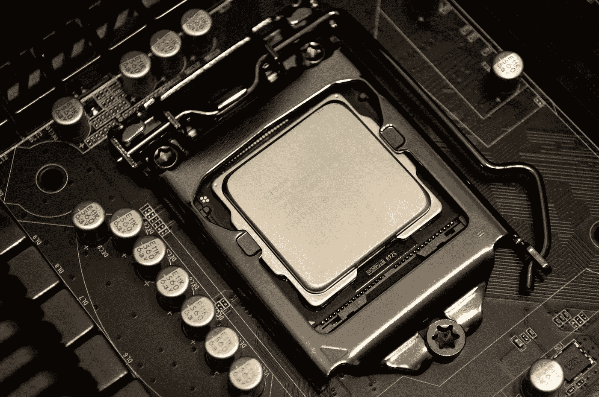

# AWS Lambda for Dummies——云上的无服务器计算

> 原文：<https://medium.com/geekculture/aws-lambda-for-dummies-serverless-computing-on-the-cloud-a9fb3ca95427?source=collection_archive---------1----------------------->

## AWS Lambda 初学者指南。了解 Lambda 服务的核心概念、主要组件和特性。

Image by [@spiridonov from unsplash.com](https://unsplash.com/photos/FemeYrbdMWE)

随着近年来无服务器架构的趋势，AWS lambda 已经成为 AWS 云基础设施中使用最广泛的服务之一。由…