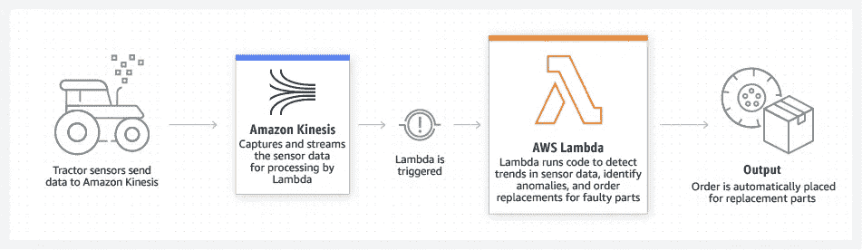

# 简而言之 AWS Lambda

> 原文：<https://medium.com/geekculture/aws-lambda-in-a-nutshell-2c8c31b369e?source=collection_archive---------4----------------------->

## 亚马逊无服务器计算服务概述。

[Use case example for AWS Lambda in IoT backends.](https://d1.awsstatic.com/product-marketing/Lambda/Diagrams/product-page-diagram_Lambda-IoTBackends.3440c7f50a9b73e6a084a242d44009dc0fbe5fab.png)

# 什么是 AWS Lambda？

AWS Lambda 是由亚马逊网络服务(AWS)提供的无服务器计算服务。