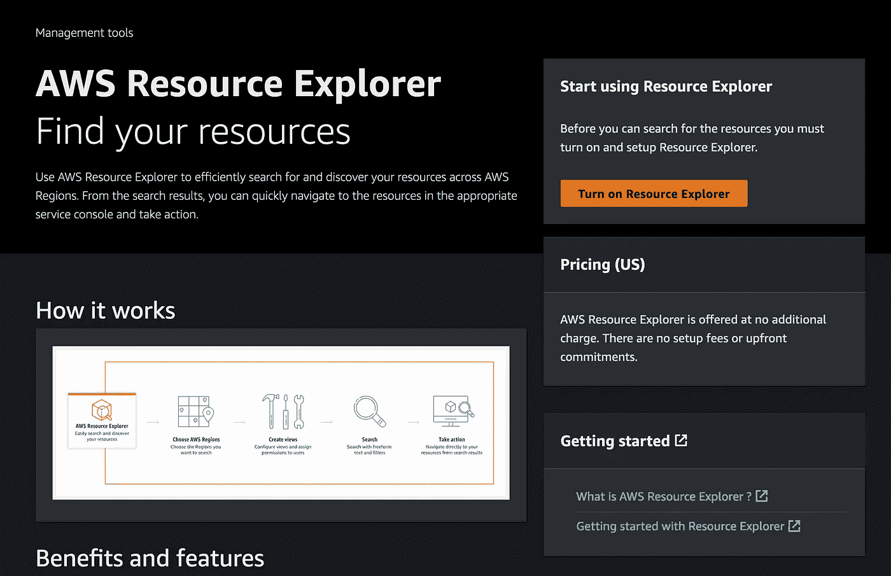

# AWS 启动资源浏览器

> 原文：<https://medium.com/geekculture/aws-launches-resource-explorer-35a09b14c4df?source=collection_archive---------13----------------------->

## 快速找到您的 AWS 资源！！

AWS 已经推出了*资源浏览器*——一种简化通过名字、ARN、标签、id 等查找资源过程的服务。这项新服务还支持一个名为**视图**的功能，允许你为你正在寻找的资源创建过滤器(关于过滤器的列表，请查看这个[链接](https://docs.aws.amazon.com/resource-explorer/latest/userguide/using-search-query-syntax.html))。例如，您可以创建一个视图来筛选…