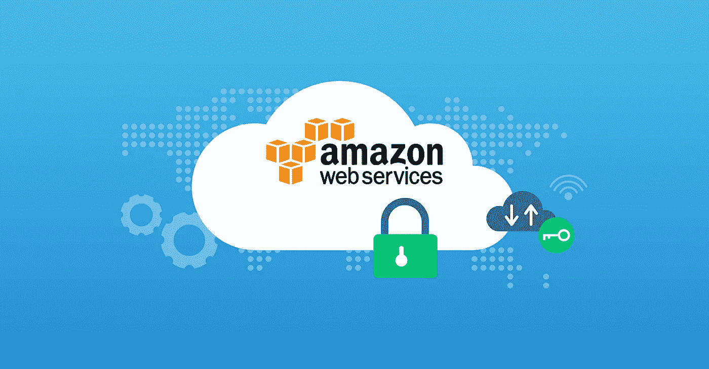
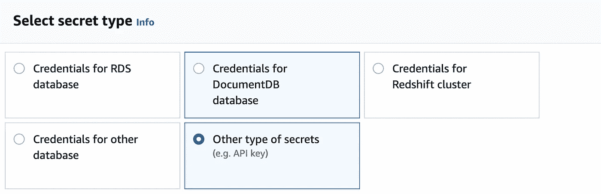
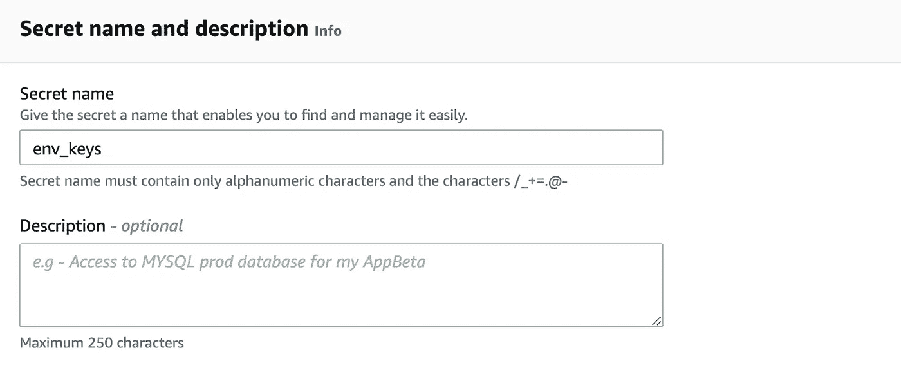

# 测试自动化项目的 AWS 秘密管理器

> 原文：<https://medium.com/geekculture/aws-secrets-manager-for-test-automation-project-2958331a8309?source=collection_archive---------12----------------------->

存储密钥、令牌、密码等机密数据是测试自动化中具有挑战性的任务之一。尤其是在许多项目和大型团队使用秘密数据情况下。我们如何让它既安全又易于管理？



**要求:**

*   集中访问所有机密
*   易于设置和管理
*   为新用户/存储库/作业轻松共享所有机密数据

有几种变体，从开源库到 SaaS 解决方案，各有利弊。

今天我想展示一下 [AWS 秘密管理器](https://aws.amazon.com/secrets-manager/)的设置。
假设我们有许多测试环境，每个环境都有通过测试访问它的特殊密钥。在正常情况下，你需要和所有同事分享这个秘密文件。你还需要把它保存在詹金斯的秘密中，并添加到所有的工作中。我们如何避免每次新的秘密都这样？

让我们将秘密数据添加到 AWS 中，看看如何在自动化项目中使用它。

**1)进入:AWS 密码管理- >存储新密码- >选择密码类型。**



对于当前示例，它将是具有“环境”:“键”结构的 json 文件。

```
{
  "[https://stage-1.int](https://stage-1.int)": "key1",
  "[https://stage-2.int](https://stage-2.int)": "key2",
  "[https://stage-3.int](https://stage-3.int)": "key3"
}
```

2)以纯文本形式添加密码。


**3)添加名称和描述**



**4)** **将 AWS SDK 依赖项添加到您的项目中**

```
<dependency>
    <groupId>com.amazonaws</groupId>
    <artifactId>aws-java-sdk</artifactId>
    <version>1.11.1000</version>
</dependency>
```

**5)** **使用 AWSSecretsManagerClient 检索机密数据**

要访问 AWS API，您需要创建具有读取机密权限的用户组，并生成 ***访问密钥&保密密钥*** *。*

下面的代码检索秘密数据，并通过 Gson 库将其序列化为 Map <environment key="">。所以你可以通过环境 url 获得任何密钥。</environment>

```
var credentials = new BasicAWSCredentials("accessKey", "secretKey");AWSSecretsManager secretManager = AWSSecretsManagerClient.*builder*()
    .withCredentials(new AWSStaticCredentialsProvider(credentials))
    .withRegion("region")
    .build();var request = new GetSecretValueRequest().withSecretId("name");var data = secretManager.getSecretValue(request).getSecretString();
Map<String, String> keys = new Gson().fromJson(data, Map.class);
String stage1key = keys.get("https://stage-1.int");
```

这样你就不在乎和同事共享文件，把它们放到所有的作业里。只需将所有用户添加到权限组，所有需要的人将通过他们的访问密钥获得秘密。

# **关于使用 AWS Secrets Manager 的结论**

*   在一个地方安全存储所有机密
*   轻松共享和访问管理
*   不关心秘密存储基础架构