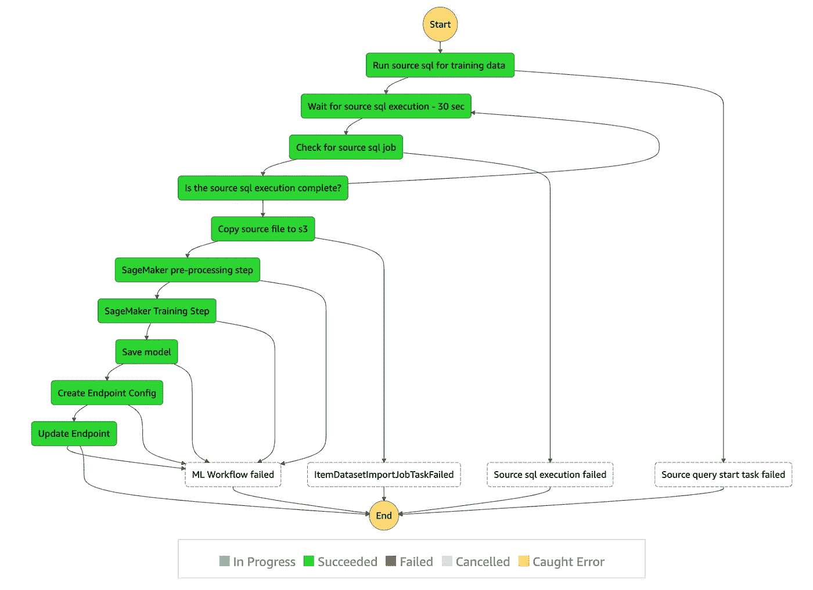
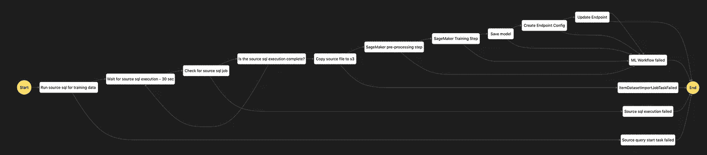

# 基于张量流的时间序列预测模型的 AWS 阶跃函数训练管道

> 原文：<https://medium.com/geekculture/aws-step-function-pipeline-for-time-series-forecasting-model-using-tensorflow-d993abc10ddc?source=collection_archive---------13----------------------->


我和一个推荐引擎一起工作，它为用户推荐食物食谱，我们使用推送通知将它发送给用户。然而，不同的用户在一天的不同时间使用该应用程序，这也会在一周和一个月内发生变化。作为这项工作的一部分，我创建了一个深度学习模型，可以预测用户在某一天最有可能使用该应用程序。在这篇分为 2 部分的文章中，我将更多地强调深度学习管道构建部分，其中第 1 部分涵盖训练管道，第 2 部分涵盖推理管道。

端到端训练管道将使用 sql 获取源数据，预处理数据，使用数据训练 Tensorflow GRU 模型，并使用该模型创建/更新 SageMaker 端点。

# 特征

作为这项研究的一部分，我的假设是，以下功能列表可以帮助预测在某个特定日期用户将使用该应用程序。这些特征可以分为两类。

## 当前功能

所有这些特征都应该在推断之日计算出来。

*星期几*:推断访问时间的星期几。
*一月中的某一天*:推断拜访时间的一月中的某一天。
*自上次就诊后的天数*:自上次就诊后的天数。

## 历史特征

所有这些功能都属于用户的最后一次使用。

*总花费时间*:用户上次访问花费的总时间。
*总浏览量*:用户上次访问的总浏览量。
*类型 1 页面浏览量*:用户上次访问的类型 1 页面浏览量总数。
*第二类页面浏览量*:用户上次访问的第二类页面浏览量总数。
*第三类页面浏览量*:用户上次访问的第三类页面浏览量总数。
*第 4 类页面浏览量*:用户上次访问的第 4 类页面浏览量总数。
*第一次就诊时间*:最后一次就诊时当天的第一次就诊时间。
*最后就诊时间*:最后一次就诊时当天的最后就诊时间。
*每小时的访问量*:判断点击是否为每小时新访客的标志。
*星期几*:最后一次就诊的星期几。
*:最后一次访问的日期。
*:最后一次访问的月份。
*平台*:上次访问的用户平台，如 iOS 或 android 或其他。**

# ****培训渠道****

**下面显示的端到端培训管道是使用 AWS Step function 创建的，这是一种可视化工作流服务，用于自动化 AWS 服务。**

****

**注意，我使用 [AWS 步骤函数 Data Science Python SDK](https://aws-step-functions-data-science-sdk.readthedocs.io/en/stable/) 为 AWS 步骤函数创建工作流定义。AWS 步骤功能将通过连接到 AWS Athena、AWS s3、AWS Lambda 和 AWS SageMaker 服务来协调工作流程。除了 AWS lambda 的代码，下面讨论的所有 python 代码都必须从 SageMaker 笔记本或本地 jupyter python 笔记本上运行。**

**下面声明了所有的库和环境变量**

**对于使用用户输入运行的工作流，我们需要预先定义以下值。**

```
**execution_input = ExecutionInput(
schema={
"PreprocessingJobName": str,
"TrainingJobName": str,
"EvaluationProcessingJobName": str,
"ModelName": str,
"EndpointName": str,
"InputFilePath": str
})**
```

**R**un source SQL for training data:**这是通过创建一个 lambda 函数并最终从 step 函数中调用它来实现的。下面是 lambda 函数 *ds-StartQueryExecution 的代码。*该函数从 s3 位置读取 sql 文件，并使用*start _ query _ execution*API 运行 sql。**

**我们使用下面的代码在 step 函数中调用这个 lambda 函数，其中 *LambdaStep* 调用 lambda 函数，而 *Catch* step 捕捉失败， *Retry* 在失败的情况下重新调度该步骤。**

**触发的 sql 可能是长时间运行的 sql，因此要跟踪它，我们需要执行以下任务。**

**W 源 sql 执行的等待:在步骤函数中创建一个等待步骤。**

```
**from stepfunctions.steps import Wait
wait_src_query_execution_job =  Wait(state_id="Wait for source sql execution - 30 sec",seconds=30)**
```

**C 检查源 sql 作业:由于 sql 可以运行更长时间，因此需要使用一个名为 *ds-GetQueryExecution* 的 lambda 函数，使用*get _ query _ execution*API*来检查其运行状态。***

**这个函数是用下面的代码在 step 函数中调用的。在这段代码中， *QueryExecutionId* 跟踪 AWS Athena 内部的 sql，以及< *QueryExecutionId >。csv* 成为存储在 s3 中的输出文件名。**

**是否源 sql 执行完成:如果 sql 最终长时间运行，我们需要检查 sql 执行是否完成。如果没有，等待循环将继续。下面是该步骤的声明(为了变量的可发现性，稍后将进一步添加该代码)。**

```
**from stepfunctions.steps import Choice
check_src_sql_run_choice_state = Choice(state_id = "Is the source sql execution complete?")**
```

**将源文件复制到 s3:我想到了这一步，因为我不能将变量文件名传递给下游的 ML 管道脚本。这个步骤依赖于 lambda 函数 *ds-CopyS3Content* ，下面是它的代码。**

**下面是调用 lambda 函数的步骤函数代码**

**此外，既然所有下游任务都已定义，我们最终可以对选择状态进行编码，等待输入 sql 完成，并在成功后开始将数据复制到 s3。**

**ageMaker 预处理步骤:有了输入数据，我们就可以开始预处理了。**

**第一步是将 scikit-learn 预处理脚本作为处理作业运行，创建一个 *SKLearnProcessor* ，它允许您使用 AWS SageMaker 提供的 scikit-learn 映像在处理作业内部运行脚本。**

```
**sklearn_processor = SKLearnProcessor(
framework_version="0.20.0",
role=role_arn,
instance_type="ml.m5.xlarge",
instance_count=1,
max_runtime_in_seconds=1500,
)**
```

**第二步是使用 [SageMaker 脚本模式](https://aws.amazon.com/blogs/machine-learning/using-tensorflow-eager-execution-with-amazon-sagemaker-script-mode/)创建一个将在 SageMaker docker 内部运行的预处理脚本。像早期的 python 代码一样，这个代码片段在 jupyter 中运行时，使用 *%%writefile* jupyter 命令在给定位置创建一个本地 python 文件 *preprocessing_step.py* 。**

**这个 python 脚本是在一个不同的位置创建的，所以要传输它，我们需要下面的 jupyter 代码。在 SageMaker docker 内部执行该代码期间，该代码还将设置输入和输出的路径。**

**最终，所有这些都将由步骤函数内预处理步骤用以下代码调用。**

**S ageMaker 训练步骤:为了使用预处理数据训练模型，我再次利用 [SageMaker 脚本模式](https://aws.amazon.com/blogs/machine-learning/using-tensorflow-eager-execution-with-amazon-sagemaker-script-mode/)并使用 jupyter 代码块创建了以下名为 *training_step.py* 的本地 python 脚本。**

**像前面一样，这个脚本是在本地创建的，因此要在 s3 中传输它，需要运行下面的代码。**

```
**TRAINING_SCRIPT_LOCATION = 'get-visit-time/training_step.py'training_code = sagemaker_session.upload_data(
TRAINING_SCRIPT_LOCATION,
bucket=default_bucket,
key_prefix="get-visit-time/scripts",
)**
```

**该脚本需要使用以下代码包装在 SageMaker 提供的 Tensorflow 估计器中。**

**该估计器最终由步骤函数中的*训练步骤*调用，并应使用以下代码通过*失败*步骤进行错误处理。**

**ave 模型:这个模型用下面的代码保存在这里**

```
**model_step = ModelStep(
"Save model", model=training_step.get_expected_model(), model_name=execution_input["ModelName"],
instance_type="ml.m5.xlarge"
)**
```

**创建/更新端点:虽然在前面的步骤中保存了模型用于健全性检查，但是我们更愿意创建一个用于推理的端点，并在重新训练期间使用下面的代码更新它。**

**一旦创建了所有这些单独的任务，我们需要为所有使用以下代码的任务添加错误处理 *Catch* 步骤。**

```
**catch_state_processing = Catch(
error_equals=["States.TaskFailed"],
next_step=failed_state_sagemaker_processing_failure,
)processing_step.add_catch(catch_state_processing)
training_step.add_catch(catch_state_processing)
model_step.add_catch(catch_state_processing)
endpoint_config_step.add_catch(catch_state_processing)
endpoint_step.add_catch(catch_state_processing)**
```

**现在，为了创建完整的工作流，使用以下代码将前 4 个任务链接起来，最终形成选择状态*check _ src _ SQL _ run _ Choice _ state。***

```
**full_workflow_graph= Chain([lambda_state_start_src_query,
                            wait_src_query_execution_job,
                            lambda_get_src_query_execution_status,
                            check_src_sql_run_choice_state
                            ])**
```

**成功后，选择状态指向*状态副本源 s3 文件作业。* 由于选择状态不能在步骤函数中链接，我们使用下面的代码创建另一个链，将*lambda _ state _ copy _ source _ S3 _ file _ job*作为任务集合中的第一个任务。**

```
**train_workflow_graph = Chain([lambda_state_copy_source_s3_file_job,
                              processing_step,
                              training_step,
                              model_step,
                              endpoint_config_step,
                              endpoint_step
                              ])**
```

**最后，我们用下面的代码定义工作流。**

```
**full_workflow = Workflow(
name="ds-GetVisitTime-Train-Workflow",
definition=full_workflow_graph,
role=role_arn,
)**
```

**我们可以使用这段代码来呈现工作流定义。这是验证你的工作流是否被定义为思想的好方法。**

```
**full_workflow.render_graph()**
```

****

**此后，如果我们是第一次创建工作流，我们应该运行**

```
**full_workflow.create()**
```

**为了更新它，我们应该运行**

```
**full_workflow.update(definition=full_workflow_graph,role=role_arn)**
```

**我们可以立即执行工作流，但是为了与 AWS 同步，最好使用下面的代码等待 30 秒。**

```
**time.sleep(30)**
```

**我们可以使用以下代码直接从笔记本运行工作流，其中我们需要使用 *uuid* 库来为 SageMaker 预处理和训练作业生成唯一的名称。**

**然而，在生产中使用 lambda 函数(从 AWS CloudWatch events 调用 lambda 函数[)进行调度更为现实。](https://docs.aws.amazon.com/AmazonCloudWatch/latest/events/Create-CloudWatch-Events-Scheduled-Rule.html)**

**使用以下命令，可以从 AWS 步骤功能控制台或 jupyter 笔记本中找到状态机执行的进度。**

```
**execution.render_progress()**
```

**这就完成了获取源数据的端到端训练过程，以便在训练完模型之后创建/更新端点，并且可以在本文的[第 2 部分](/@tanaychowdhury/aws-step-function-inference-pipeline-for-time-series-forecasting-model-9d5cc3121f88)中找到使用这里构建的模型的推理。然而，这一培训渠道可以进一步优化，以完成以下任务。**

1.  **对训练数据集运行交叉验证。**
2.  **仅当 RMSE 或 MAE 优于特定阈值时，才更新终点。**