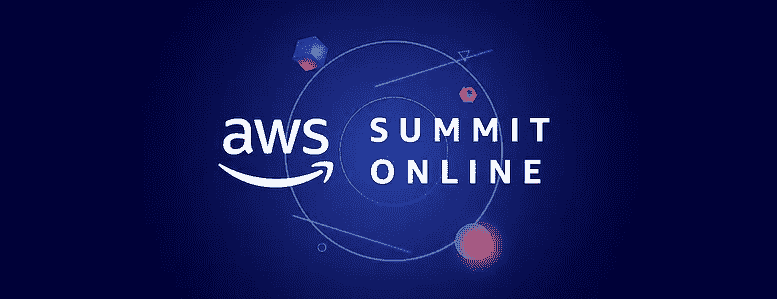

# AWS 峰会在线印度 2021

> 原文：<https://medium.com/geekculture/aws-summit-online-india-2021-e247e3f76c5a?source=collection_archive---------65----------------------->

你猜怎么着？？？AWS 峰会将于 6 月 29 日至 30 日在印度举行。大家可能会想这是怎么回事？如果我参加，我会得到什么？谁有资格参加？活动费用是多少？等等。,

你脑海中浮现的所有问题。这是它的答案。

AWS 峰会是专为 it 专业人士和高管创建的，旨在支持 AWS 的发展和创新。本次峰会旨在就 AWS 产品、服务、如何设计、部署、操作基础设施和应用程序进行培训。此外，AWS 峰会是免费的。

AWS Summit 2021

**前提:**云入门或者有经验的用户都可以参加这个活动。

AWS 峰会不拘泥于一个特定的话题进行探讨。根据你的兴趣或领域，以下是你可以参加的主题列表:

**人工智能/机器学习:**我们已经知道机器学习如何影响每个领域，尤其是商业领域。许多组织仍然纠结于如何实现 ML 以获得有效的结果。因此，请了解 AWS 如何支持各种 ML 用例，并通过平衡商业价值和上市速度来加快您组织的 ML 之旅。

**大数据&分析:**组织正在构建数据湖，以更深入地了解他们的所有数据。了解 AWS 客户如何使用现代数据平台来实时利用他们的业务成果和预测，构建更好的产品和客户体验。

**DevOps:** DevOps 将软件开发和 IT 运营结合起来，缩短软件开发周期，持续交付，高软件质量。在这里，您将了解工程师如何在部署代码时单独完成任务。

**应用&现代化:**现代应用是模块化架构模式、容器、敏捷流程和运营模型的组合。在这篇文章中，AWS 谈到了应用程序现代化、无服务器技术、服务网格、Kubernetes 部署、集成模式和安全性。

**现代化&创新:**如果您是云初学者，那么这将帮助您构建变革案例、云路线图，并消除迁移风险。如果您已经有一个现有的云，那么学习如何更新和发明新的功能来推动有效的商业价值。这将由具有应对挑战经验的 AWS 专家和客户来完成。

**安全性:**学习如何安全地设计、实施和操作，现有客户演讲者将详细阐述其组织中遇到的安全挑战。

**数据库:**数据库是任何组织的基本组成部分。该专题讲座涉及 AWS 专门构建的数据库，可帮助您选择合适的数据库，更快地扩展和快速创新。

对于每个主题，将有基于专业知识的水平。级别如下:

级别 100:这是一个介绍级别，重点介绍 AWS 的特性和服务。

级别 200:这是一个中级级别，包含服务功能和演示的细节。

300 级:这是一个高级级别，可以深入到所选的主题。

级别 400:这是一个专家级别，他们对主题非常熟悉，并且自己实现了解决方案。

**谁能在各自的日期出席？**

2021 年 6 月 29 日:如果你是一个商业或 IT 决策者，期待有一天可以学习从入门(100 级)到中级(200 级)的内容。此外，观看鼓舞人心的主题演讲，了解接受云的行业，以及具有真实世界经验的业务解决方案。

2021 年 6 月 30 日:如果您是技术领导者、数据科学家、开发人员、工程师、系统管理员，或者只是对 AWS insights 感兴趣，请收听技术主题演讲，并从高级(300 级)到专家(400 级)会议中学习新知识。

AWS 峰会的注册链接如下:

【https://register-summits-india.virtual.awsevents.com/? trk = em _ in V5 _ summit _ is _ back _ summit India 21&trkcampaign = AWS-summit-online

快乐学习！！