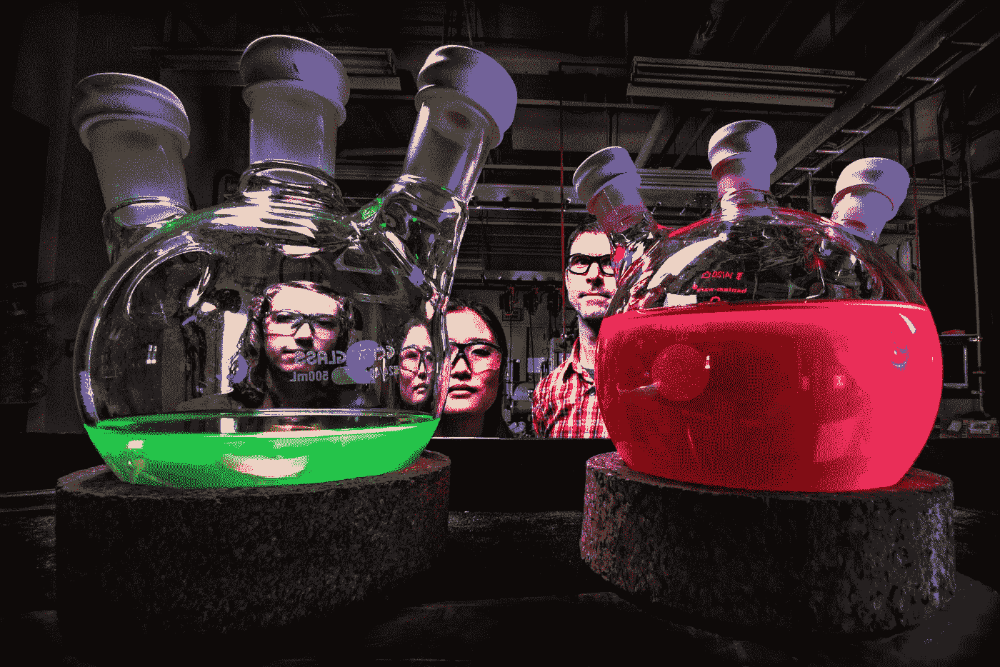

# 用 Jest 进行 AWS 测试:第 2 部分

> 原文：<https://medium.com/geekculture/aws-testing-with-jest-part-2-d5e0a2efa119?source=collection_archive---------0----------------------->

Now that all your Unit Tests are passing you’ll have a lot more time to spend looking at flasks of colourful liquids. Photo by [Science in HD](https://unsplash.com/@scienceinhd?utm_source=unsplash&utm_medium=referral&utm_content=creditCopyText) on [Unsplash](https://unsplash.com/s/photos/test-passed?utm_source=unsplash&utm_medium=referral&utm_content=creditCopyText)

用 Jest 测试 AWS 的第一部分是[这里是](/@krisraven/aws-testing-with-jest-unit-tests-part-1-4c93c1d4bf21)。本文遵循 Jest 单元测试框架的一个更标准的用法。下一个例子是 AWS 函数在另一个被测试的函数 ie 中。在函数中只留下业务逻辑。

在软件开发行业中，术语“单元测试”经常被使用。尤其是作为捕捉错误或帮助实现目标的早期方法…