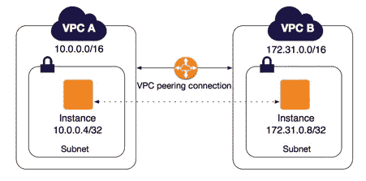
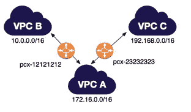
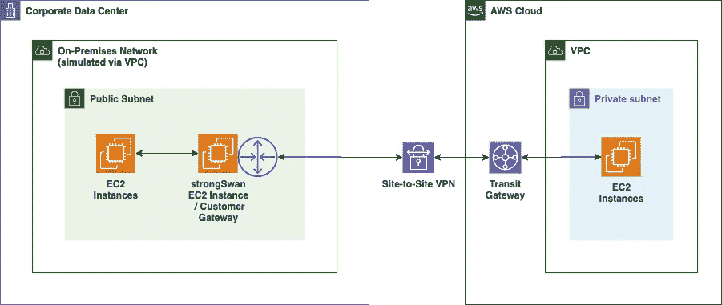
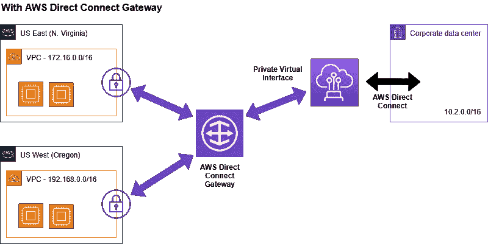

# AWS VPC 对等、VPN 连接和直接连接

> 原文：<https://medium.com/geekculture/aws-vpc-peering-vpn-connection-and-direct-connect-abf1b3e533a?source=collection_archive---------8----------------------->

如果你认为你可以在云平台上直接运行所有的基础设施，这是一个神话。您将会遇到许多阶段，在这些阶段中，您需要连接运行在您的场所或云中不同 vpc 内部的服务。我们有不同的方法来成功完成这些任务: ***VPC 对等、VPN 连接和直接连接。***

现在，让我们深入了解每项服务，然后您来决定哪一项最适合您。

***AWS VPC 对等***

*AWS VPC 对等*是两个 VPC 之间的网络连接，使您能够使用私有 IPv4 地址或 IPv6 地址在它们之间路由流量。任一 VPC 中的实例可以相互通信，就好像它们在同一个网络中一样。您可以在自己的 VPC 之间创建 VPC 对等连接，或者与另一个 AWS 帐户中的 VPC 建立对等连接。VPC 可以位于不同的区域(也称为区域间 VPC 对等连接)。

***多个 VPC 对等*** 连接也是可能的，但是不支持可传递对等关系。

下图是一个 VPC 对等到两个不同 VPC 的示例。有两个 VPC 对等连接:VPC A 与 VPC B 和 VPC C 对等。VPC B 和 VPC C 不对等，并且您不能使用 VPC A 作为 VPC B 和 VPC C 之间对等的中转点。如果您想要启用 VPC B 和 VPC C 之间的流量路由，您必须在它们之间创建唯一的 VPC 对等连接。

为了使多个 VPC 相互对等，许多连接将基于公式***【n(n-1)/2】。*** 例如，如果您的网络中总共有 5 个 VPC，并且都需要对等，那么根据公式，总连接数将是 10，其中“ ***n*** ”是 VPC 的数量。

观看下面的视频，体验跨区域 VPC 对等操作。[***https://www.youtube.com/watch?v=KmCEFGDTb8U***](https://www.youtube.com/watch?v=KmCEFGDTb8U)

— — — — — — — — — — — — — — — — — — — -

***AWS 站点到站点 VPN 连接***

AWS VPN 连接允许您安全地将本地网络中的服务连接到云上 VPC 内部的服务。这些通信通过安全的 IPsec 专用链路进行。在这个网络中流动的所有数据都将被加密并遵循 IPsec 协议。

建立站点到站点 VPN 连接时需要注意的几个关键概念-

*客户网关:*AWS 资源，向 AWS 提供有关客户网关设备的信息。

*虚拟专用网关:*站对站 VPN 连接亚马逊端的 VPN 集中器。

*站点到站点 VPN 连接:*这是使您的本地和 AWS 端资源相互对话的连接。

参考下面的视频进行*站点到站点 VPN 连接*设置。

【https://www.youtube.com/watch?v=3j1MLlgc5Eg】

*— — — — — — — — — — — — — — — — — — — — — — -*

****AWS 直连****

**AWS Direct Connect* 是一种云服务解决方案，可以轻松建立从您的场所到 AWS 的专用网络连接。使用 AWS Direct Connect，您可以在 AWS 和您的数据中心、办公室或托管环境之间建立私有连接。这可以增加带宽吞吐量，并提供比基于互联网的连接更一致的网络体验。*

*AWS Direct Connect 与所有可通过互联网访问的 AWS 服务兼容，速度从 50 Mbps 到 100 Gbps 不等。*

**

**直接连接的优势* -一致的网络性能、保护传输中的数据、降低带宽成本以及灵活的连接选项。*

> ****在下一篇博客中，让我们了解 AWS Transit Gateway，这是 VPC 和本地资源通信的最佳方法。****

*— — — — — — — — — — — — — — — — — — — — — — — — — -*

*“对知识的投资会有最好的回报。”*

*你的建议和反馈很重要！！！请点赞、分享和订阅，传播云计算。*

*关注我的页面，了解最新的 AWS 服务和版本。*

***@ yogendrahj.medium.com***

*学习并保持好奇心！！！！！*

*快乐学习，*

****约根德拉。****