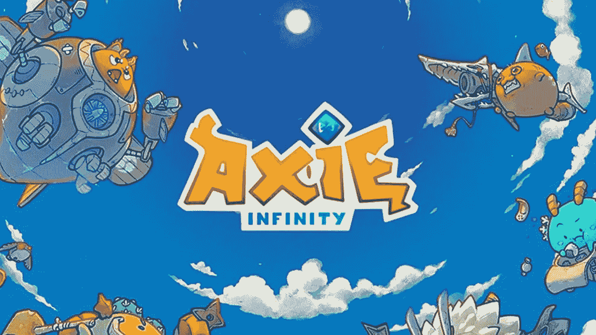
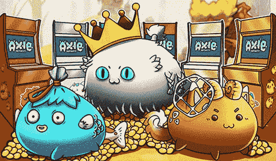
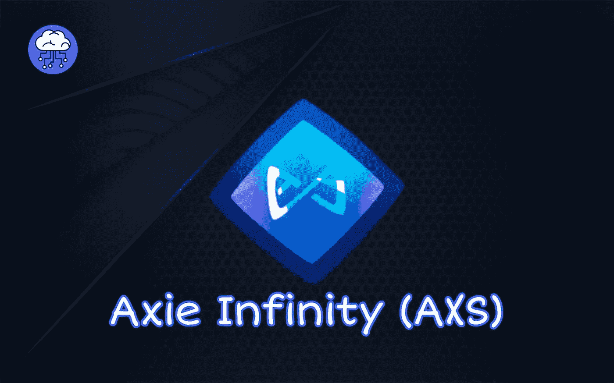
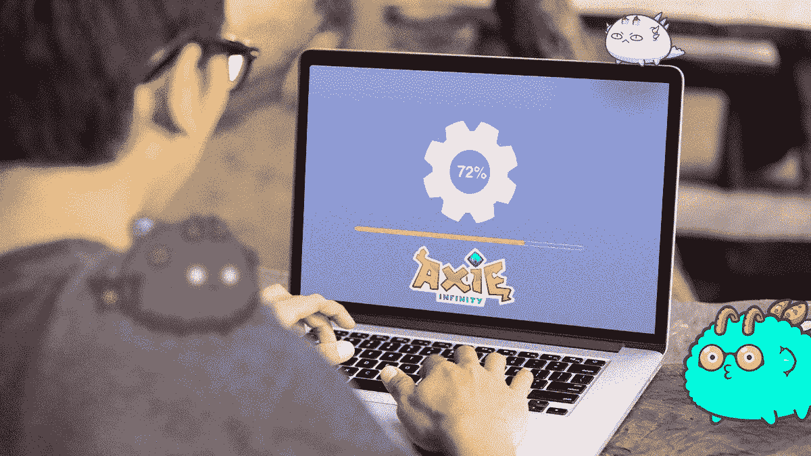

# Axie infinity 克隆脚本:构建一个像 Axie Infinity 一样的 NFT 市场平台

> 原文：<https://medium.com/geekculture/axie-infinity-clone-script-build-an-nft-marketplace-platform-like-axie-infinity-a9a626c0f621?source=collection_archive---------10----------------------->

Axie infinity 克隆脚本是一个源代码，您可以使用它来构建和启动一个 NFT 游戏平台，如基于区块链的 Axie Infinity。它是当今知名的游戏平台，拥有许多活跃用户和收入。出于这个原因，本文致力于简要介绍 Axie infinity 克隆源代码脚本，它的特性，不同的赚钱方式等等。

# 什么是 Axie infinity 克隆脚本:深刻理解

Axie Infinity 是一款战斗游戏，玩家可以收集、繁殖、培育、交易和战斗 Axie。Axie Infinity 的灵感来自流行游戏 Pokémon，它允许玩家收集、繁殖和交易被称为 Axie 的令牌化动物生物。另一方面，这个脚本是一个类似于 Axie infinity 的 NFT 游戏平台。与原版 Axie infinity 一样，在游戏克隆脚本中，玩家可以收集不同的数字动物，并繁殖它们，以便与其他玩家的其他数字宠物进行战斗。

更深入地说，Axie infinity 克隆脚本可以定义为一段白色标签的脚本代码，可用于快速构建 NFT 游戏 [**平台，类似于众所周知的 NFT 游戏 Axie infinity**](https://radindev.com/axie-infinity-clone-script/) 。这段代码的好处是它是可定制的，使用它，你可以在 7-10 天内总结游戏的整个开发工作。因此，你有一个稍微调整和定制的市场竞争对手。由于赚钱的特性和吸引人的 UI 设计和功能吸引了玩家的注意力，并使他们在网站上停留更长时间，这款游戏可能是玩家和制作人的一个利润丰厚的收入来源。它也有移动和网络应用程序。

在这个游戏中，每个数字动物，即 Axie，都是唯一的，并根据 ERC721 令牌标准表示为 NFT。根据您定制的克隆脚本，每个轴由 6 个身体部位和 4 个状态组成，这些部位和统计信息有助于区分两个轴的优势。这两个因素决定了每个 Axie 的成本。四个基本状态对评估一个 Axie 是至关重要的:它的战斗速度，恢复，能力和损害。这四个阶段或状态如下:

- HP 会参考 Axies 的健康状况，并确定它在战斗中可以攻击多长时间。

-士气:它使 Axies 能够像一种力量提升一样进行致命一击

- Skill 代表 Axies 使用多张卡的能力。根据技能等级，阿西可以对对手造成进一步的伤害。

-速度:是一种不言自明的状态，速度较高的 Axie 有先攻的优势。

正如前面在游戏克隆脚本中提到的，你可以自定义所有的状态。

# 使用 Axie infinity 克隆脚本构建 NFT 市场的优势

# 游戏效用

使 Axie infinity 脚本成为一项出色投资的主要因素是它在增强游戏功能方面的效率。其日活跃玩家率达到每天 280 万，并通过交易获得约 36 亿美元的可观收入。AXS 的所有者可以在游戏的未来中扮演直接的角色，并有权决定游戏。此外，AXS 值也在增加。

# 隐性风险

虽然 AXS 的价值正在迅速上升，你应该意识到加密市场是高度不稳定的。在这样的市场中，比特币扮演着代理的角色，影响着加密交易。因此，AXS 价值随着比特币而变化。要记住这一点，你应该知道提高 Axie 代币价值可以受到比特币的影响，并停止增长。

# AXS 价格

AXS 最近的价格是 53.09 美元。基于 AXSs 价格增长路径，可以说可能是一个优秀的长期投资。

# 判决

由于 Axie NFT 的波动性，对它们进行投资可能是一个长期增长的好主意，因为它具有现实世界的效用，其用户比率也在增加。

# Axie infinity 克隆的主要功能

该脚本的一些基本功能如下:

# 阿协育种脚本

这个游戏最重要的特点之一就是繁殖后代。当一个有不同属性的 Axie 出现时，它会产生一个新的 Axie，这个 Axie 可能比其他 Axie 更好，并且能够帮助玩家提高他们的游戏性。用户还可以在市场上向其他玩家出售新品种的 Axies。这意味着 Axie 繁殖对玩家来说从各方面来说都是有利可图的。

# 斗争

这款游戏的战斗性质要求我们的 axis 与对手 axis 作战。如果阿西赢得战斗，玩家将获得巨额奖励。此外，Axie 的状态决定了其与对手 Axie 作战的能力。状态更高更好的轴比其他的更贵。

# 市场

玩家可以培育新的轴，交易它们，并购买游戏中的资产，如土地等。，使用市场平台。有自己市场的游戏通常比其他游戏更成功。

# 陆地

Axies 的土地被称为 Lunacia，可以分为令牌化的地块。这些土地是 Axies 的避难所，能提供更好避难所的土地更贵，可以用来制造 AXS 代币。Lunacia 由 90601 块土地组成，分布在七种不同类型的土地上:

萨凡纳

森林

北极区

神秘的

起源

卢纳斯着陆

地图

# 小爱情魔药(SLP)

SLP 是可以在冒险和战斗中获得的象征性奖励。这些令牌可用于创建全新的 Axie 或升级现有 Axie 的功能。

# Axie Infinity 碎片(AXS)

AXS 是基于 ERC20 的治理令牌，可以通过参与 Axie infinity 世界来实现。通过拥有 AXS，玩家有权参与游戏中发生的治理投票。赢得游戏后，投资者可以通过堆叠加密代币来获得奖励。投票支持 NFT 市场的治理后，股东可以获得利益。

# 游戏内投资

此游戏中的代币可用于投资 Axie infinity 克隆中的可用项目，如新生物、更好的能力、土地等。

# 提供奖学金

这一功能允许 Axies 克隆人所有者将他们的数字动物借给其他游戏玩家在平台内使用；他们可以立即开始玩并赢得 SLP。

# 转换 SLP

如果您愿意，可以将获得的 SLP 转换为 ETH 并转移到钱包中。

# Axie Infinity 克隆脚本功能

克隆脚本可能具有不同的管理员和玩家特性，包括:

# 管理功能

-安全的 CMS 和 CRM

-可定制的仪表板

-球员管理

-转诊计划管理

-访问实时数据管理

# 玩家特征

-逼真的游戏体验

-钱包整合

-用户安全

-奖励分配

-完全透明

# 脚本是如何工作的？

1.首先，玩家应该使用钱包集成注册他们的个人资料

2.购买至少三个轴来玩游戏

3.进行战斗以获得代币

4.本地代币可以堆积成显著的奖励

5.每个 Axie 都是独一无二的，有其特定的职业和属性。玩家在战斗中使用这些轴。

6.无限克隆和繁殖轴控制种群。因此，每个轴 NFT 最多可以繁殖 7 次。

7.玩家可以为他们的轴建造他们的土地

8.Axie Infinity clone 为游戏玩家提供治理。

# 为什么人们想创建像 Axie infinity 这样的 NFT 游戏，你如何快速构建这样一个游戏？

Axie infinity 是现有的几款网游中比较优秀的网游之一。这款游戏的流行是因为它的快速成长。此外，据说 Axie infinite 每天有 100 万活跃用户，其用户在 AXS 的赌注约为 20 亿美元。这款游戏也有大约 3 . 64 亿美元的收入。所有这些都表明这个平台将有一个充满希望的未来。

# 将 Axie infinity 克隆脚本用于业务的优势

你可以用这个克隆脚本赚钱。它有一些特性使它适合商业。这些功能包括:

# 可能的

快速部署是可行的，这意味着你可以在一周内设计并制作出像 Axie infinity 这样用户友好的 NFT 游戏。

# 管理面板

它的用户和管理仪表板是卓越的。作为 NFT 游戏平台的所有者，您可以轻松控制所有功能和安全模块。

# 多语言支持

因为它是专为元宇宙游戏用户打造的，你可以很容易地吸引各种各样的游戏玩家。

# 用户化

Axie infinity 最重要的一个方面是它的高度定制化。使用这个，玩家可以修改从外观到后端功能的任何东西。

# 如何从 Axie infinity Colone 平台上赚钱？

Axie infinity clone 的“游戏赚钱”性质意味着玩家可以因为参与这个全球 NFT 游戏平台而获得奖励。玩家可以:

-参加 PVP 战斗，赢得排行榜大奖

-培育并在市场上销售 Axie(或者对用户培育的每个新 Axie 收取少量费用)

-收集和推测像神秘主义者和起源这样的稀有轴

-通过购买和交易加密货币交易所赚取的爱情药剂

-使用 AXS 代币购买平台上的数字产品和资产

-从每笔 NFT 交易中抽取 4.25%的佣金

总之，可以说 Axies 的无限收入模型是基于以下来源:

-向玩家出售游戏中的物品

-向投资者出售开发商的股份

-玩家可以定期兑现他们获得的代币。

-此外，开发时间可以考虑其他收入来源，如广告或商品销售。

# 代币

克隆脚本中有两种类型的令牌。这两种令牌都可以在 ERC20 网络上交易:

- SLP:玩家赚钱和套现。游戏玩家可以在 Uniswap 这样的分散交易所(dex)获得或交易这个代币。

- AXS:这是一个治理令牌，当它被实现时，所有者可以说游戏是如何被开发的。它旨在奖励玩家参与并鼓励他们长期保留代币，以分散平台所有权和治理。