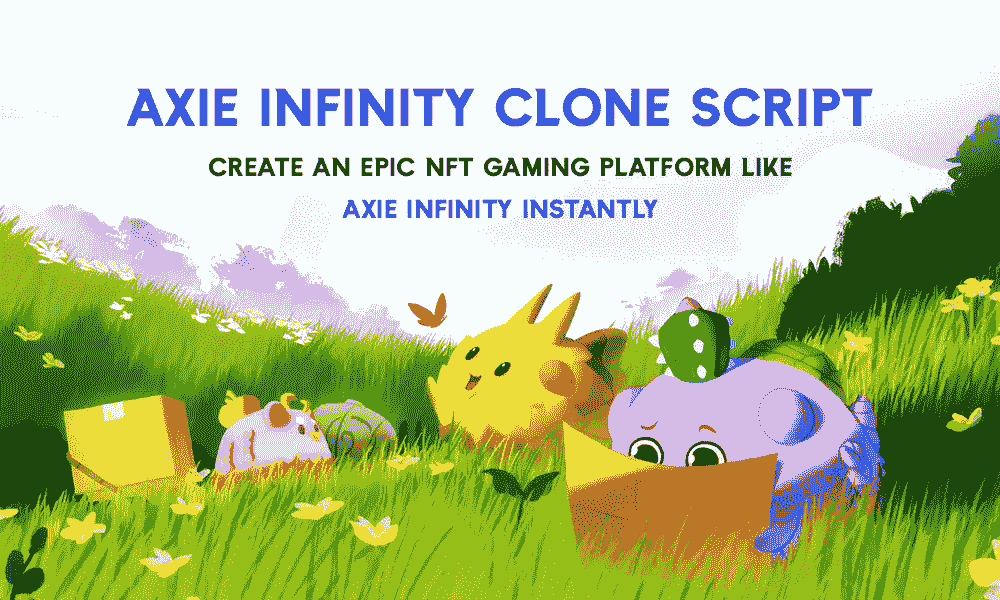

# Axie Infinity 克隆脚本—立即创建像 Axie Infinity 一样的史诗级 NFT 游戏平台

> 原文：<https://medium.com/geekculture/axie-infinity-clone-script-create-an-epic-nft-gaming-platform-like-axie-infinity-instantly-9a6b8c66ce00?source=collection_archive---------6----------------------->

Axie Infinity Clone Script — Create an Epic NFT Gaming Platform like Axie Infinity Instantly

Axie Infinity 是一款从 2021 年开始推出的区块链游戏。事实上，这种游戏在菲律宾和越南等国家已经相当流行，为参与者提供了收入来源。其代币 AXSN 飙升 77468%证明了 Axie Infinity 这样的游戏可以变得巨大，现在是推出 Axie Infinity 这样的 NFT 游戏的最佳时机。因为现在区块链游戏行业正在蓬勃发展。

# Axie Infinity 克隆脚本

Axie Infinity 克隆脚本是 NFT 市场上最受欢迎的概念之一，它和 Axie Infinity 一样，是在以太坊区块链上构建的现成的数字游戏平台。用户可以利用这个平台培育、战斗和交易被称为 Axies 的数字怪物。Axies 是完全不可替代的令牌，构建在各种区块链平台上，如 Tron、Eos 和币安智能链。在了解 [**Axie Infinity 克隆脚本**](https://www.alwin.io/axie-infinity-clone-script) 的概念之前，要了解什么是 Axie Infinity，现成的 Axie Infinity 克隆脚本帮助你启动自己的 Axie Infinity 游戏平台。

# 什么是 Axie Infinity？这样的游戏如何快速制作？

Axie Infinity 是一个区块链驱动的口袋妖怪。它的游戏是围绕一个基于战斗的宠物饲养游戏。游戏参与者必须购买三个角色才能开始游戏。随着他们继续玩游戏，他们获得了 Axie Infinity 平台收入的很大一部分。

不过，它创建了一个名为 Ronin 的侧链，以解决以太坊的 gas 和可扩展性问题。使用 Axie Infinity 克隆脚本时，请确保选择了适当的侧链，以避免充气问题。

Axie Infinity 克隆脚本是一段被贴上白色标签的代码，可以用来轻松创建一个类似的游戏。代码是可定制的，将游戏的整体开发时间减少到 7-10 天。因此，通过一些小的调整和定制，可以在市场上提供一个竞争性的游戏。

# Axie Infinity 克隆脚本的功能

此处列出了 Axie Infinity 克隆脚本的基本功能。

**育种**

你的斧头可以繁殖创造一个额外的斧头，可以在战斗中买卖或使用。Axies 有三个影响其后代特征的基因。你每繁殖一只 Axie，就要花费 0.002 ETH。

**战斗**

战斗是一种回合制棋盘游戏，玩家努力攻击对手，每一方在任何时候都由三把斧头组成。每个 Axie NFT 都有独特的品质，使他们适合各种游戏角色(健康，士气，速度，技能，它也可以是一个职业，如水生，月球，爬行动物，鸟类，动物等。).

**着陆**

Axie Infinity 克隆脚本游戏有自己的王国，叫做 301*301 网格。指定网格中的每个位置都是一个标记化的地块，玩家可以随时购买。任何土地所有者都可以升级，并自定义边界来托管商店。

**商场**

通过市场买卖 axes 来交易 axes。此外，你可以购买土地和体育财产和装饰你的土地。

**赌注奖励**

AXS 代币持有者可以将代币押在赌注上，以获得 AXS 通货膨胀的一部分。

**治理**

Axie Infinity clone 旨在过渡到分散化的治理结构，在这种结构中，AXS 利益攸关方承担对平台发展决策某些领域的控制。

**购买资格**

用户可能需要持有 AXS 才能参与未来的 Axie、土地或项目销售。

# Axie Infinity 的优雅特性包括

克隆脚本将为管理员和玩家提供几个特性。

**管理功能**

*   可定制的仪表板
*   安全的 CMS 和 CRM
*   推荐计划管理
*   玩家管理
*   访问实时数据管理

**用户功能**

*   真实的游戏体验
*   钱包整合
*   用户安全
*   奖励分配
*   完全透明

# 像 NFT 游戏平台 Axie Infinity 是如何工作的？

*   首先，玩家应该通过整合钱包来创建一个帐户。
*   买至少三个轴玩游戏。
*   获得代币的战斗。
*   自己的代币可以堆积成非凡的奖励。
*   每个轴都是不同的，有特定的职业和属性。这些轴被玩家在战斗中使用。
*   种群由无限克隆轴和繁殖轴控制。因此，每一轴 NFT 只能繁殖七次。
*   玩家可以为他们的轴建造他们自己的土地。
*   Axie Infinity clone 为玩家提供治理。

# 如何用 Axie Infinity 克隆脚本盈利？

经常赚取代币的玩家可以将代币套现。游戏中有两种不同类型的代币:

**小爱药水**——是玩家频繁赚取和套现的 SLP。

**Axie Infinity Shard—**AXS 是一个提议的治理令牌，如果实施，将赋予所有者在游戏开发中的角色。

Axie Infinity 的商业战略现在集中在两大来源上:向玩家出售游戏内产品和向投资者出售开发者股份。游戏开发团队也在考虑其他收入选择，如广告和商品销售。

**游戏内投资** —代币可以用来购买 Axie Infinity 克隆中的物品，比如技能提升的新生物和 Lunacia 剧情。

**Axie 繁殖者——**通过结合两个先前存在的生物的特征来创造新的 Axie 是可能的。

提供奖学金——它允许 Axies 克隆人所有者将他们的生物借给平台内的其他玩家使用，允许他们立即开始游戏并获得 SLP。

**转换 SLP**—你可以将你收集的 SLP 转换成 ETH，并转移到你喜欢的任何钱包里。

# 使用 Axie Infinity 克隆的优势

**可行**

快速部署是可能的，这意味着你可以在不到一周的时间内设计出像 Axie Infinity 这样的用户友好的 NFT 游戏并发布。

**管理面板**

它的用户和管理面板非常出色。作为 NFT 游戏平台的所有者，您可以轻松控制所有功能和安全模式。

**多语言支持**

由于它是专为元宇宙游戏用户打造的，因此您可以轻松吸引各种各样的游戏玩家。

**定制**

Axie Infinity 最重要的优势之一就是高度的定制化。玩家可以用它来改变从外观到后端功能的一切。

# 结果

Axie Infinity clone script 是一个现成的 NFT 游戏平台，它提供 3D 体验，将带来巨额收入。如果你是一个密码创业者，想要建立一个像 Axie Infinity 一样的趋势 NFT 市场，并拥有 Axie Infinity 的核心功能，我们可以为你提供合适的解决方案。

We WeAlwin Technologies 是一家先驱 [**NFT 游戏开发公司**](https://www.alwin.io/nft-gaming-platform-development) ，它可以通过使用复杂的 Axie Infinity 克隆脚本来帮助您获得无 bug 的优秀 NFT 游戏平台，如 Axie Infinity，并提供卓越的游戏体验。我们设计和开发 Axie Infinity 克隆脚本，这是一个令人惊叹的虚拟游乐场，实现了玩家童年成为游戏角色的梦想。