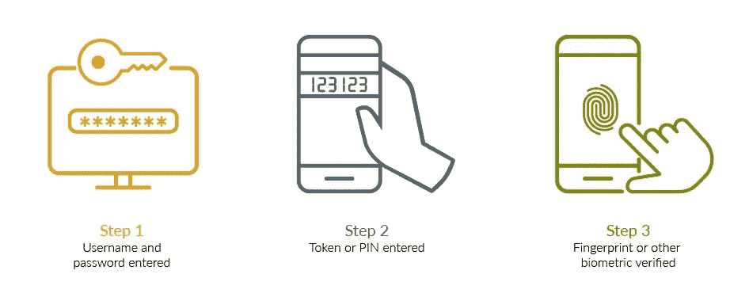
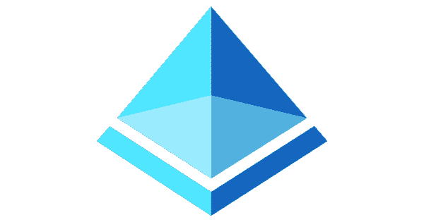
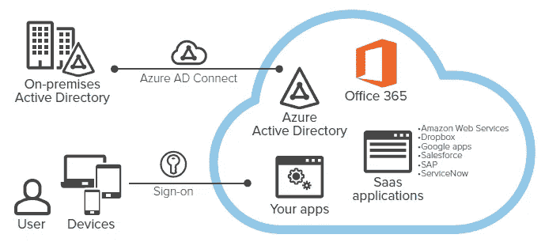
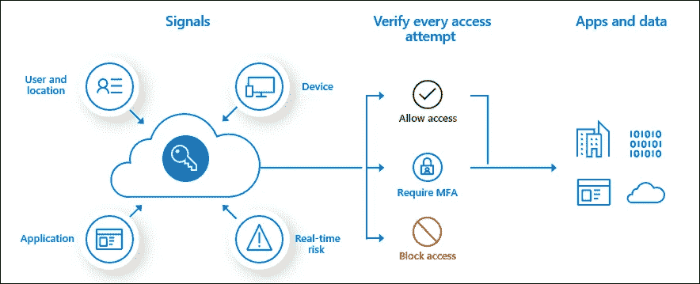

# Azure 活动目录(AAD) 101

> 原文：<https://medium.com/geekculture/azure-active-directory-aad-101-3bd4383bbabe?source=collection_archive---------8----------------------->

Photo by [Franck](https://unsplash.com/@franckinjapan?utm_source=medium&utm_medium=referral) on [Unsplash](https://unsplash.com?utm_source=medium&utm_medium=referral)

大家好！

我目前正在为 AZ-900 考试做准备，最近我学习了其中的 azure 核心身份服务模块。所以我想写一篇关于它的介绍性文章，因为它可能会帮助像我一样准备考试的人或对学习 Azure AD 基础知识感兴趣的人。

# 身份验证与授权

所以在深入之前，首先我们要了解两个关键词*认证*和*授权*的区别。这个你可能已经知道了。但无论如何我会很快解释一下。

因此，识别某人自己的过程被称为**认证。**

比如说如果我告诉你我是卡尔帕尼，就会有人找我证明。我怎么证明呢？也许我可以给你看政府颁发的身份证、护照或驾驶执照。这就是认证。

那什么是**授权**？

基于我已经证明的身份；接下来的问题是，在一个特定的组织或系统中，我能做什么，不能做什么？在 Azure 的上下文中，我可以访问哪些不同的服务以及我不能访问哪些服务，这被称为授权。

Authentication vs Authorization — [https://afteracademy.com/](https://afteracademy.com/)

# 多因素认证

当我登录一个特定的网站，我提供了我的用户名和密码，并认为不知何故密码被泄露。然后有人未经授权的访问和我的密码可以访问其中的数据和服务。

那么，我们如何缓解这个问题呢？那就是我们需要多因素认证的时候( **MFA** )。除了用户名和密码之外，还必须提供身份，可能是他们将在手机上获得的 OTP，或者是通过移动网络进行的电话呼叫。否则，他们可以安装一个移动应用程序，在该应用程序上，他们必须确认自己是正在登录的人。

因此，多因素身份认证需要以下两种或多种身份认证方法:

*   **你知道的东西**，一般是密码。
*   **你所拥有的**的东西，比如不易复制的可信设备。(例如:电话或硬件键)
*   **你是什么样的人**——指纹或面部扫描等生物识别技术。

Multi-Factor Authentication steps — [www.securid.com](http://www.securid.com)

# Azure 活动目录(AAD)

Azure Active Directory logo

现在，让我们看看谁将提供这种身份认证和授权，以及谁将负责这些多因素身份认证功能。在 Azure 中，我们有 Azure 活动目录。我们称之为 Azure 中的身份和访问管理服务。

***认证***

Azure AD 是一个创建用户和配置文件的地方。因此，组织的用户或员工将使用他们的用户名和密码登录。当然，有时可能需要多因素身份认证。然后基于该身份，我们提供对应用程序的访问。

*单点登录*

*同一身份可以跨多个应用程序使用。这个特性叫做单点登录。您只需登录一次，就可以尝试访问所有资源。*

****应用管理****

*正如我之前提到的，将为 Azure AD 创建和配置多个应用程序。这些应用程序可以是企业对企业的应用程序(B2B)。*

*在这里，我们正在构建应用程序，这些应用程序只能由我的组织内的用户使用，或者在某些情况下，由另一个组织的一些用户使用。我可以邀请其他组织的用户作为嘉宾加入我的广告。这意味着在用户身份存在的地方多了一个 AD 租户。但在我的广告里，他将以嘉宾的身份存在。*

*一旦该用户与我的其他用户一起被添加到我的 AD，该特定用户也可以像同一组织内的任何其他用户一样被授予权限。*

*此外，我应该能够为任何用户提供访问，如果他们有某种登录，像可能是脸书登录。如果一个用户有一个脸书帐户，谷歌帐户，或 Twitter 帐户，他们应该能够登录该身份。然后，相应的服务提供商将向我的 Azure AD 提供有关该用户的信息。因此，这些服务被称为 B 到 C，企业到消费者。因此，世界上任何拥有社交媒体账户的人，我们都可以让这些用户访问我们 azure 门户中托管的应用程序。*

****设备管理****

*通过将我们的移动设备或笔记本电脑加入 Azure 租户，我们可以使用 Azure AD 提供设备管理。通过租户，我们可以控制设备。比方说，如果我丢失了我的设备，然后我可以锁定我的帐户。因此，在设备上，没有人可以登录和窃取我的数据。*

*由于我上面提到的所有功能，Azure AD 是使 Azure 更受欢迎的主要和强大的服务之一。*

# *Active Directory 到 Azure Active Directory*

*企业很容易在他们的组织中采用 azure，因为几乎每个组织都有一个*内部活动目录*。这意味着其组织的用户已经在本地 active directory 中。现在，微软所做的是他们提供一个设施，将所有的内部身份信息都整合到 azure Ad 中。如果一个用户存在于本地，相同的用户名和密码也可以添加到 azure 与一些工具，如 Azure AD connect。这是将您的现有广告连接到 Azure AD 的最受欢迎的方式。*

*由此，组织的所有员工都可以使用相同的用户名和密码登录和访问他们本地的应用程序，以及云中的应用程序。这也是单点登录的一种形式。员工的工作效率将会提高，因为他们不必为他们的应用程序记住不同的用户名和密码，这些应用程序是在云中还是在本地。*

**

*Migrating to Azure AD — Mitch Tulloch*

# *条件接收*

*MFA 不是免费服务。因此，我们不希望为所有应用程序和所有用户自动启用 MFA。只有对于某些重要的应用，我们可以启用 MFA。否则，用户应该能够使用一个用户名和密码登录。而这个功能是借助条件接收实现的。*

*条件访问是 Azure Active Directory 使用的工具，用于将信号汇集在一起，以做出决策并实施组织策略。*

*您可以根据特定设备、特定应用程序的 IP 网络范围或位置，仅允许特定用户或群组进行条件访问。甚至你的 Azure 广告也可以做风险检测。*

**

*Conditional Access — Microsoft docs*

*所以，正如你在这张图片中看到的，你可以使用不同的信号。信号通过您正在登录的设备、您的位置、您的凭证、您正在使用的应用程序以及所有实时任务(如使用浏览器等)发出。*

*将检查每一次尝试是否需要多因素身份认证，是否需要阻止或允许该访问。所以，如果这两个条件都通过了，你就可以访问你的应用程序和数据本身。*

*是啊！现在你对 Azure AD 及其核心服务的工作原理有了基本的了解。希望这对你有帮助。😃*

*注意安全！快乐学习！*

# *参考*

* [## Azure 活动目录|微软 Azure

### 关于 Azure AD 的常见问题 Azure AD 有什么新功能？Azure AD 获得持续改进。熬夜到…

azure.microsoft.com](https://azure.microsoft.com/en-us/services/active-directory/#security)  [## Azure Active Directory 中的条件接收是什么？

### 现代安全边界现在已经超出了组织的网络范围，包括用户和设备身份…

docs.microsoft.com](https://docs.microsoft.com/en-us/azure/active-directory/conditional-access/overview)  [## Azure AD 多因素身份验证概述

### 多因素身份认证是一个过程，在此过程中，用户在登录过程中会被提示提供其他形式的…

docs.microsoft.com](https://docs.microsoft.com/en-us/azure/active-directory/authentication/concept-mfa-howitworks)*