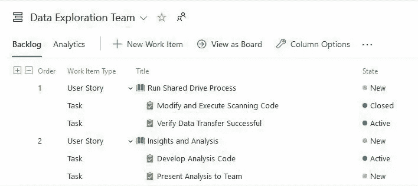

# Azure DevOps:认识“开发者办公室”

> 原文：<https://medium.com/geekculture/azure-devops-meet-the-office-for-developers-2ba06a1cdd77?source=collection_archive---------24----------------------->

Azure DevOps can help keep the team on track

**数据工程师 Lindsay Scott 透露了他的公司如何使用 Azure DevOps 来保持 IT 项目正常进行**

2019 年，一位高级经理第一次向我介绍了微软的 Azure DevOps (ADO)平台，他听到了关于它的好消息，并想知道它是否可以帮助我们团队的数据库升级项目。我们是一个六人 IT 团队，试图升级一个核心 CRM 系统及其…