# Azure 函数:一个带有 Java 中的 BlobInput 的 HttpTriger

> 原文：<https://medium.com/geekculture/azure-function-a-httptriger-with-a-blobinput-in-java-ea6939199e7b?source=collection_archive---------3----------------------->

假设您已经创建了一组教程，并决定将它们托管在 Azure Blob 存储上。现在，您希望经过身份验证的用户能够从他们的个人资料中下载该文件。做了一些调查之后，你决定使用 Azure 函数来为你的网站实现这个下载特性。

在本帖中，我们将关注 Azure 函数并回答以下问题，还将关注一个示例实现:

*   Azure 功能是什么？
*   我们如何设置在本地开发 Azure 功能？
*   如何将我的本地 Azure 功能部署到 Azure cloud？


# Azure 功能是什么？🤔 🤔

Azure Function 是我们编写运行在云中的简单功能的一种方式，我们无需创建和/或配置运行它的基础架构。

> 哦好吧！我明白这些话，但这一切是怎么回事？

现在，假设我们编写代码来执行或响应不同的事件和/或动作——从调用时检索和/或更新数据的 Web APIs 到下载用户已付费的正确文档。

为了满足这一需求，Azure Functions 通过以下方式提供了*按需计算*:

*   通过被称为 ***函数的*代码块*，为我们提供了编写和部署特性逻辑的方法(通过 Azure Portal 和 SDK)。***
*   好了，我们的 ***函数*** 现在已经写好了，[希望]已经测试好了，并且部署好了。现在，当对我们的 ***函数*** 的请求增加时，Azure 函数会根据需要使用尽可能多的资源和 ***函数*** 实例来满足这一需求，以处理增加的请求。同样随着请求的减少，多余的资源和 ***函数*** 实例被移除。

> 我明白了…！那么我可以用什么编程语言来编写我的代码块… ***函数*** ？

我们可以用几种编程语言编写这些函数，包括 Java、C#、F#、Typescript、JavaScript 和其他一些语言。支持语言的完整列表可以在[这里](https://docs.microsoft.com/en-us/azure/azure-functions/supported-languages#languages-by-runtime-version)找到。

在 Java 中，我们使用`@FunctionName`注释创建一个函数。

```
@FunctionName("download")
public HttpResponseMessage downloadFile(...) {
  ...
}
```

> 不错！！！那么，为了更好地理解和编写我的代码块，我需要知道哪些概念… ***函数*** ？

当然，有一些。在本帖中，我们将考虑三个关键的基本概念。

## 功能应用

一个函数 app 提供了一个执行上下文，我们的 ***代码块…函数*** 将在其中运行。考虑到这一点，一个功能可以被认为是我们的 ***功能的一个部署和管理单元。***

值得注意的是，一个功能 app 可以有多个功能一起管理和扩展。

此外，功能应用程序**中的所有功能必须**用相同的编程语言编写，并共享相同的定价计划和部署方法。

## 扳机

记住我们的函数基本上是代码块。现在，这些代码块被包装成 ***触发器*** 以使它们能够运行。

一个 ***触发器*** 指定一个代码块(函数)应该如何运行。一个 ***触发器*** 有与之相关的数据。该数据通常是传递给代码块的有效载荷。

值得注意的是，一个**功能**可以有且只能有一个**触发器**。

一些触发示例包括

*   [***HTTP 触发器***](https://docs.microsoft.com/en-us/azure/azure-functions/functions-bindings-http-webhook) 。每当接收到 HTTP 请求时将运行的函数，基于有效负载或查询字符串进行响应。在我们的例子中，我们将看看这个；
*   [***天蓝色 Blob 存储触发器***](https://docs.microsoft.com/en-us/azure/azure-functions/functions-bindings-storage-blob) 。将 blob 添加到指定容器时将执行的函数；
*   [***定时器触发***](https://docs.microsoft.com/en-us/azure/azure-functions/functions-bindings-timer?tabs=java) 。将按给定的时间表执行的功能；
*   [***发送网格***](https://docs.microsoft.com/en-us/azure/azure-functions/functions-bindings-sendgrid?tabs=java) 。一个功能，将发送确认电子邮件时，新的项目被添加到一个特定的队列；
*   [***天蓝色宇宙 DB 触发器***](https://docs.microsoft.com/en-us/azure/azure-functions/functions-bindings-cosmosdb-v2) 。每当文档集合中的文档发生变化时将执行的功能。

关于触发器的更多细节可以在 ***下的 ***触发器和绑定*** 部分找到，参考*** [这里](https://docs.microsoft.com/en-us/azure/azure-functions/)

```
@FunctionName("download")
public HttpResponseMessage downloadFile(
             @HttpTrigger(
              name = "request",
              methods = {GET},
              authLevel = ANONYMOUS)
              final HttpRequestMessage<Optional<String>> request,
              final ExecutionContext context) {
     ...
}
```

## 粘合剂

这是将我们的功能连接到另一个资源(或服务)的一种方式。绑定可以是输入、输出或两者都是。

来自绑定的数据通过参数传递给我们的函数。

更多关于 Azure 函数支持的绑定可以在[这里](https://docs.microsoft.com/en-us/azure/azure-functions/functions-reference#bindings)找到。

> 在我们的例子中，我们将研究如何在函数中将 Blob 存储作为输入绑定进行传递。

下面是我们如何将 blob 存储注释为输入绑定

```
public HttpResponseMessage downloadFile(
        @BlobInput(
                name = "file",
                dataType = "binary",
                path = "java-functions-container/test.png",
                connection = "AzureWebJobsStorage")
                byte[] content,
        final ExecutionContext context) {
          ...
 }
```

## function.json 文件

这是一个强制文件，其中包含函数的定义，如触发器、绑定(输入、输出或两者都有)以及其他配置设置。

值得注意的是

*   运行时使用这个配置文件来确定要监视什么事件，数据应该如何传递给函数内的参数，以及在执行函数时应该返回什么数据；
*   在编译语言中，这个文件是从代码的*块中使用的注释自动生成的。在脚本语言中，这个文件必须在我们的*代码块中提供。**

对于我们的示例，function.json 文件的内容如下所示

```
{
  "scriptFile" : "../java-azure-function-1.0.0-SNAPSHOT.jar",
  "entryPoint" : "dev.etimbuk.functions.FileDownloadHttpTriggerFunction.downloadFile",
  "bindings" : [ {
    "type" : "httpTrigger",
    "direction" : "in",
    "name" : "req",
    "methods" : [ "GET" ],
    "authLevel" : "ANONYMOUS"
  }, {
    "type" : "blob",
    "direction" : "in",
    "name" : "file",
    "path" : "java-functions-container/{filename}",
    "dataType" : "binary",
    "connection" : "AzureWebJobsStorage"
  }, {
    "type" : "http",
    "direction" : "out",
    "name" : "$return"
  } ]
}
```

# 怎么会？

既然我们已经看了函数，它们如何成为一个函数 app，什么是触发器和绑定，那么让我们考虑如何创建、编写和部署一个 Java 函数 app 到 Azure 云平台。

在开始之前，让我们先了解一下这个例子需要什么工具，并理解在定义一个基于 Java 的 Azure 函数时使用的注释，这个函数带有一个 HTTP 触发器和一个 Blob 存储输入绑定。

## 工具⚙️ ⚙️

*   命令行界面。
*   [***蔚蓝 CLI***](https://docs.microsoft.com/en-us/cli/azure/) 。这必须安装在本地，使我们能够连接(或登录)到我们的 Azure 订阅，并将我们的功能应用程序部署到 Azure 平台。之所以需要，是因为在撰写本文时，我们还不能从 Azure 门户网站编辑编译过的语言；
*   [***Azure 功能核心工具***](https://docs.microsoft.com/en-us/azure/azure-functions/functions-run-local?tabs=macos%2Ccsharp%2Cbash#v2) 。这个基于 CLI 的工具允许我们在本地计算机上开发和测试我们的功能。
*   Java 8 或 11 **必须**安装在您的本地环境中，并且`JAVA_HOME`环境变量**必须**被设置
*   Gradle 或 Maven 构建工具。
*   一个 IDE。目前，针对 IntelliJ(本文使用的 IDE)、Eclipse、Visual Studio 代码和 Visual Studio (C#人员)的 Azure 函数工具已经存在。
*   [***邮递员***](https://www.postman.com/downloads/) 。这是一个可选工具，我们用它来测试我们的 HTTPS 请求。这是可选的，因为你选择你喜欢的选项。

## 一些函数注释…

**@函数名。**这个注释用于告诉 Azure functions 工具在部署到 Azure 平台时被注释的函数的名称。对于 HttpTriggers，这基本上定义了我们的端点。

从 Azure 门户来看，这将类似于我们给出的示例中的`https://{YOUR_HOST/api/download}`。

**@HttpTrigger。**该注释应用于 Azure 函数，调用该函数指定的 HTTP 端点将触发该函数。

回忆一下我们的`FunctionName`定义的终点…

**@BlobInput。**我们对其值来自 blob 的参数使用此注释。参数类型可以是下列类型之一:

*   任何原生 Java 类型如 int、String、byte[]；
*   可空值使用可选的<t>；或者</t>
*   任何 POJO 类型。

# 一个例子💃 🕺

唷！！！文字说够了，现在我们来看看我们的例子。

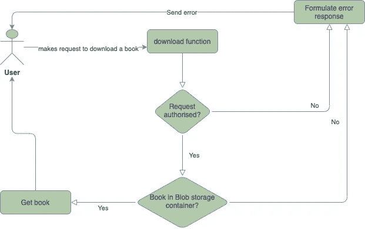

## 一份简报

在我们的例子中，有一个用户(或另一个服务)点击我们的 API(一个 Azure 函数)来下载一个文件。

*   当请求被授权时，该函数访问 Blob 存储(链接到它)以检索文件；
*   如果文件可以从存储容器中获得，这将作为对用户的响应发送回来。否则，将返回一个适当的错误。

## 正在创建 Azure 函数…

创建 Azure 函数有多种方法，在这篇文章中，我们将关注如何使用 IntelliJ IDE 和 Azure Toolkit 插件，这些插件与 Gradle 命令一起安装，因为我们的示例将侧重于 Java。

所以让我们开始吧…

## 使用 IntelliJ

在这里，我们使用图示视图来浏览创建带有 HTTP 触发器的 Azure 函数的步骤

*   打开 IntelliJ IDE 后，选择 ***文件>新建>项目…***

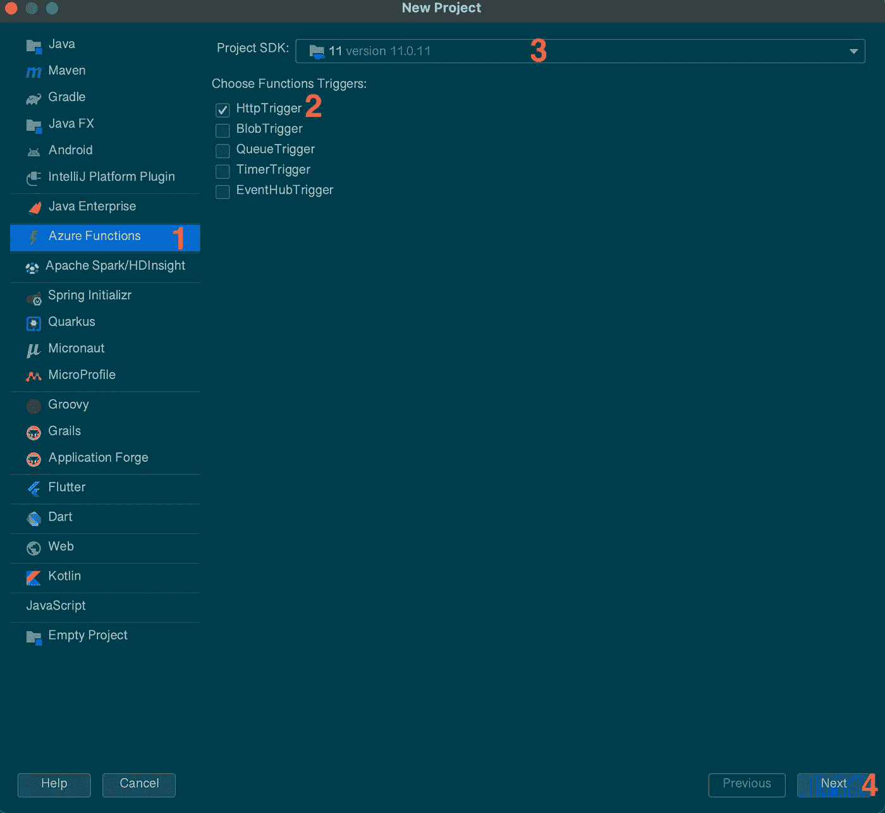

Viewing having clicked ***File > New Project*** in IntelliJ

*   当从上面的视图中点击步骤 4 时

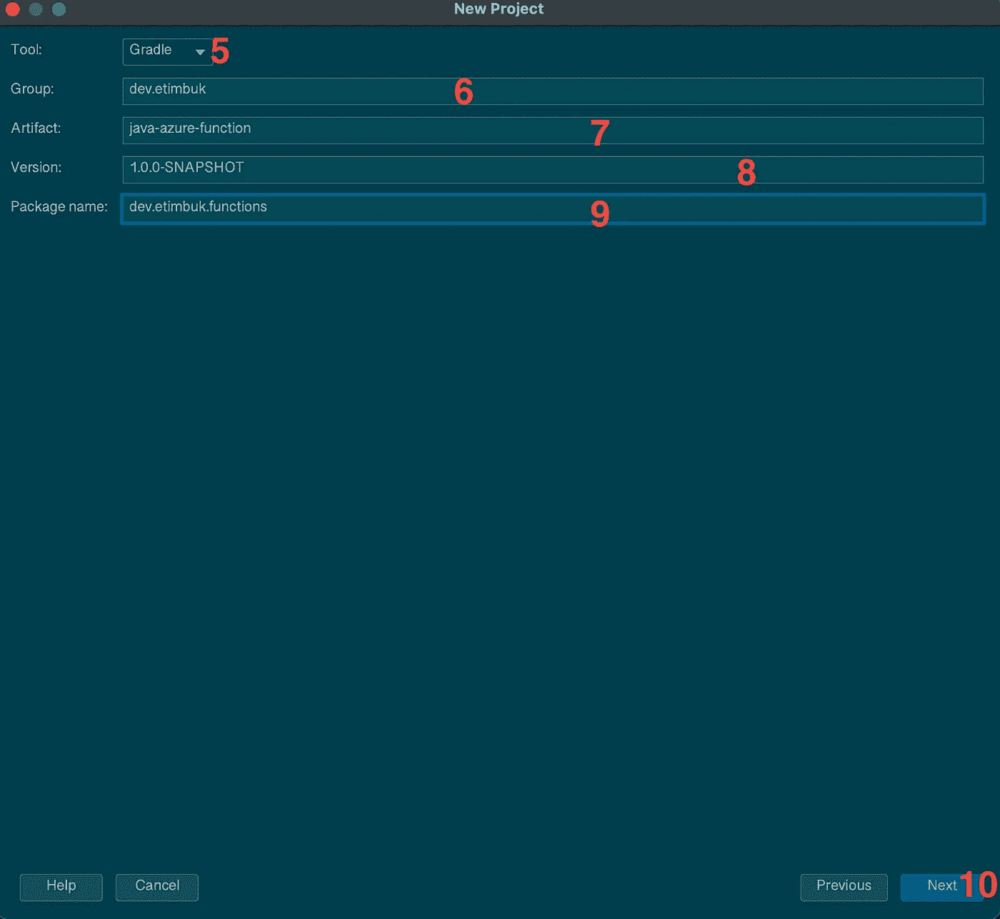

In this post, we are using Gradle as our Build tool

当从上面的视图中点击步骤 10 时

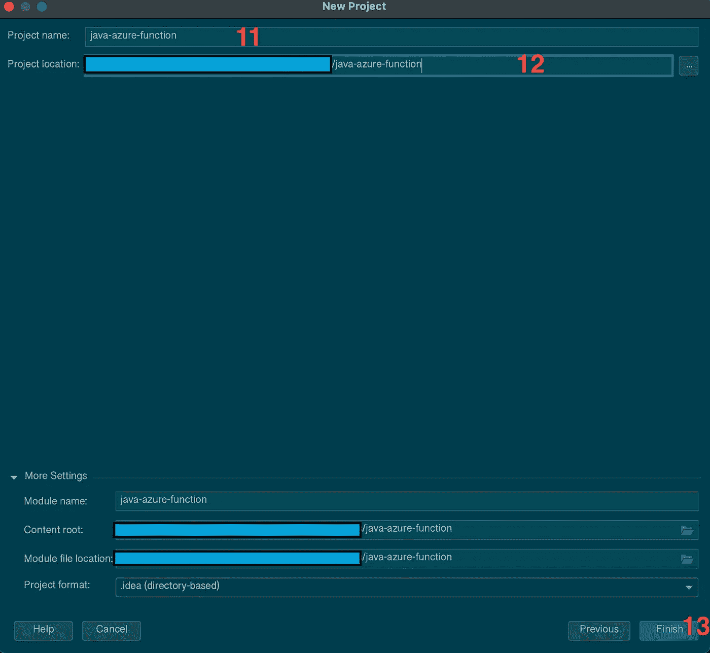

Naming our project.

一旦生成了新的 Azure function 项目，您应该会看到下面的结构

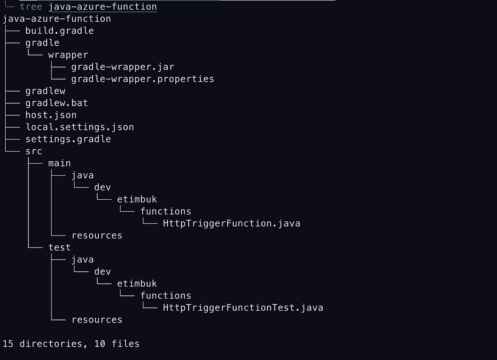

java-azure-function project structure

现在我们已经为自己生成了第一个 Azure function 项目，让我们仔细看看我们的`build..gradle`文件中的`azurefunction`配置。

```
azurefunctions **{** *subscription = '<your subscription id>'* resourceGroup = 'eau-java-functions-rg'
    appName = 'java-azure-function-de5a' *// please rename the function name* pricingTier = 'Consumption' region = 'westus'
    runtime **{** os = 'windows'
      javaVersion = '11'
    **}****}**
```

此`azurefunctions`配置允许我们指定功能应用程序所需的不同设置，包括

*   `appName`。这是我们函数的名称，在 Azure 平台上必须是唯一的，并且必须为**和**提供一个值。为了在这篇文章中获得一个独特的值，我使用了`echo java-azure-function-$(openssl rand -hex 3)`，然后复制了 echo-ed 值；
*   `resourceGroup`。这些必需的设置设置我们的函数将运行的 Azure 资源组；
*   `region`。这个可选的配置在 Azure 中设置我们希望我们的功能部署到的区域。如果未提供，这将默认为`westus`
*   告诉 Azure 我们希望我们的功能部署在哪个操作系统上
*   `runtime.javaVersion`这告诉我们应该使用哪个 java 版本。在撰写本文时，支持的 java 版本是 8 或 11。虽然是可选的，但我建议添加 as，如果没有它，我们的函数会超时，并出现类似下面的错误

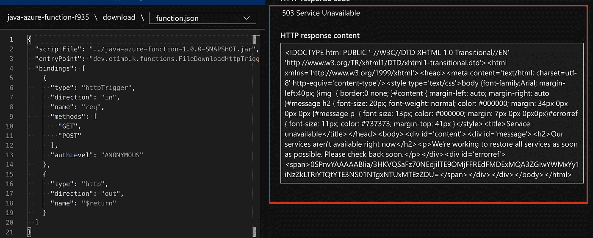

Error when java version not given in appSettings config

更多配置选项可在[这里](https://github.com/microsoft/azure-maven-plugins/wiki/Azure-Functions:-Configuration-Details)找到。

## 代码

最后，我们现在来看看并理解允许我们创建一个带有 ***blob 输入*** 绑定的 ***HTTP 触发器*** 的代码。

如果您在安装了 Azure 插件的情况下使用 IntelliJ 创建了 HTTP 触发器，那么您将会得到类似于

## 只是 HttpTrigger…

在我们测试和部署这个基本的 HTTP 触发器之前(还没有 blob 输入！)，我们将尝试并理解它实际上在做什么

*   首先是我们的函数被命名为`download`。这是使用`@FunctionName`注释完成的；
*   其次是在`@HttpTrigger`中使用的方法。

```
**name.** This is used in the function code for the request or request body;**methods.** This basically uses the http methods. In our example we are saying our function supports both GET and POST methods;**authLevel.** Determines what keys (authorisation), if any, need to be present on the request in order to invoke the function. The authorisation level can be one of the following values:- *ANONYMOUS*: No API key is required.
- *FUNCTION:* A function-specific API key is required. This is the default value if none is provided.
- *ADMIN:* The master key is required.
```

*   第三，我们的函数获取一个查询参数(name)或主体(在 JSON 中带有 name ),并返回带有来自 ***名称的值的`Welcome,`。*** 如果没有提供名称，它会返回 404 错误消息。

现在，让我们在本地测试我们的功能，部署并确保它按预期工作。

为了进行本地测试(当部署时)，我们需要从命令行运行以下两个命令

*   `gradle jar --info`。这将构建一个 jar 文件。作为构建 jar 文件的一部分，`--info`选项为我们提供了所发生的事情的细节；
*   `gradle azureFunctionRun`。这将使我们能够在本地测试 HTTP 触发器。这将启动我们在`[http://localhost:7071/api/download](http://localhost:7071/api/download)`的功能

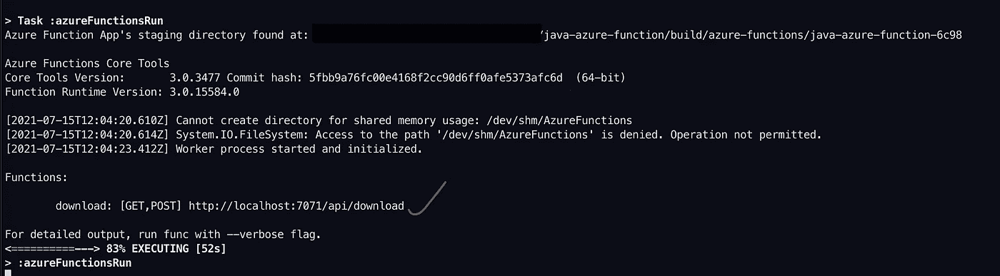

Running our function locally

*   接下来，我们将测试我们的函数，以确认它工作正常。

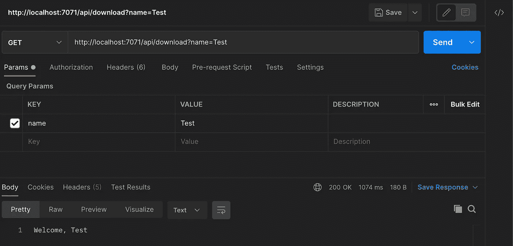

Testing our function locally

最后，我们将部署到 Azure 平台并进行测试。为此，我们将运行以下命令

*   `az login`。这是为了确保我们登录到我们的 Azure 订阅；
*   `gradle azureFunctionDeploy`。这将使用凭证`az login`来部署我们的功能。一旦部署，这将自动创建

```
**Resource group.** Named with the resourceGroup we supplied.**Storage account.** This is required by Functions. The name is generated randomly based on Storage account name requirements.**App Service plan.** Serverless Consumption plan hosting for your function app in the specified *region*. The name is generated randomly.**Function app.** A function app is the deployment and execution unit for your functions. The name is your *appName*, appended with a randomly generated number.
```

在我们考虑`@BlobInput`之前，我们需要在我们的存储帐户中创建一个容器(更像是一个文件夹)来存储我们的文件。

## 在我们的存储帐户中创建一个容器

我知道…我知道，您在问我如何找到新创建的存储帐户的名称😄

我们有两个选择

*   登录我们的 Azure 门户订阅；或者
*   使用我们作为先决条件的一部分安装的 Azure CLI。在这篇文章中，我们将选择这个选项🙄 🙄

让我们开始吧…

*   首先，我们需要获取我们的功能应用程序设置。这将被下载并更新`local.settings.json`文件。我们可以通过跑步做到这一点

```
func azure functionapp fetch-app-settings **FUNCTION_NAME** --show-keys
```

*   现在我们可以打开我们的`local.settings.json`文件，我们的存储帐户可以在`AccountName`的值中找到

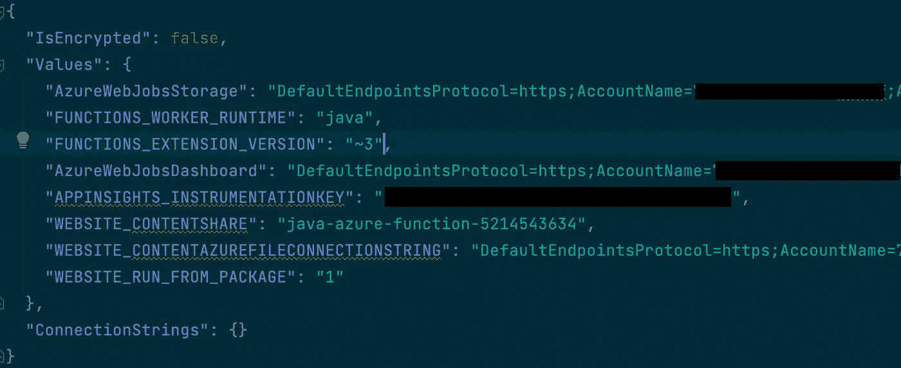

Locating storage account name

*   接下来，我们执行下面的命令来创建容器

```
az storage container create --account-name $AZURE_STORAGE_ACCOUNT --account-key $AZURE_STORAGE_KEY -n java-functions-container -g eau-java-functions-rgwhere
**AZURE_STORAGE_ACCOUNT** - Is our storage account name saved in an environment variable**AZURE_STORAGE_KEY** - Is our storage account key value saved in an environment variable. This is the value from ***AccountKey*** found in local.settings.json
```

*   然后我们上传一张图片到我们新创建的`java-functions-container`容器中。为此，我们将使用 Azure 门户

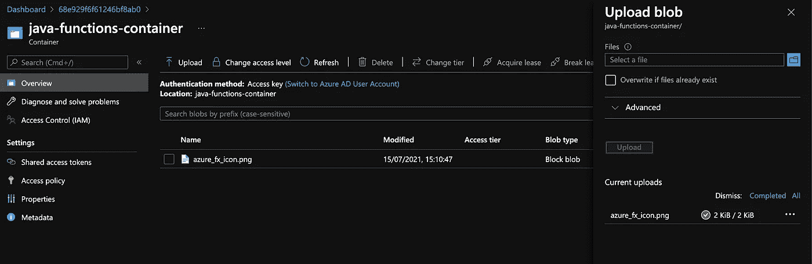

Uploading a file to java-functions-container from Azure portal

## 现在，HttpTrigger 和 BlobInput 都…

HttpTrigger and BlobInput

现在我们已经将`@BlobInput`添加到组合中，我们将通过重新部署它来进行更新。

要更新我们的功能，我们只需再次运行`gradle azureFunctionDeploy`。

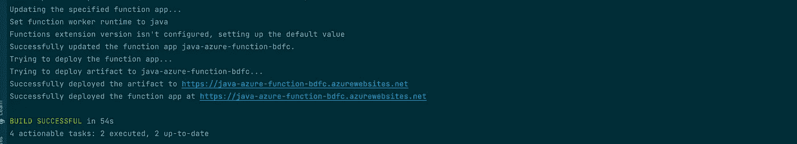

Updating our function

现在让我们确认我们可以下载/查看我们的文件。

*   我们将需要我们的函数链接，这可以通过运行

```
func azure functionapp list-functions java-azure-function-5214 --show-keys
```

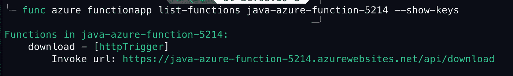

Details of our java-azure-function-5214 function

*   使用 Postman 发出一个 GET 请求

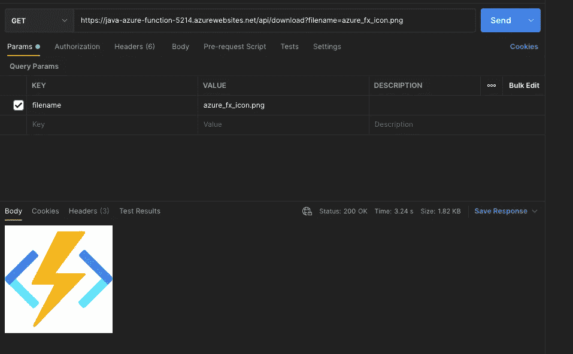

到目前为止，我们已经看了

*   什么是 Azure functions 及其基本概念；
*   在我们的本地环境中开发了一个基本的 HttpTrigger 函数，并在本地进行了测试；
*   使用 Gradle 构建工具部署到 Azure 平台；
*   向我们的 HttpTrigger 添加了一个 BlobInput 绑定；
*   更新了我们在 Azure 平台上的功能；和
*   对此进行了测试，以确认我们可以查看该文件。

再次感谢你坚持到底，按照传统，这篇文章的代码可以在 [GitHub](https://github.com/Gogetter/azure-blog-posts/tree/main/java-azure-function) 上找到。

在我们走之前，清理我们的资源是值得的，这样我们就不会产生任何计划外的成本。这可以通过运行以下命令来完成

```
az group delete --name eau-java-functions-rgThis will delete all resources created in our eau-java-functions-rg resource group which was used in this post.
```

在那之前…