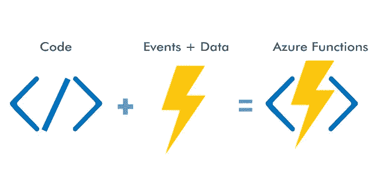
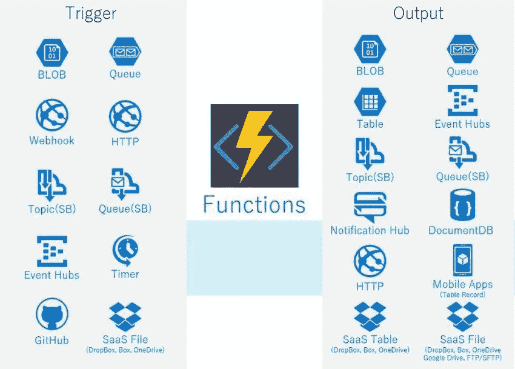

# Azure 函数

> 原文：<https://medium.com/geekculture/azure-functions-45369498a498?source=collection_archive---------14----------------------->

Azure Functions 是 Azure 提供的无服务器计算解决方案，允许用户运行事件触发的代码。在这种情况下，无服务器意味着用户不必担心配置、管理和扩展任何服务器，因为这是由云提供商处理的功能。

开发人员只需将他们的代码与所有合适的运行时环境一起打包到容器中，也就是说，将应用程序成功执行所需的所有文件打包到容器中。然后部署这些容器，在这种情况下，无服务器计算服务 Azure Functions 会根据需求做出响应，并根据使用水平进行伸缩。

Azure Functions 是一个基于触发器的服务，一个脚本、代码或一组指令基于触发该功能的任何事件运行，这有效地实现了按需计算。Azure 提供了几个易于实现的触发器模板，例如:

*   ***CosmosDBTrigger***—处理 Azure CosmosDB 流程，例如新的文档条目和更新已经存在的文档项目，以进行记录更改和删除。
*   ***TimerTrigger*** —负责批量数据处理操作或按照定义的时间表运行编排好的任务。这在 ETL 过程和处理按照定义的时间表变化的数据时特别有用。
*   ***HTTPTrigger*** —使用 API 相关事件通用的 HTTP 请求触发代码执行。web 应用程序的 API 端点是通过 HTTPTrigger 实现的。
*   ***Queue trigger***—与 Azure 存储队列集成，并在消息到达队列时做出响应。
*   ***blob trigger***—处理与 Azure blob 相关的操作，例如向容器添加 blob，以及管理其他进程，例如向 blob 追加内容。
*   ***eventhub trigger***——与 Azure Event Hub 协同工作，处理通过物联网用例或其他数据流实现交付的事件。
*   ***ServiveBusTopicTrigger***—负责将代码连接到其他 Azure 服务，甚至是内部服务，在这些服务中可以实现上面列出的其他触发器。

在 Azure 函数中创建自定义触发器是可能的，然而，上面的触发器涵盖了大多数的用例。对于更复杂的实现，可能会有使用多个 Azure 函数的架构，这些函数使用多个触发器。

Azure 函数的一般设置遵循如下 5 个步骤:

*   开发者用 Azure 函数支持的语言创建一个函数。拥有 Microsoft Azure SDK 的所有语言都支持这一点。
*   然后，开发人员上传带有所有相关运行时环境信息的函数。
*   Azure Functions 然后将函数容器化。
*   然后，Azure Functions 基于函数中的代码需要访问/利用的服务来构建触发器。
*   Azure 函数在触发器被执行时运行，并负责根据需要放大和缩小。

Azure 函数在 Azure 栈中扮演着重要的角色，对于希望开发更多无服务器解决方案的组织来说，它是一个很好的资源。提供的各种触发器使它能够在认证服务、API 创建和连接其他 Azure 服务中有用例。