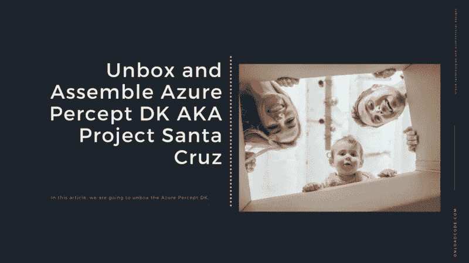
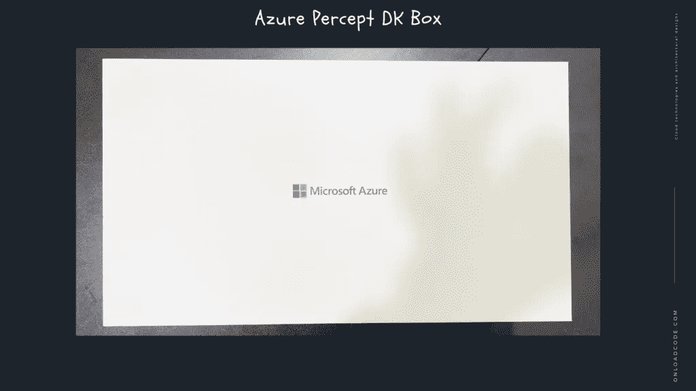
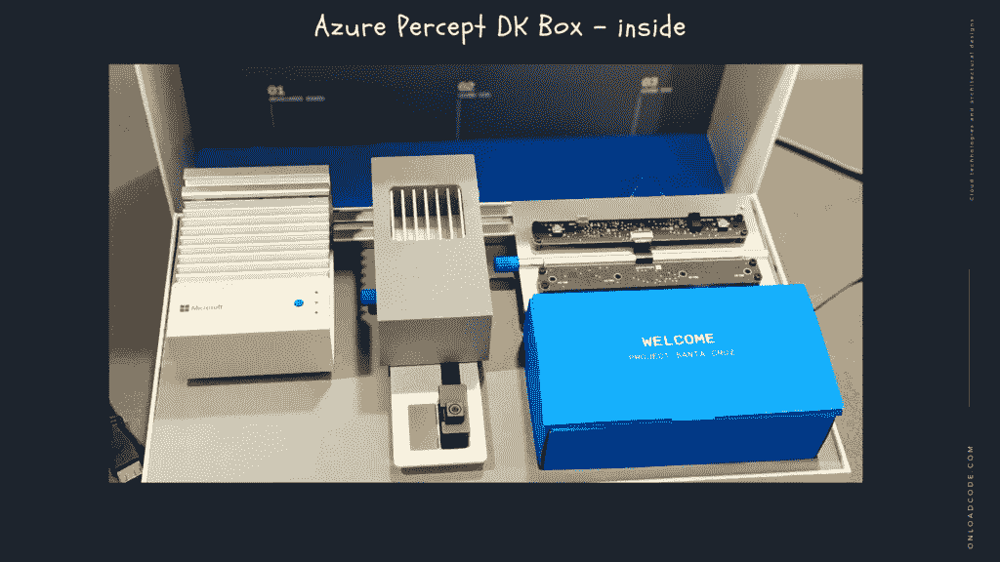
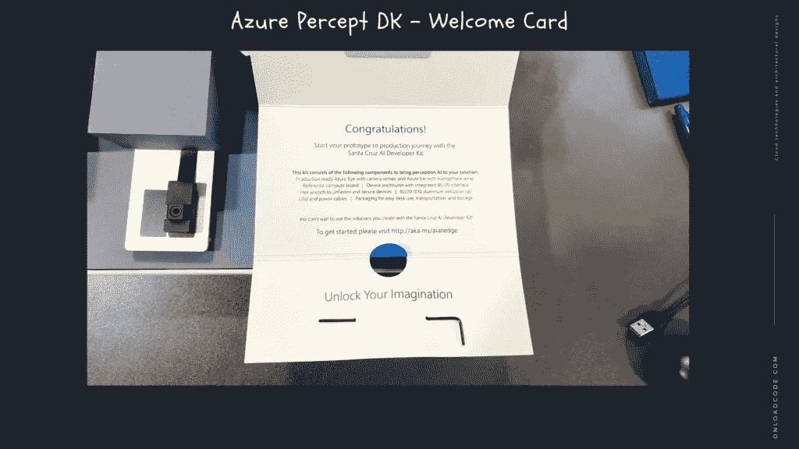
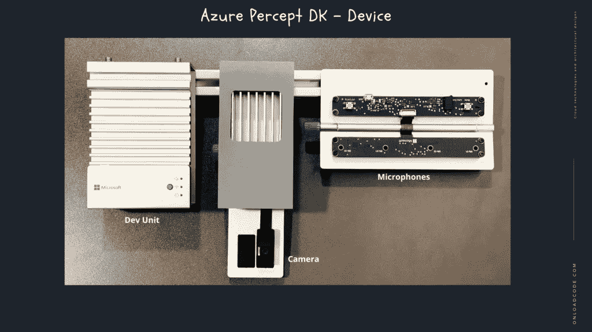
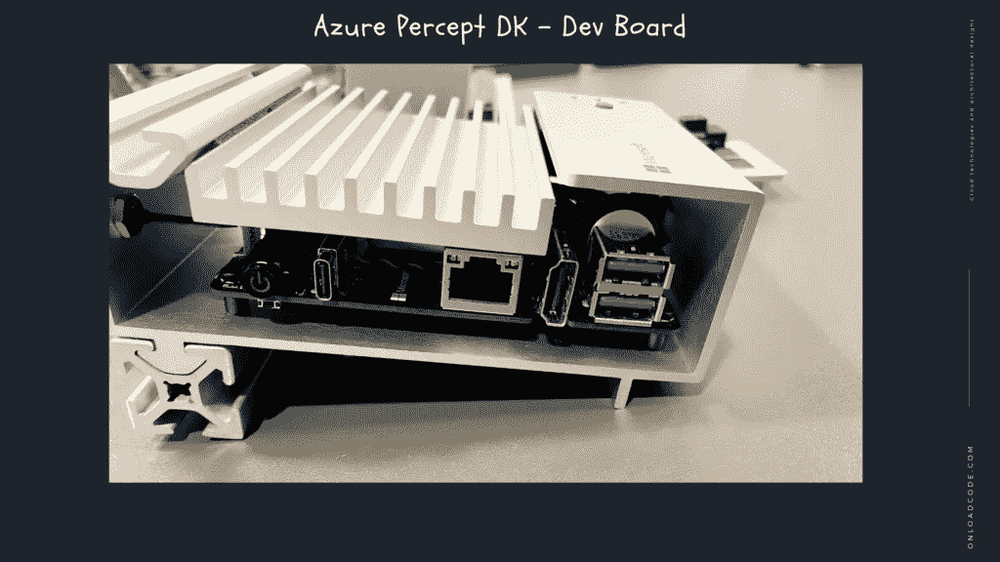
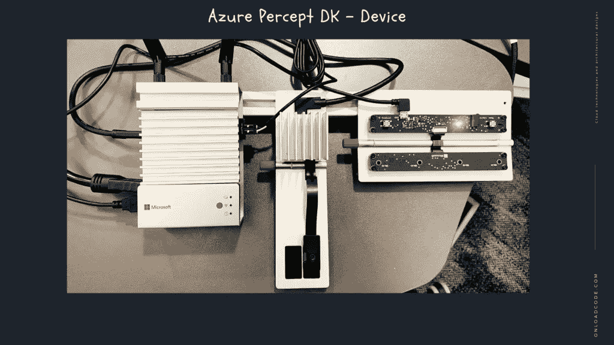

# Azure Percept DK 又名项目圣克鲁斯-拆箱和组装

> 原文：<https://medium.com/geekculture/azure-percept-dk-aka-project-santa-cruz-unbox-and-assemble-2a9fc03c79fe?source=collection_archive---------38----------------------->

在本文中，我们将对 Azure Percept DK 进行拆箱。

# 什么是 Azure Percept？

Azure Percept 是一个全面、易用的平台，为创建边缘人工智能解决方案增加了安全性。它是硬件、软件和服务的组合，旨在通过在边缘使用物联网和人工智能来加速业务需求。Azure Percept 覆盖了从芯片到服务的全栈，以解决大规模边缘 AI 的集成挑战。

# 什么是 Azure Percept DK？

华硕的 Azure Percept DK 是一个试点开发套件，带有载板、安装工具和 Azure Percept Vision，这是一个支持相机的模块上系统(SoM ),用于快速基于场景的定制。Azure Percept Vision 增加了摄像头和视觉功能，针对工业和零售环境进行了优化，以增强货架库存分析、人员和对象检测以及丢失预防等用途。这款开发套件与 Azure AI、Azure 机器学习和 Azure 物联网管理服务深度集成，开箱即用。

# 硬件组件规格

*   恩智浦 iMX8m 处理器
*   可信平台模块(TPM)版本 2.0
*   Wi-Fi 和蓝牙连接
*   英特尔 Movidius Myriad X (MA2085)视觉处理单元(VPU)
*   RGB 摄像头传感器

让我们开始吧…

# 结论

感谢您阅读文章**Azure Percept DK AKA Project Santa Cruz—拆箱并组装**。在下一篇文章中，我们将尝试在一些边缘计算的演示场景中使用它。

*原载于 2021 年 6 月 20 日*[*【https://onloadcode.com】*](https://onloadcode.com/azure-percept-dk-aka-project-santa-cruz-unbox-and-assemble/)*。*