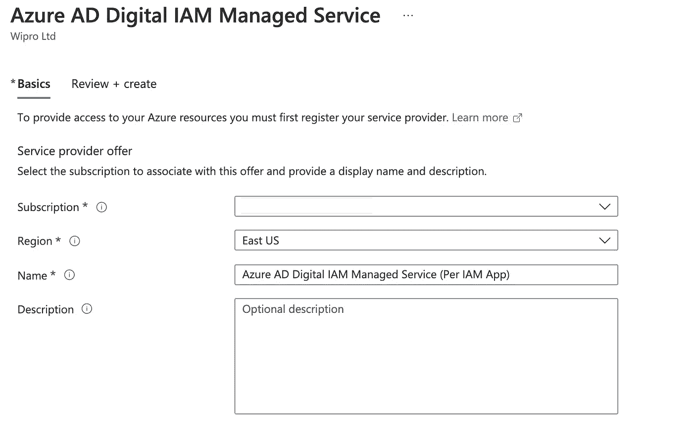
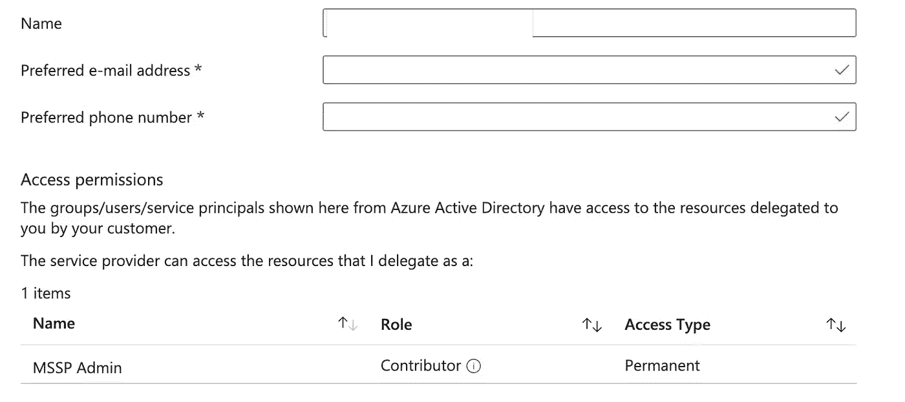
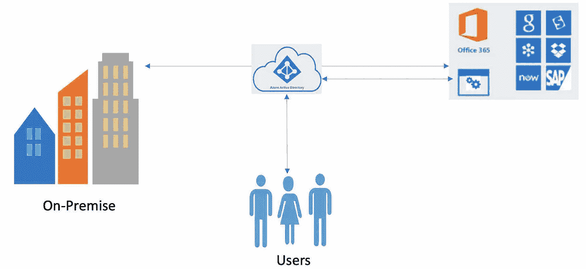
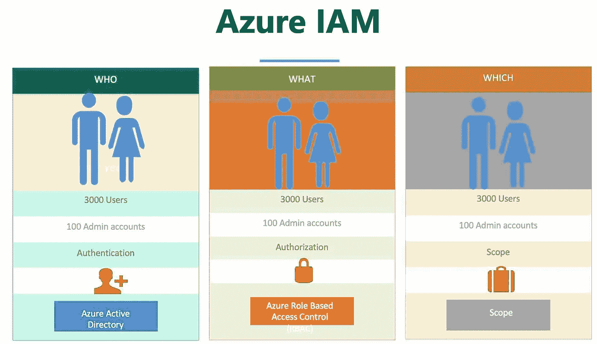
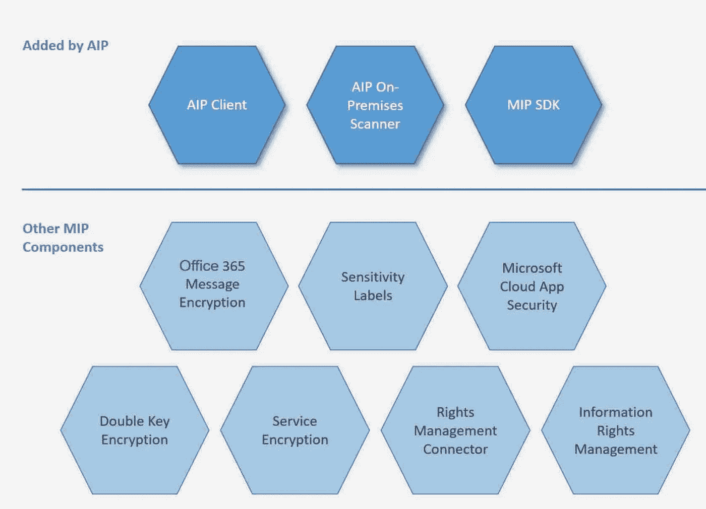
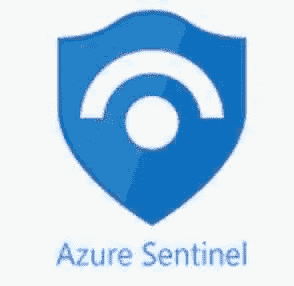
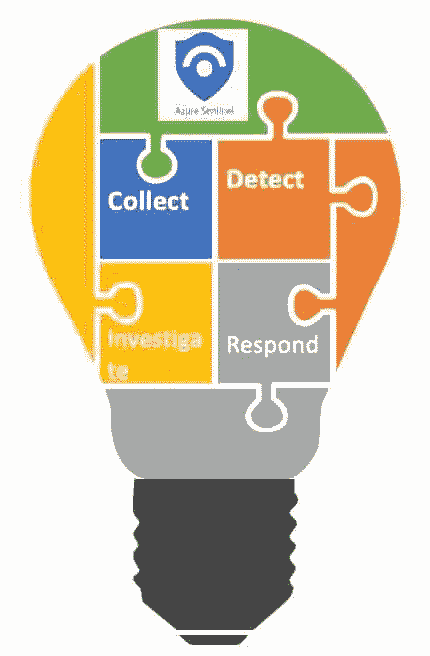
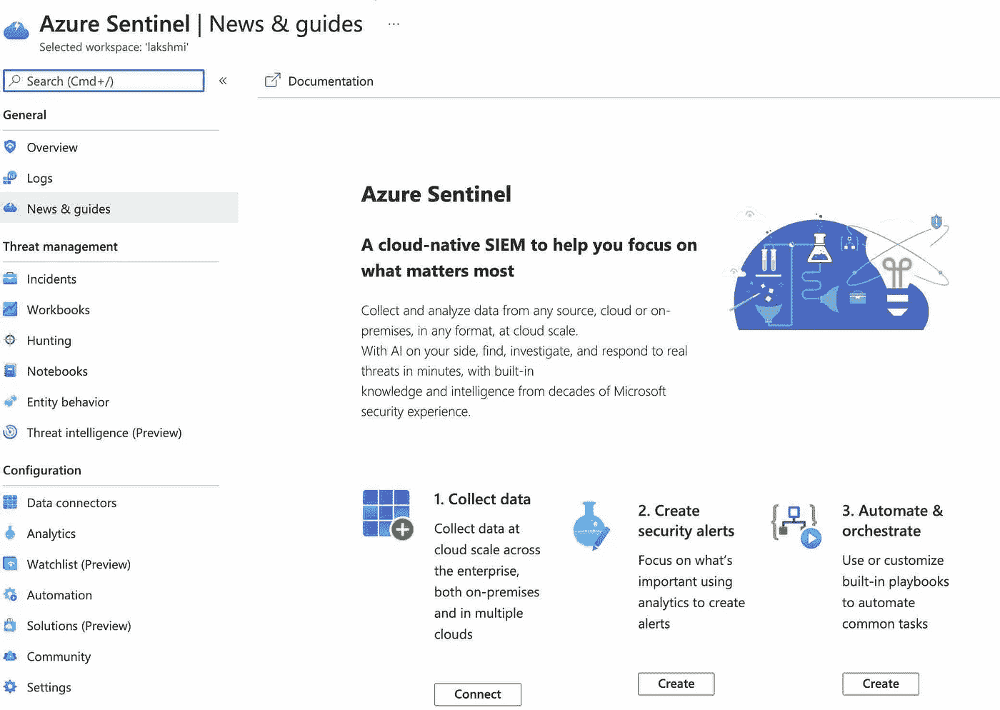

# Azure 系列#1:安全层-1。身份和登录

> 原文：<https://medium.com/geekculture/azure-series-1-security-layer-1-identity-login-a39feeccd610?source=collection_archive---------14----------------------->

身份和登录本质上是任何服务器或系统的入口点。Azure 提供了一个复杂的 IAM(身份和访问管理),但是用户也有责任确保密码和密钥被设置为所需的难度级别并得到很好的保护。我们不希望身份假冒或黑客攻击/错误的用户进入我们的系统。Azure 中的 IAM 是通过 Azure Active Directory 实现的。

***身份&登录核心服务:*** IAM — Azure AD、AIP、Azure Sentinel &身份治理。

***截图:***

Reference: Microsoft Azure

Essence: For who; Do What

## Azure 活动目录:

***什么是 Azure AD:***

它是微软 Azure 中基于云的身份和访问管理服务。为了访问这些资源，最重要的第一步是登录帐户。

*Azure AD 由*使用

1.  IT 管理员
2.  应用开发人员
3.  DevOps
4.  微软在线(微软 365、Office 365、Azure、Dynamics CRM 等。)

*与 Azure 许可证相关的*

下面是一些可用的 Azure 许可证，组织可以根据需要使用它们。根据许可的服务，除了免费服务外，还将启用额外的保护/风险覆盖。这些功能中的大多数都是现收现付(PAYG)功能许可证。

*   Azure 免费和高级广告
*   Azure 广告安全
*   Azure AD Connect 健康
*   Azure 广告连接
*   Azure AD 身份保护
*   Azure 广告身份安全得分
*   Azure AD 身份验证方法
*   Azure AD 条件接收
*   Azure 广告风险用户
*   Azure AD 有风险的登录
*   Azure 广告风险检测
*   Azure AD 命名位置
*   Azure AD 密码保护
*   Azure AD 特权身份管理
*   创建自定义 Azure 广告角色
*   Azure 广告 B2C
*   多因素认证(MFA)

***工作原理:***

Azure AD 需要创建管理员帐户和所有关联的 Azure AD 功能。组织应该始终遵循保守的最低权限方法来访问所有用户。Azure IAM (Azure AD)执行三项关键任务

**认证**:登录/注册外部资源、微软 365、Azure portal 等 SaaS 应用。

**授权**:检查访问 Azure 资源的权限

**作用域/自定义角色定义:**在该可访问的资源中，允许的作用域/所有操作是什么。

Azure IAM has 3 components

一旦用户被创建并依赖于已被许可的内容，Azure AD 将启用以下功能

*   应用管理
*   证明
*   混合身份
*   身份治理
*   面向开发者的 Azure 活动目录
*   企业对企业—来宾用户管理
*   企业对消费者—定制和控制管理
*   条件接收
*   域服务
*   特权身份
*   报告和监测

# Azure 信息保护(AIP):

Azure 信息保护(AIP)使组织能够(1)分类(2)发现(3)保护云上组织的信息资产，并且您可以将标签应用到这些资产。它是微软信息保护解决方案(MIP)的一部分。

Reference: [Azure](https://docs.microsoft.com/en-us/azure/information-protection/what-is-information-protection)

还有一个 AIP 内部部署扫描器，它可以扫描内部部署信息资产。它可以使用 PowerShell 或使用 Azure portal 或 MIP SDK 安装。

# 蔚蓝哨兵报

Azure Sentinel 是基于云的

*   安全协调自动化响应(SOAR) &
*   安全信息事件管理(SIEM)解决方案。

它还可以在您的整个组织中执行高效的(1)安全分析(2)威胁情报，并为与威胁相关的主动识别和响应提供单一窗口解决方案。它使您能够从云中收集任何来源的数据。

*   **收集 Azure 提供的所有设备和服务/产品的**数据、内部部署数据甚至是多重云数据。
*   **主动检测**之前未检测到的所有威胁，并改进威胁情报。
*   **调查** —使用 AI/ML 获得更好的分析并捕获可疑/恶意活动。
*   **更快速地对任何网络威胁事件做出**响应。

Reference: Azure Sentinel screenshot.

Azure Sentinel 有助于改进身份治理。

**母篇** : [天蓝色多部系列。](/geekculture/azure-series-multi-part-series-on-azure-cloud-and-related-guidelines-f40128ac3037?source=your_stories_page-------------------------------------)