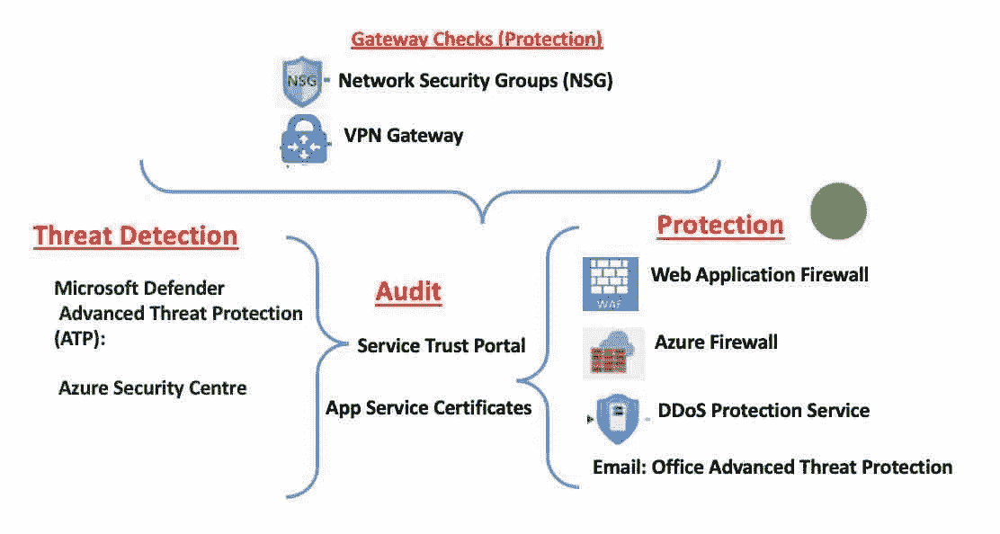

# Azure 系列#1:安全层-2。网络保护

> 原文：<https://medium.com/geekculture/azure-series-1-security-layer-2-network-protection-4cf02123a2d6?source=collection_archive---------46----------------------->

这篇文章是 Azure 系列文章的一部分。文章的上一部分— [Azure 系列#1:安全层— 2。网络—威胁检测](/geekculture/azure-series-1-security-layer-2-network-threat-detection-ed3b5bfbb3e7?source=your_stories_page-------------------------------------)。

# 保护:

## Web 应用程序防火墙:

Azure Web 应用程序防火墙(WAF)为 Azure 应用程序提供集中保护…