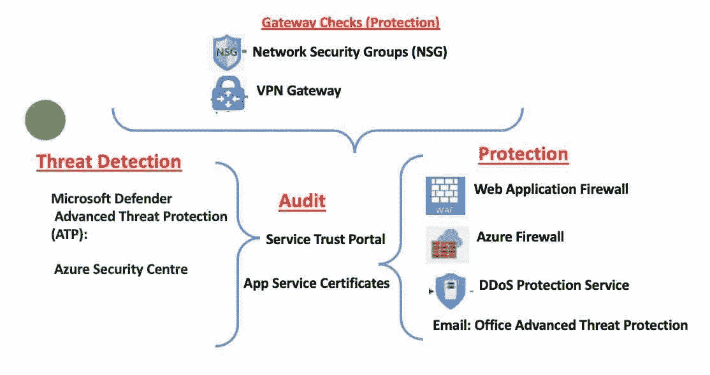

# Azure 系列#1:安全层-2。网络—威胁检测

> 原文：<https://medium.com/geekculture/azure-series-1-security-layer-2-network-threat-detection-ed3b5bfbb3e7?source=collection_archive---------55----------------------->

这篇文章是 Azure 系列文章的一部分。文章的上一部分— [安全层，网络—网关检查](https://luxananda.medium.com/azure-series-1-security-layer-2-network-gateway-checks-f01f50db8bc0)。

# 检测:

## Microsoft Defender 高级威胁防护(ATP):

*SQL 可承诺量:*