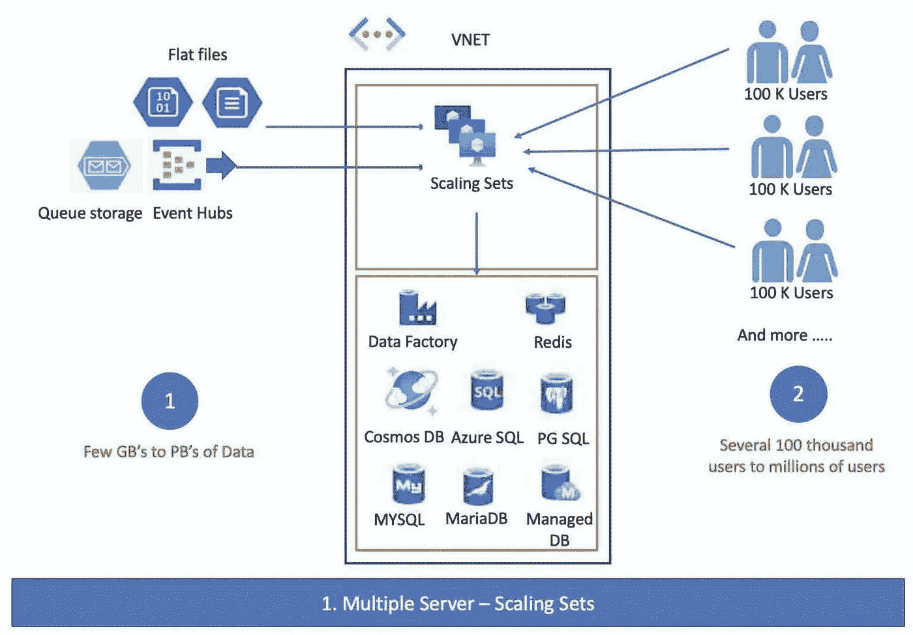

# Azure 系列#2:多可伸缩部署(核心基础设施)

> 原文：<https://medium.com/geekculture/azure-series-2-multi-scalable-deployment-core-infrastructure-ec2c05bf28cd?source=collection_archive---------18----------------------->

在前面的[章节中，我们介绍了单服务器部署的核心基础设施。我们讨论的所有内容都与多可扩展部署以及一些资源/服务相关。](/geekculture/azure-series-2-single-server-deployment-core-infrastructure-i-f2bfa4aeaebf)

Image created by the author

*作为单服务器部署的一部分，我们介绍了以下资源:*

1.  虚拟网络