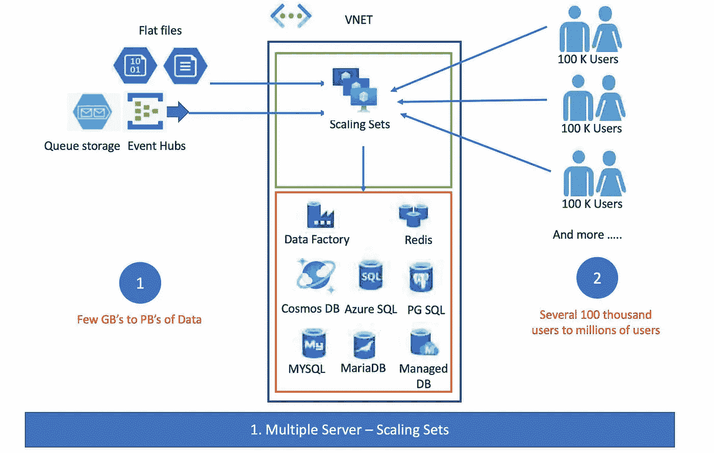

# Azure 系列#2:多可扩展服务器(网关)

> 原文：<https://medium.com/geekculture/azure-series-2-multi-scaleable-servers-gateway-4ea3bc92db28?source=collection_archive---------59----------------------->

在本文的前一部分，我们回顾了单一服务器部署和参考体系结构。现在，我们将使用**“扩展集”**来看看多服务器部署。作为部署的一部分，我们还没有引入容器和微服务。这将在下一节讨论，因为我们需要涵盖很多概念。

Image by author