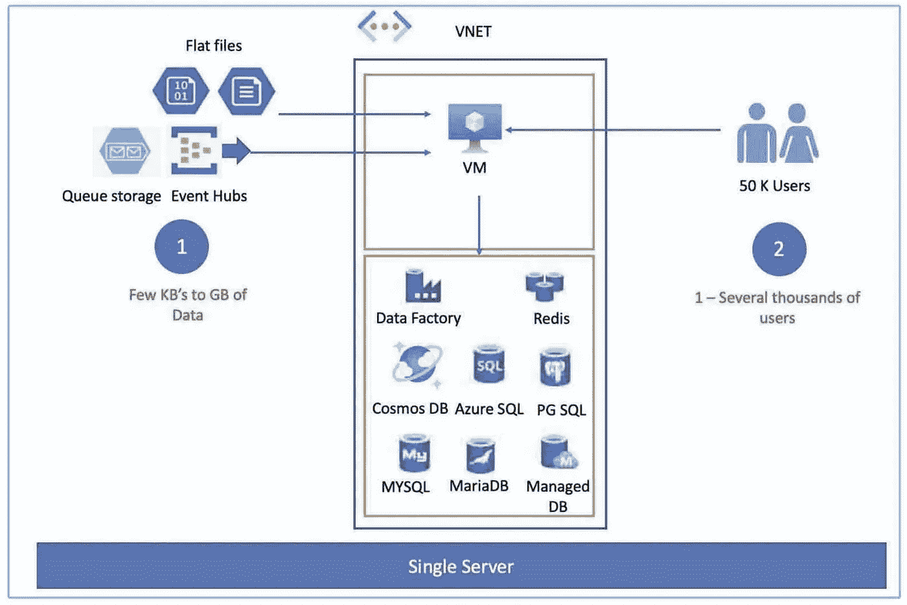

# Azure 系列#2:单一服务器部署(核心基础设施— I)

> 原文：<https://medium.com/geekculture/azure-series-2-single-server-deployment-core-infrastructure-i-f2bfa4aeaebf?source=collection_archive---------41----------------------->

# 单服务器部署的核心基础架构

Image by the author

作为本文的一部分，我们将讨论虚拟网络、子网和连接性(链路)。

## 1.虚拟网络