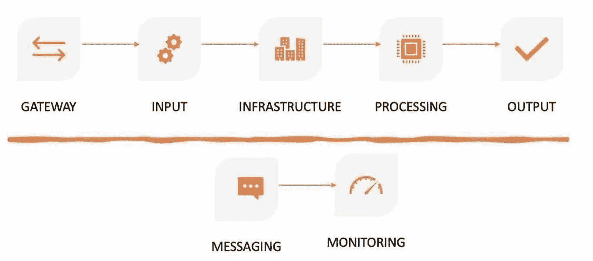

# Azure 系列#2:单一服务器部署(输入)

> 原文：<https://medium.com/geekculture/azure-series-2-single-server-deployment-input-bfc57a44adee?source=collection_archive---------55----------------------->

在[上一篇文章](https://luxananda.medium.com/azure-series-2-single-server-deployment-part-1-6791796f43a5)中，我们讨论了单服务器部署的网关(例如:webserver)。在这一部分，我们将继续讨论输入和核心基础设施。

image by author

# 单服务器部署的输入

当您谈论组织的数据时，它涵盖了所有三个方面，“人员、流程和技术”。更多…