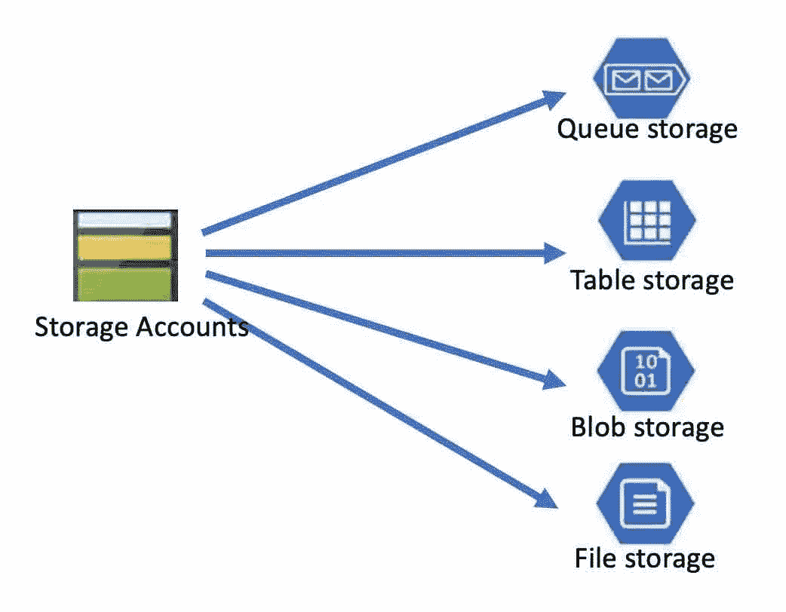

# Azure 系列#2:单一服务器部署(处理)

> 原文：<https://medium.com/geekculture/azure-series-2-single-server-deployment-processing-7f92fcc06445?source=collection_archive---------29----------------------->

在本系列的[之前的](/geekculture/azure-series-2-single-server-deployment-core-infrastructure-i-f2bfa4aeaebf)部分，我们讨论了单服务器部署——核心基础设施，现在是时候讨论处理和输出了。

# 处理

## 1.临时贮藏

Image by the author

Azure 提供了 4 种不同类型的存储以及不同类型的数据库。没有组织…