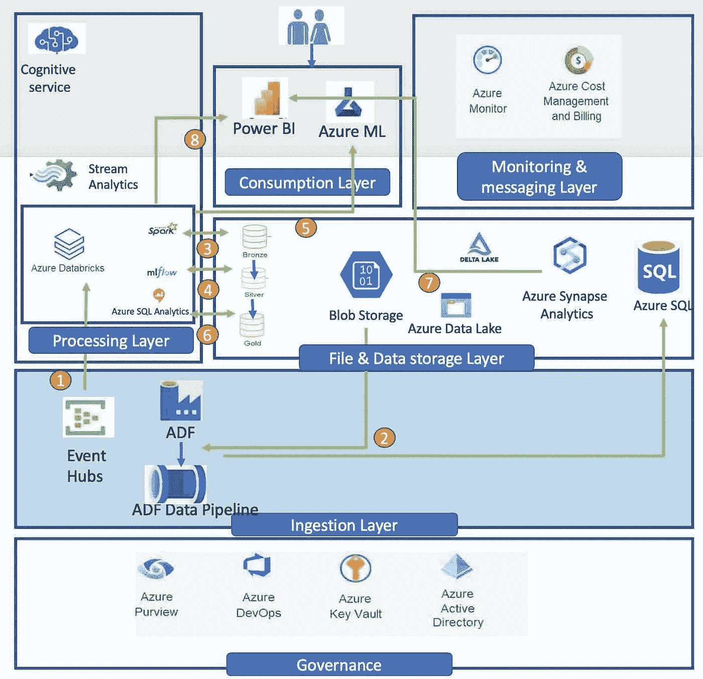

# Azure 系列# Azure 数据平台— Azure 数据工厂(ADF)

> 原文：<https://medium.com/geekculture/azure-series-azure-data-platform-azure-data-factory-adf-3bfefc5cfca2?source=collection_archive---------12----------------------->

Image by the author

# 它试图解决什么问题？

Azure 提供了云分析堆栈，有助于构建现代分析解决方案，支持数据移动和转换的集成服务变得必不可少— **ADF 是云数据集成服务**。它提供了 ETL(提取、转换和加载)、ELT(提取、加载和转换)和数据…