# Azure 系列:关于 Azure 云和相关指南的多部分系列

> 原文：<https://medium.com/geekculture/azure-series-multi-part-series-on-azure-cloud-and-related-guidelines-f40128ac3037?source=collection_archive---------18----------------------->

在这个由多个部分组成的 Azure Cloud 系列中，我打算用简单的术语涵盖 Azure 的一般方面、云的业务案例、一些必要的深入探讨、迁移策略、AllOps、设计框架的安全性、参考架构和/或演示等等。我正在建立一个多层的乐高积木方法(结合 OSI / TCP/IP 层),并将在对这些乐高积木进行分类后添加几个参考架构(用于 Web、批处理、移动、数据湖、大数据、机器学习等)。在此过程中，我还将讨论不同规模的组织对云的采用，构建可扩展的云，以及如何最好地使其持久，同时将其扩展到与其他云提供商的交流，以实现组织对基于聚合云/多云的采用。

# ***层:***

我采用分层方法来设计 Azure 云。这些层基本上分为 4 组:( 1)必备堆栈;( 2)输入堆栈;( 3)处理堆栈;( 4)输出堆栈。

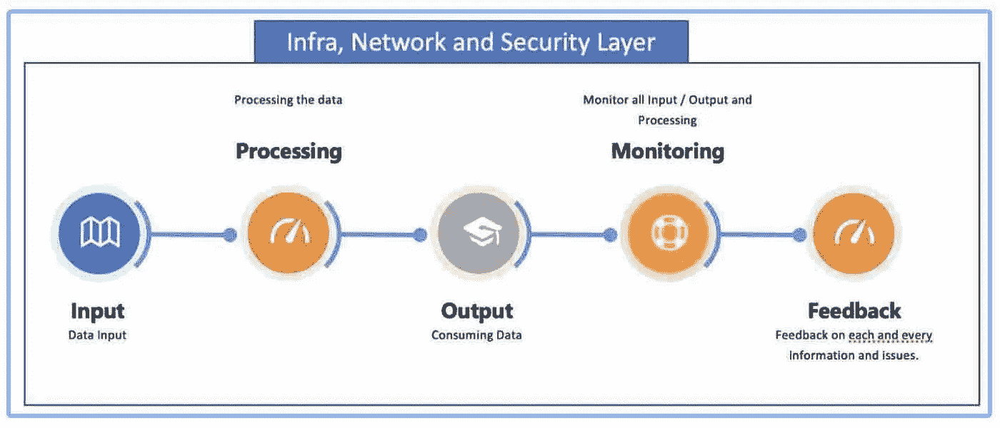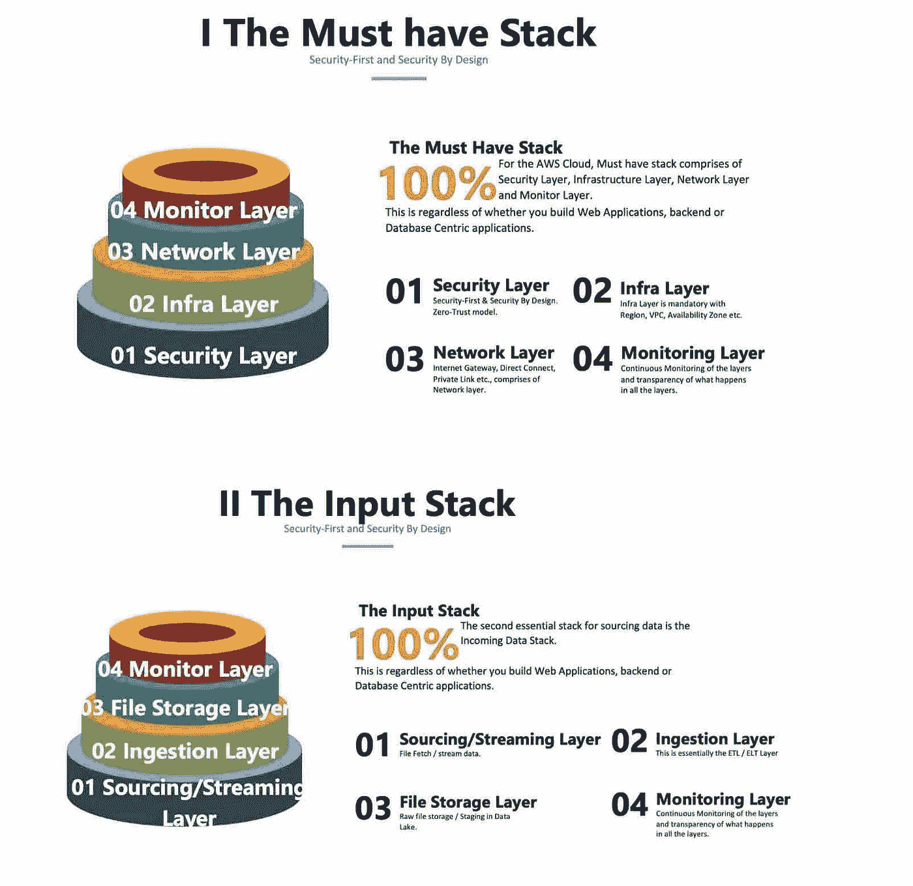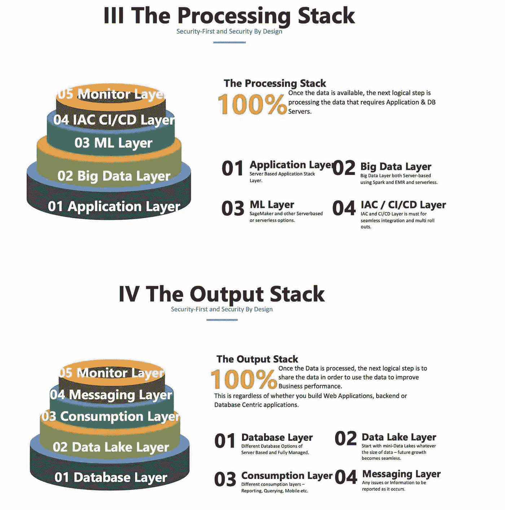

# 必须具有堆栈:

## 安全层:

**登录:** IAM，用于 MFA 的 Azure AD，Azure AD 和 SSO，Azure AD 特权身份管理，用户，外部身份，身份治理。

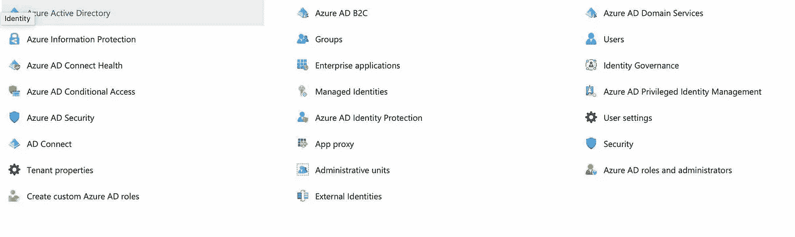

Reference: Azure

**存储/数据**:传输中的加密、静态数据的存储加密、TDE、密钥库、BYOK/BYOE、信息保护— AIP(防止数据丢失— DLP)、Azure 安全中心(文件完整性监控— FIM)、密钥库

**网络& Web** :路由控制，WAF，网络安全组，Azure 防火墙，应用网关，内置 DDoS 防御，应用网关(SSL 解密)，微软 Defender ATP(端点保护)，

**电子邮件** : Office 高级威胁防护

**SIEM &日志分析:** Azure 哨兵，Azure 监视器

**反恶意软件**:微软反恶意软件，Azure 安全中心(漏洞评估)

**计算**:安全策略、补丁升级、虚拟机磁盘加密

**治理** : Azure 安全中心，Azure 策略

安全 : Azure Synapse Analytics，Azure 信息保护，安全中心。

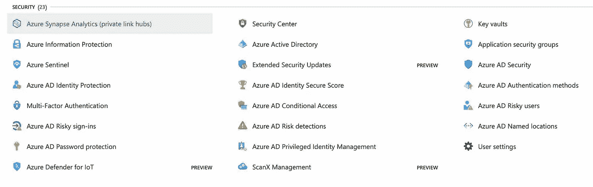

Reference: Azure

> 链接到文章的第 1 部分:
> 
> [云模型](/nerd-for-tech/1-cloud-series-the-iaas-paas-saas-8faa46124722?source=your_stories_page-------------------------------------)
> 
> [云业务案例](/nerd-for-tech/aws-series-1-business-case-for-cloud-how-to-pitch-to-your-management-and-why-is-it-important-pa-8c6d42b30a8b?source=your_stories_page-------------------------------------)
> 
> 云部署模型( [Part1](/nerd-for-tech/aws-series-1-cloud-deployment-models-public-private-poly-multi-cloud-part-1-d405a94d5d1a?source=your_stories_page-------------------------------------) & [Part2](/nerd-for-tech/aws-series-1-cloud-deployment-models-public-private-poly-multi-cloud-part-2-995f9a03c9e?source=your_stories_page-------------------------------------)
> 
> [云安全路线图](https://luxananda.medium.com/azure-series-2-cloud-security-roadmap-697ad93c425f?source=your_stories_page-------------------------------------)
> 
> [Azure 系列#1:安全层—登录](https://luxananda.medium.com/azure-series-1-security-layer-1-identity-login-a39feeccd610)
> 
> [Azure 系列#1:安全层— 2。网络—网关检查](https://luxananda.medium.com/azure-series-1-security-layer-2-network-gateway-checks-f01f50db8bc0?source=your_stories_page-------------------------------------)
> 
> [Azure 系列#1:安全层— 2。网络—威胁检测](https://luxananda.medium.com/azure-series-1-security-layer-2-network-threat-detection-ed3b5bfbb3e7?source=your_stories_page-------------------------------------)

## 基础架构和网络层:

**以下&网络**:虚拟网络

**请求/响应** : CDN

**链接:**虚拟网络，快捷路线，SSTP

**网关:**应用网关

**负载均衡器** : Azure 负载均衡器

**补丁&变更管理** : Azure 安全中心、更新管理、Azure 自动化(变更跟踪)

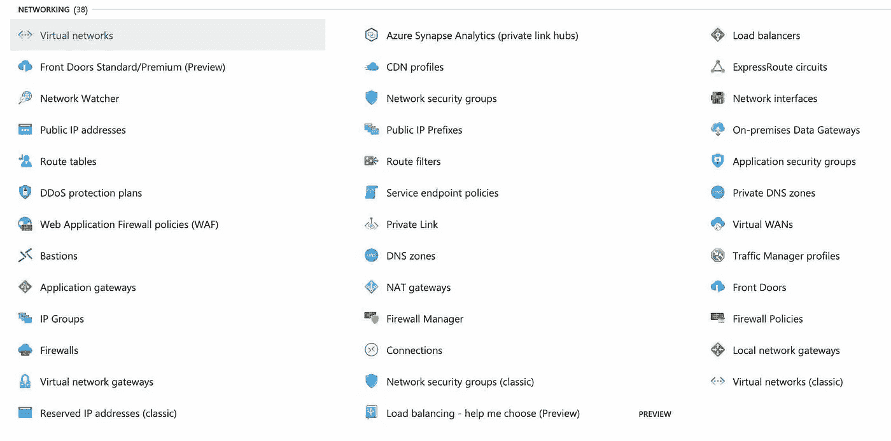

Reference: Azure

## 监控和消息传递层:

**日志** : Azure 审计日志、日志分析工作区、活动日志、Azure 工作簿

**监视器**:诊断设置、应用洞察、网络观察器、应用变化分析。

**消息传递**:警报

此外，

## 管理和治理:

顾问，成本管理+计费，Azure Arc，托管桌面。

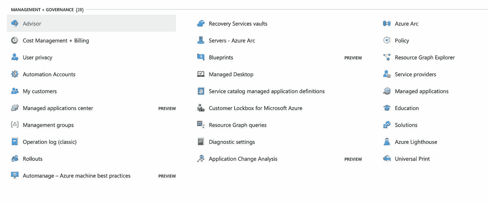

Reference: Azure

## 迁移:

Azure Migrate，Azure Stack Edge，Data Box，Azure Data Box Gateway，Azure 数据库迁移服务。

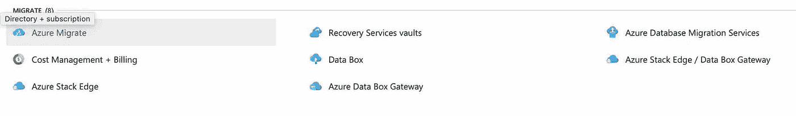

Reference: Azure

# 输入堆栈:

## 源和流层:

蔚蓝海岸的卡夫卡，活动中心。

## 摄入层:

**数据摄取** : Azure 数据工厂、用于数据摄取管道的 DevOps、事件中心(实时数据摄取)

**数据准备** : Azure Synapse

## 文件存储层:

**对象存储:** Blob 存储

**共享文件存储:**文件存储

**数据传输:**导入/导出功能

**数据备份:**备份软件

**内容交付:**内容交付网络

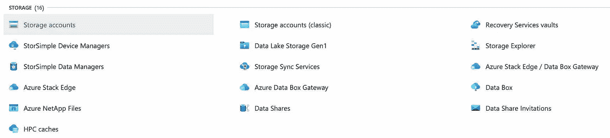

Reference: Azure

# 处理堆栈:

## 计算/应用层:

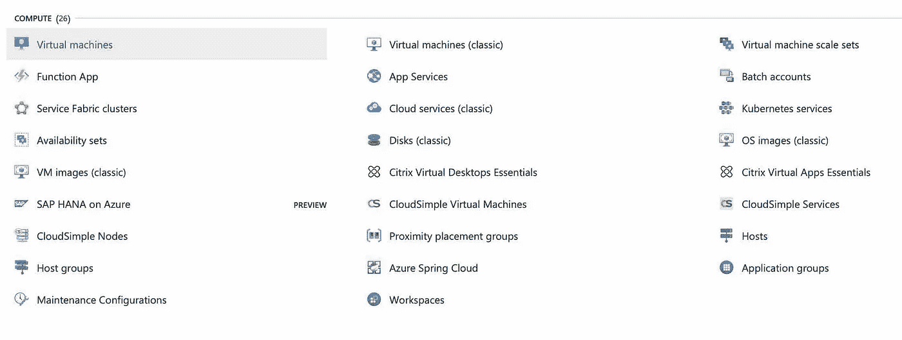

Reference: Azure

**虚拟服务:**虚拟机

**自动扩展:**虚拟机规模集，应用服务自动扩展

**虚拟服务器磁盘:** Blob 存储，高级存储

**容器:**容器服务、Azure Kubernetes 服务、Azure 容器服务、容器注册、批处理帐户、应用服务、服务结构集群

**后端逻辑:**云服务(工人)、功能、逻辑应用、Web 作业

**微服务:**服务结构

**网络应用:**网络应用，应用服务

**API 运行时:** API 应用程序

**恢复:**站点恢复

**模板:**快速入门模板

**集成**:服务总线，事件网格，集成服务环境，

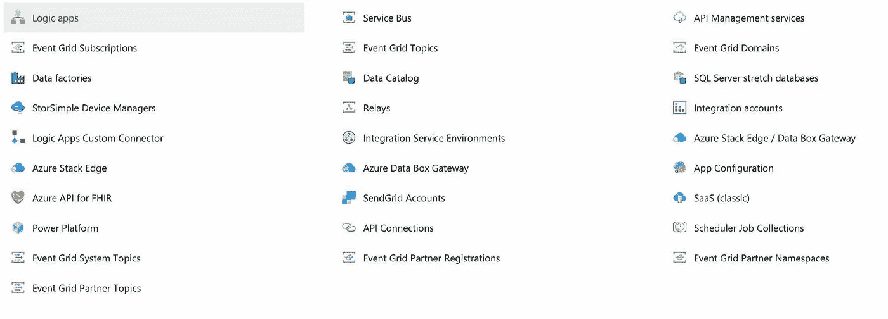

Reference: Azure

**网**:

应用服务、CDB 档案、电力平台、API 连接。

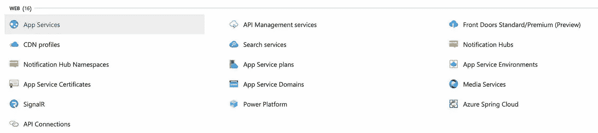

Reference: Azure

**移动** : App 服务，通知中枢，电力平台。

## 大数据层:

**分析** : HDInsights，Azure Synapse Analytics，Event Hubs，Data Lake Storage gen1，Azure Data Explorer 集群，数据工厂，Azure 数据砖，分析服务，流分析。

**可视化**:嵌入电源 BI

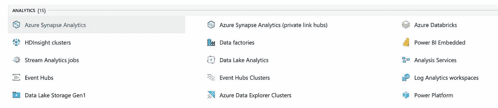

## 机器学习层:

Azure Synapse Analytics，机器学习，基因组账户，机器人服务，机器学习工作室，认知服务，Bonsai。

## **DevOps CI/CD 层:**

DevOps 中心。DevTestLabs，API 连接，Azure DevOps 组织，API 管理服务，应用更改分析，应用洞察，实验室服务。

# 输出堆栈:

## 数据库层:

SQL 仓库，Redis，CosmosDB，数据工厂，托管数据库。

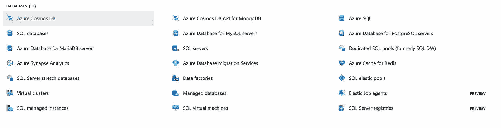

Reference: Azure

## 数据湖层:

数据湖分析，数据湖第一代。

## 消费层:

数据库、文件存储、可视化。

## 备份和恢复层:

Azure 备份，Azure 站点恢复

请留意文章中与相关部分链接的更新。

Azure Cloud series 松散地映射到 OSI 层。

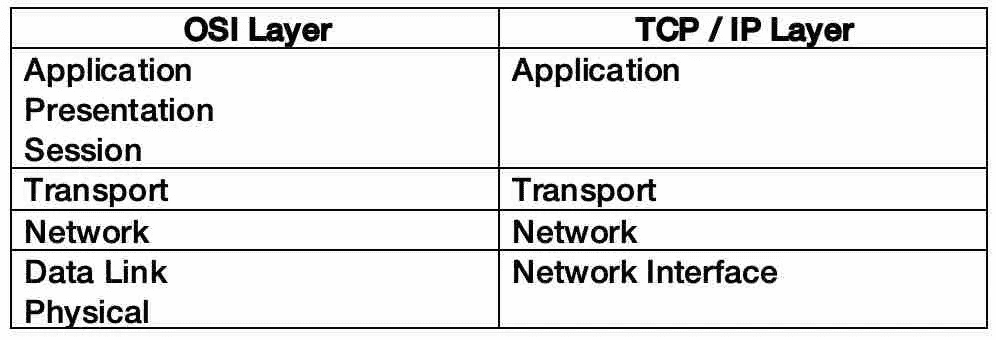

链接到 [AWS 系列多部分](/nerd-for-tech/aws-series-multi-part-series-on-aws-cloud-and-related-guidelines-c7c2437f1639)文章。

其他文章请查看并订阅**luxananda.medium.com**