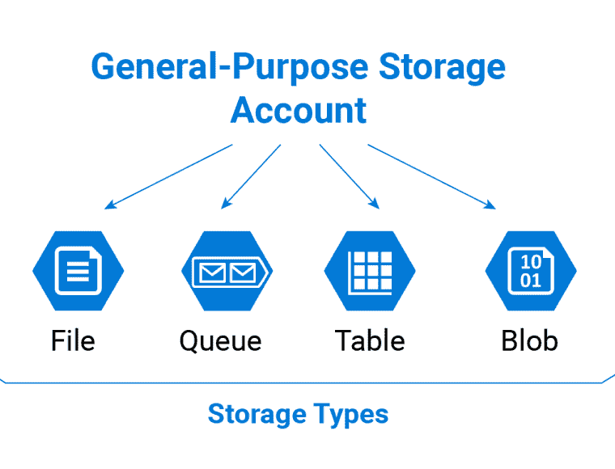
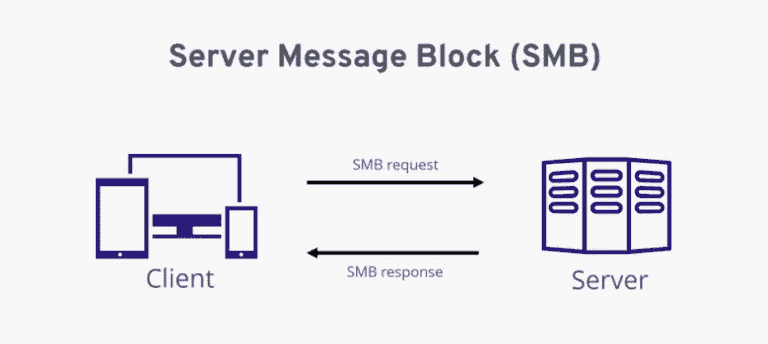
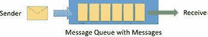

# Azure 存储服务

> 原文：<https://medium.com/geekculture/azure-storage-services-337d55cf489b?source=collection_archive---------11----------------------->

Azure 存储服务是一个总括术语，指的是微软为现代数据存储场景提供的存储选项。所有 Azure 存储服务产品的共同主题是高可用性、大规模可伸缩性、持久性和安全存储，就像 Azure 提供的所有其他服务一样，它们是受管理的。

Azure 存储服务充当通用存储服务，它们是 Azure 文件服务、Azure 队列、Azure 表和 Azure Blob 存储。下面我们来分别看看这些服务。

**Azure 文件服务—** 提供完全托管的云文件共享，您可以通过行业标准的服务器消息块(SMB)协议从任何地方访问这些文件。服务器消息块协议是一种客户端-服务器交互协议，其中客户端请求文件，服务器向其提供文件。用户能够在共享网络中创建、共享、修改和删除文件。

简而言之，SMB 是一种响应请求协议，要求在访问文件之前完成 SMB 身份认证协议。

在混合使用情况下，或者在组织想要迁移到完全基于云的系统的情况下，Azure 文件服务是本地文件存储的良好补充。

Azure Edge 网络允许管理员在全球范围内设置缓存，访问基于离用户位置最近的数据中心。

**Azure Queue —** 这允许应用程序组件之间的异步消息排队。这种形式的存储允许您以在各种应用程序组件之间共享消息的方式设置先进先出策略。

**Azure Blob—**Azure Blob 提供大规模、可扩展的非结构化数据存储，这些数据存储在称为 Blob 的块中。 *Blob* 代表二进制大物体。可以存储在这里的非结构化数据包括图像、文本文件、视频和音频。

Azure 提供了三种类型的 blobs:

*   Block blobs 它们的主要用途是存储需要从头到尾读取的文件。块 blobs 文件往往大于 100MB。
*   页面 blobs 它们是 512 字节页面的集合，针对读写操作进行了优化。
*   追加 blob——这种类型的 blob 专门针对需要不断向 blob 添加数据而不修改 blob 中已有数据的情况进行了优化。就像列表一样，任何新添加的数据都被附加到 blob 的末尾。这些操作的例子有日志和审计。

存储在 blobs 中的数据可能不是立即需要的，因此访问频率将决定其指定的访问层。有三种类型的访问层:

*   热—用于需要频繁修改的数据的访问层，这与较高的存储成本和较低的访问成本相关。
*   Cold —针对存储不常访问的数据进行了优化。冷层中的数据通常会保存 30 天以上。这里的存储成本较低，访问成本往往较高。
*   归档—针对存储很少被访问的数据进行了优化，预计最小存储期限为 180 天。

Azure Blob 存储及其可扩展性使其成为 Azure 数据湖的构建块，Azure 数据湖是一个集中式存储库，允许大规模存储结构化和非结构化数据。然后，湖中的数据可以被转换并用于相关的分析。

**Azure Table —** Azure Table 存储旨在存储大量结构化信息。它们是结构化非关系数据的理想选择。Azure Table 的常见用例有:存储不需要复杂连接、外键或存储过程的数据集，使用聚集索引快速查询数据，以及元数据存储。

Azure 表存储支持单个区域和可选的只读辅助区域，以实现可用性。

Azure Storage 提供静态加密和客户端加密，以确保存储数据的安全性。

我希望这有助于更好地理解 Azure 存储以及所提供的不同服务的区别。