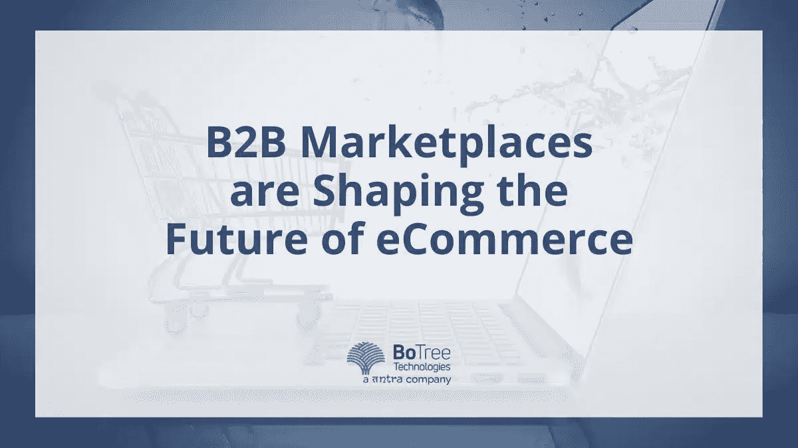

# B2B 市场正在塑造电子商务的未来

> 原文：<https://medium.com/geekculture/b2b-marketplaces-are-shaping-the-future-of-ecommerce-4d6f650bd9bf?source=collection_archive---------22----------------------->

B2B 市场通过高效、经济地连接买家和卖家，正在重塑电子商务的未来。这些市场是在一家电子商务网站开发公司的帮助下设计的，旨在促进公司之间的交易，而不是个人之间的交易。B2B 市场提供各种产品和服务，从原材料到成品。它们为组织买卖商品和服务以及建立长期合作关系提供了一个高效、安全的平台。

B2B 市场的出现使公司能够受益于更好的价格、更快的交货时间和比他们在当地市场能找到的更多种类的产品。此外，这些市场允许公司进入全球供应商网络，允许他们从世界各地采购产品。

这使得许多企业能够扩大其产品供应，并为客户提供更多的选择和更好的性价比。B2B 市场正在彻底改变企业买卖商品的方式，而 [b2b 电子商务网站设计](https://magnetoitsolutions.com/services/b2b-ecommerce-solutions)也在这一转变中发挥着重要作用，它为企业提供了一个方便在线访问和购买产品的平台。

> **阅读更多:-**[**2022 年市场问题及其解决方案**](https://www.botreetechnologies.com/blog/marketplace-problems-and-their-solutions/)

# B2B 市场对企业的好处:-

由一家电子商务网站开发公司开发的 B2B 市场为企业提供了各种好处，包括提高效率、节约成本和获得更大的客户群。本节将讨论 B2B 市场对企业的各种好处。

*   **提高效率—**
*   B2B 市场通过提供一个在线平台来与其他企业进行商品和服务交易，从而提高企业的效率。通过这些市场，企业可以快速找到并购买他们需要的产品和服务，简化采购流程并降低成本。
*   此外，[电子商务网站](https://www.botreetechnologies.com/blog/how-can-ecommerce-help-retail-businesses/)开发公司可以开发 B2B 市场，为企业提供来自全球的各种产品和服务，让他们找到最适合自己需求的价格。
*   **延伸范围—**
*   [B2B 市场](https://www.botreetechnologies.com/blog/how-to-choose-b2b-marketplace-platform-before-re-platforming/)让企业将触角伸向更广泛的受众。通过利用该平台，企业可以进入全球买家和供应商网络，从而进入新的市场并与潜在客户和合作伙伴建立联系。
*   B2B 市场为企业寻找新客户、建立关系和达成交易提供了一个简化的平台。此外，企业可以受益于在大型平台上展示的可见性和声誉的提高。
*   **能见度提高—**
*   [B2B 市场对企业的好处](https://www.botreetechnologies.com/blog/ecommerce-marketplace-case-study-with-ruby-on-rails/)包括提高可见性。B2B 市场为企业提供了一个向更多受众展示其产品和服务的平台。这有助于企业接触到更广泛的受众，建立品牌意识，增加客户群并获得更多线索。
*   B2B 市场也有助于提高可见性和可信度，因为客户可以查看不同企业的评论和评级，以做出更明智的决定。

通过利用这些优势，企业可以增加利润并在市场中获得竞争优势。

> **阅读更多:-**[**2022 年引领行业的 10 家电子商务网站开发公司**](https://botreetechnologies.medium.com/10-ecommerce-website-development-companies-that-lead-the-industry-in-2022-59bf99b5fe2a)

# B2B 市场的挑战

几个挑战与经营 B2B 市场有关。这些挑战包括确保产品质量、管理定价和费用，以及处理国际交易的物流和法律复杂性。

此外，B2B 市场必须能够与传统的实体店和其他在线零售商竞争。这可能很困难，因为许多 B2B 市场相对较新，需要其竞争对手的既定客户群。下面将详细介绍其中的一些:

*   **缺乏控制—**
*   缺乏控制是 B2B 市场面临的最大挑战之一。公司经常需要帮助来控制他们的产品或服务，因为它暴露给平台上的各种各样的用户。这使得很难确保所提供的产品或服务的质量和一致性。
*   此外，很难控制价格，因为用户可以比较价格并在其他地方找到更好的交易。最后，公司可能需要帮助控制用户体验，因为它依赖于平台及其用户。
*   **高度竞争—**
*   激烈的竞争是 B2B 市场面临的主要挑战之一。随着越来越多的企业转向数字市场买卖产品和服务，竞争变得越来越激烈。为了在竞争中脱颖而出，B2B 市场必须专注于提供独特和优质的产品和服务，并创造用户友好的体验。
*   此外，B2B 市场必须具有创新性和灵活性，才能在竞争中保持领先，并继续提供卓越的客户体验。
*   **安全问题—**
*   安全性是 B2B [市场](https://www.botreetechnologies.com/case-studies/ecommerce-marketplace)的主要挑战。许多贸易伙伴增加了数据泄露和其他恶意活动的风险。因此，公司必须确保他们与客户之间传输的所有数据都是安全的。
*   此外，B2B 市场必须有强大的认证措施，以防止未经授权的访问。公司还需要意识到各种可能危及其市场安全的网络安全威胁，并采取主动措施来减轻这些威胁。

B2B 市场提出了一系列独特的挑战，必须解决这些挑战才能确保成功。通过应对这些挑战，B2B 市场可以成为企业成功的有力工具。[美国最好的网络开发机构](https://selectedfirms.co/companies/web-development/usa) 总是试图克服这些挑战，提供买家期望的结果。

# B2B 市场如何改变电子商务

*   **自动化程度提高—**
*   随着自动化程度的提高，由一家软件开发公司开发的 B2B 市场正在简化买卖过程，使之更快更有效。自动化允许买家和卖家快速方便地搜索产品，比较价格，并进行购买。
*   自动化也有助于减少流程中涉及的文书工作和体力劳动，使[企业](https://www.botreetechnologies.com/blog/say-yes-to-ecommerce-business/)能够专注于运营的其他方面。通过提供更有效的买卖方式，B2B 市场正在改变企业的经营方式，并有助于推动电子商务的发展。
*   **简化交易—**
*   通过简化交易，这些市场使企业更容易找到他们需要的产品和服务，同时提供一种安全有效的方式来完成交易。有了 B2B 市场，企业可以快速方便地搜索产品和服务，比较价格，并进行购买。
*   简化的交易也使企业更容易跟踪订单、管理库存和保持客户服务。通过简化交易，B2B 市场让企业做生意变得更容易，并改变了电子商务的运作方式。
*   **更好的可访问性—**
*   这家软件开发公司开发了一个 B2B 平台，该平台增加了可访问性，允许企业访问更广泛的产品和服务，并找到更好的交易和价格。此外，B2B 市场为企业提供了进入全球市场的机会，使他们能够扩大自己的影响范围，增加客户群。
*   通过为企业提供更大的可访问性，B2B 市场正在改变电子商务行业，并使企业更容易成功。

# B2B 市场对电子商务的影响:-

B2B 市场的出现对电子商务产生了重大影响。B2B 市场为企业提供各种功能和服务，如支付处理、订单跟踪和客户支持。这使得企业更容易管理他们的交易，并确保他们的钱得到最好的价值。B2B 市场对电子商务产生了积极的影响，使企业更容易以最佳价格找到他们需要的产品和服务。

> **开始电子商务业务？查看工业气体在线市场的惊人电子商务案例研究:-** [**工业气体在线市场**](https://www.botreetechnologies.com/case-studies/online-marketplace-for-industrial-gases)

# 买家对 B2B 市场有什么想法？

由软件开发公司支持的 B2B 市场已经变得越来越受欢迎，因为企业正在寻找简化运营和增加利润的方法。因此，买家不得不调整他们对这些市场的预期和态度。在这里，我们看看买家对 B2B 市场的想法。

首先也是最重要的一点，买家寻求的是便利。B2B 市场允许买家快速、轻松地找到他们需要的产品，而无需搜索多个网站或联系多个供应商。这种便利是吸引买家的主要因素，让他们节省时间和金钱。

第二，买家寻求有竞争力的价格。B2B 市场允许买家比较多个供应商的价格，找到最好的交易。这对于寻求批量购买的买家来说尤其重要，因为他们通常可以在 B2B 市场上找到比在其他地方更好的交易。

第三，买家寻找可靠的供应商。B2B 市场允许买家阅读其他买家的评论和评级，让他们做出明智的决定，从哪些供应商购买。这对于希望批量购买的买家来说尤其重要，因为他们希望确保以最优惠的价格买到最优质的产品。

最后，买家希望交易安全。由[电子商务网站开发](https://www.botreetechnologies.com/blog/ecommerce-website-development-cost/)公司建立的 B2B 市场为买家提供了安全购买产品的能力，以及跟踪订单的能力。这对于批量购买的买家来说尤其重要，因为他们希望确保订单得到及时履行。

总的来说，买家在 B2B 市场购物时寻求便利、有竞争力的价格、可靠的供应商和安全的交易。通过了解买家在寻找什么，企业可以更好地定制产品，以满足客户的需求。

# 结论

B2B 市场的激增正在改变公司做生意的方式。通过提供一个高效且经济的交易平台，这些市场让公司能够更有效地运营并扩大其覆盖范围。随着企业继续接受这些市场，它们将受益于增强的客户体验和提高的盈利能力。

*原载于 2022 年 12 月 23 日*[*【https://www.botreetechnologies.com】*](https://www.botreetechnologies.com/blog/b2b-marketplaces-are-shaping-the-future-of-ecommerce/)*。*