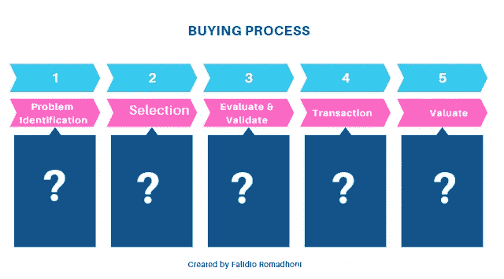
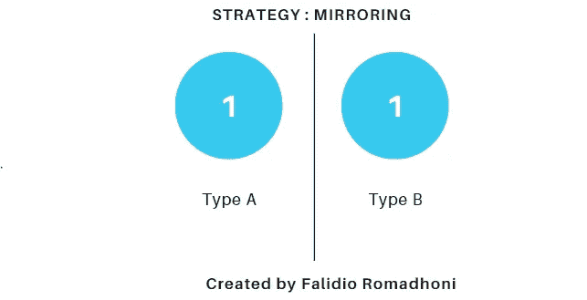
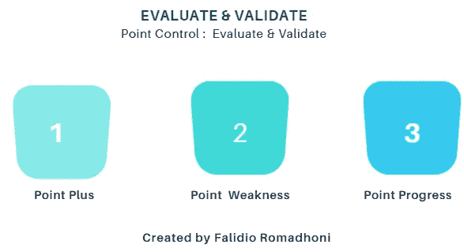

# B2B 战略如何改善购买过程，让顾客保持忠诚

> 原文：<https://medium.com/geekculture/b2b-strategy-how-to-improve-the-buying-process-so-that-customers-remain-loyal-cbd0632c3852?source=collection_archive---------14----------------------->

每一个被创造出来的公司无疑都会竞争。如果某个公司或产品能够吸引大量个人的兴趣，无疑会有许多产品彼此相同。

Picture by [Falidio Romadhoni](https://medium.com/p/cbd0632c3852/edit) via [Canva](https://www.canva.com/design/DAFQKLv6Y_U/ef_C70Nflg5KOk52LOhl4w/edit)

创造第二种产品或业务的人通常会以较低的价格提供这种产品或业务，并提供企业创始人没有公布的某些改进。

然后，为了能够吸引尽可能多的客户，这些企业将通过提供比竞争对手更低的价格来进行价格战。

因为总是有公平竞争的企业主和从事不诚实行为的其他公司，所以商业世界中的竞争实际上并不新鲜。

那么，如果你已经卷入价格战，会发生什么？现在怎么办？

更糟糕的是，这种竞争可能会吸引现有客户。

# 在 B2B 商业战略中，市场如何保持对你的忠诚？

> *答案:修正购买流程*

Created by [Falidio Romadhoni](https://medium.com/p/cbd0632c3852/edit) via [Canva](https://www.canva.com/design/DAFQKLv6Y_U/ef_C70Nflg5KOk52LOhl4w/edit)

> ***熟悉以上概念吗？***

购买过程描述了某人偏好、选择和购买某一品牌产品的原因。购买决策过程包括五个阶段，即问题识别、信息搜索、备选方案评估、购买决策和购后评估。

> ***我来总结一下:***

# 1.问题标识

通过主动确定投诉是否定期进行，以及是否需要添加或增强任何内容，尽早发现问题。

> 什么时候？

1 个月、3 个月和每 6 个月必须确定主动的问题，停止检查 1 周或时间表是可靠和严格的，因为我们需要的是不中断业务运营的客户满意度。

> 谁啊。

向谁:必须询问的对象是直接用户或公司负责人，而不是买家或客户的采购团队。因为使用你的产品的人是用户&做决定的人是公司的负责人。

📓特别注明:与用户的社交媒体身份保持联系或关联，例如 Linkedin。

# 2.选择

如果你是营销专业人士或企业主，祝贺你成为这一轮项目的营销选择。这意味着人们已经使用了你的商品和服务。

例如，以简单明了的方式:

1.  **你在 IT 部门工作，创建供应链轻松工具。**

关键是用户有意或无意地使用了你的产品和服务，他们有可能妨碍他们的工作。软件会自动更新，因为更新过程非常重要且常见，但是有两种反应:

1.  ✅Positive 反馈:这不是一个问题，因为根据协议，有一段时间的软件更新。
2.  ❎Negative 反馈:如果软件仍然在大量和紧急的情况下使用，影响将导致投诉和抱怨。

你的服务和商品的用户将决定是否再次使用它们，如果让他们自己决定的话。

# 解决方法是什么？

> ***如果专心品***

与客服的建议相反，耐心或等待并不能找到产品的答案。

Capture by [Falidio Romadhoni](https://www.canva.com/design/DAFQKLv6Y_U/ef_C70Nflg5KOk52LOhl4w/edit) by [Canva](https://www.canva.com/design/DAFQKLv6Y_U/ef_C70Nflg5KOk52LOhl4w/edit)

这种镜像方法不会以任何方式阻碍当前的活动，无论是更新还是升级。结果，生产出重复或相同的产品。想象一下，使用突然升级的 it 产品是多么令人讨厌，然而，当用户紧急使用该产品时，镜像技术可以防止这种情况发生。

> ***如果专心服务***

在服务行业，您可以使用简单的预付方式，例如，买方可以在 30 天内付清货款，如果产品达不到用户预期，买方可以取消或不支付 30%的货款，使用升级是向您的客户预付货款，他们是服务行业中的王者和大客户。

在任何行业中，业务改进(产品开发)的目标都是让客户更容易使用贵公司的产品和服务，这一功能在很大程度上影响着客户忠诚度。

# 3.评估和验证

不仅作为客户进行评估和验证，还从业务所有者的角度进行评估和验证。

*   是否符合买家的期望？
*   目前的产品有什么问题吗？
*   它提供适当的服务吗？
*   有没有需要开发的产品服装？

对于验证和评估参与者来说，这个问题可以在任何地方延伸或扩大，变得不规则，但是在本文中，我分享一个简单的概念:

谁啊。:销售/营销和业务负责人

简单的概念:

1.  点加
2.  弱点
3.  点进度

Picture by [Falidio Romadhoni](https://www.canva.com/design/DAFQKLv6Y_U/ef_C70Nflg5KOk52LOhl4w/edit) via [Canva](https://www.canva.com/design/DAFQKLv6Y_U/ef_C70Nflg5KOk52LOhl4w/edit)

*   **点加**:作为你的优势是否被实际应用的标志。
*   **弱点**:用户对你的产品有什么问题或抱怨，影响有多大。
*   **点进度**:通常用户想要定制，那么必须确定定制点在&进度统计中处于什么状态，以便它与用户保持联系。

专注于这三点，然后就可以大规模地扩大规模。

# 4.交易

在向买方显示这一责任的情况下，点数被收取运营成本和税款。对于交易策略，有两件事必须控制。

> 谁？

1.  政府:像这样的政府行为会导致税收(如果可以减少的话)和规章制度。
2.  **供应商:**除了分销服务可用这一事实之外，评估是否存在任何问题或复制需求也很重要，例如将材料或成品运送给客户的成本。

# 5.分数评估

一旦成功完成步骤 1、2、3、4 和 5，同时保持已履行承诺的稳定性，就会出现类似的结构。

Created by Falidio Romadhoni via [Canva](https://www.canva.com/design/DAFQKLv6Y_U/ef_C70Nflg5KOk52LOhl4w/edit)

感谢您的阅读，这就是您让客户满意的方式。希望有帮助，请广而告之。