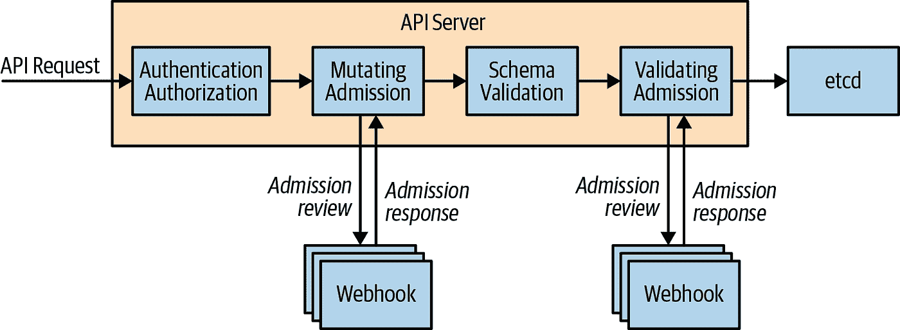
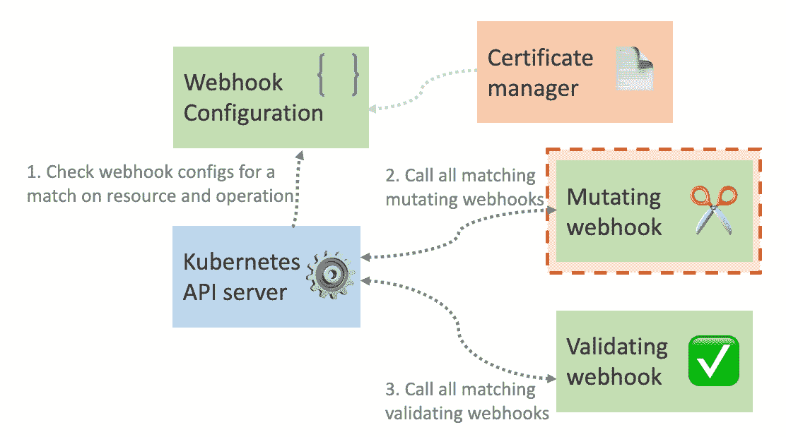

# 回归基础:Kubernetes 入学网挂钩

> 原文：<https://medium.com/geekculture/back-to-basics-kubernetes-admission-webhooks-dbf6baffb0f1?source=collection_archive---------3----------------------->

[Photo](https://unsplash.com/photos/EgtKWM2sNJw) by [Haseeb Modi](https://unsplash.com/@haseebm?utm_source=unsplash&utm_medium=referral&utm_content=creditCopyText) on Unsplash

Kubernetes 的集装箱服务环境是广泛的。但是，有时需要额外的配置来全面优化基础架构。一些管理员需要准入 webhooks 提供的可定制性。在这篇文章中，你将了解 Kubernetes 入学网页挂钩，如何使用它们，以及何时应该使用它们。

# 入场网钩

[Source](https://www.digihunch.com/2022/01/kubernetes-admission-control/)

Webhooks 是一种可以验证或更改对象的定制控制器。准入 webhooks 是 HTTP 回调，当发出请求时被触发。当在某些 Kubernetes 资源上执行某些操作时，可以配置 Kubernetes 中间件来联系服务。这些插件最终控制集群并决定 Kubernetes 如何使用它们。webhook 可以检查新创建的 pod，并采取三种操作之一:允许请求、拒绝请求或通过返回变异或更改的版本来修改它。

[Kubernetes 准入控制器](https://www.armosec.io/blog/kubernetes-admission-controller/)是一个代码块，它在对象被持久化之前，但在用户被认证和授权之后，拦截对 Kubernetes API 的请求。

在 Kubernetes 中，控制器和 webhooks 是分开存在的。控制器被编译成 Kubernetes *apiserver* 二进制文件，只能由集群管理员提供。Webhooks 在 API 中被适当地配置，因为它们直接影响 HTTP 活动。Webhooks 还可以在任何语言或框架中进行简单的适应性编码，允许 Kubernetes 准入控制器与任何第三方代码集成。

准入控制器有能力验证或变异，或做两者的结合。与请求验证控制器相关联的对象不能被它们改变，但是它们可以通过改变控制器来改变。

# 配置 Kubernetes 许可网页挂钩

[Source](https://trstringer.com/kubernetes-mutating-webhook/)

在配置准入 webhook 时，要记住的事情包括:检查集群中是否允许准入 web hook 控制器，如果允许，则配置它们。可以编写一个处理接纳请求的 [HTTP 回调](https://askmelot.com/what-is-http-callback)(这可以是一个部署到集群的简单 HTTP 服务器或者一个无服务器函数)。通过 ValidatingWebhookConfiguration 和 MutatingWebhookConfiguration 资源配置准入 webhook。

在各种情况下，webhooks 可以用来为集群管理员的资源准入创建配置。管理员可能面临的情况包括使用 RBAC 策略、自定义已创建或已修改的资源限制、未经授权的人员无法添加或删除资源、边车容器注入以实现更多日志记录，以及测量和流量控制器。

你也可以选择允许你的准入网页挂钩返回警告信息。警告代码 299 可以被编程为出现在给请求服务器的警告报头中。可以根据请求是被接受还是被拒绝来发送警告和响应。

在配置消息时，您必须记住的是:( a)您的消息中不得有前缀“warning ”,( b)您的警告响应中的字符数不得超过 120 个，这些字符应该解释发出 API 请求的服务器应该避免或纠正的问题。

# Kubernetes Apiserver 身份验证

如果您的准入 web 挂钩需要认证，您可以定制 *apiserver* 来利用基本认证、令牌或证书来连接 web 挂钩。

完成配置的步骤包括以下内容。

当启动 *apiserver* 时，使用—准入控制配置文件标志来指定准入控制配置文件的位置。指示 MutatingAdmissionWebhook 和 ValidatingAdmissionWebhook 控制器应在准入控制配置文件中的何处读取凭据。该字段的名称称为 kubeConfigFile，因为详细信息存储在 kubeConfig 文件中。最后，在 kubeConfig 文件中输入凭证。

如果我们最近创建的 webhook 配置不支持任何可以被 *apiserver* 使用的 AdmissionReview 版本，那么只有第一个版本被发送。并且，对 webhook 的尝试调用失败，并且受制于失败策略。

一旦 *apiserver* 决定了一个请求应该被路由到 webhook，它必须决定如何到达 webhook。这需要包含在 webhook 配置的 *clientConfig* 节中。Webhooks 可以通过一个 URL 或一个服务引用来访问，如果需要的话，它们可以包含一个用于 [TLS 连接](https://support.google.com/a/answer/100181?hl=en#:~:text=Transport%20Layer%20Security%20(TLS)%20is,now%20uses%20TLS%20for%20encryption.)验证的定制 CA 包。

在生产集群中，正确管理您的 TLS 证书，尤其是私钥是非常重要的，因此您可能希望使用 cert-manager 或将您的密钥存储在保险库中，而不是作为普通的 Kubernetes 秘密。要记住的最重要的事情是在 webhook 配置中包含相应的 [CA 证书](https://www.namecheap.com/support/knowledgebase/article.aspx/986/69/what-is-ca-bundle/)，以便 *apiserver* 知道它应该接受它。

# 结论

准入 webhooks 为集群管理员提供了一些实施集群安全策略所需的工具。已经向您介绍了 Kubernetes 的一些基本特性和一些高级特性，比如准入 webhooks 以及准入控制器如何实现它们。准入控制是保护 Kubernetes 集群的一个重要工具，如果您处理集群，那么您的工具箱中应该有这个工具。