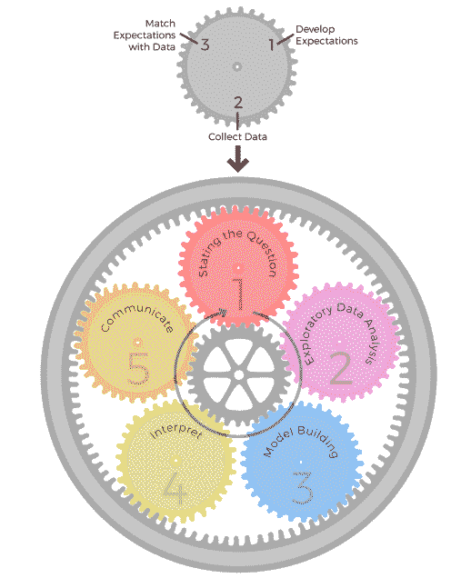
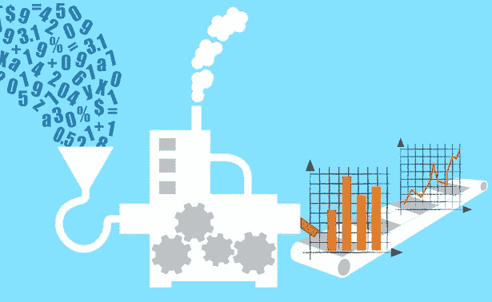

# 回到学校成为一名数据科学家。有必要吗？[第一部分]

> 原文：<https://medium.com/geekculture/back-to-school-to-become-a-data-scientist-is-it-necessary-part-1-604595eceefa?source=collection_archive---------7----------------------->

虽然进入数据科学领域的方法有很多，但攻读研究生学位似乎是最正规的途径。在决定是否值得投入时间、金钱和精力之前，您可能希望更多地了解数据科学的基本概念和通常需要的技能。然后，我们可以探索获取这些知识的可能渠道。最后，我们可以判断研究生学历是否是踏入该领域的良好开端。

**什么是数据科学？**

对我来说，数据科学就是“用数据回答问题。”在电子书《数据科学的艺术》中，彭教授和松井教授用五个过程来说明数据分析。

诚然，这些过程听起来完全是理论性的；因此，为了更好地理解，我根据自己的学习和培训，将这个管道总结为七个关键步骤。

**第一步:**问正确的问题

对你和你的组织来说，这个分析的目标是什么？数据科学家通常与利益相关方(例如，业务合作伙伴)合作，以确定他们的问题并制定正确的研究问题。一个利益相关者可能会对你说，我想促进某种产品的销售，我该怎么做？花时间采访你的利益相关者，提出更具体的问题可能会帮助他们更容易地解决问题。更好的问题可能是，例如，哪个频道的点击率最高？按年龄划分，哪个客户群体最有可能购买我们的产品？

**第二步:**收集相关数据

解决这些问题需要什么样的数据？您可以从哪里收集这些数据？什么样的数据量在统计上足以进行这种分析？对于您将要收集的数据，是否存在任何隐私问题？除了“获取数据”，你可能还需要考虑更多的事情。一些公司可能有数据工程团队。然而，作为一名数据科学家，您仍然需要了解提取、传输、加载(ETL)过程。好的数据引导你做出好的分析。

**第三步:**探索性数据分析(EDA)

在开始深入分析之前，可视化您的数据至关重要。图表和表格是你的朋友，帮助你理解数据集，并潜在地识别任何异常。在做任何假设之前花时间调查。

> 来源:[https://medium . com/analytics-vid hya/explorative-data-analysis-EDA-data-science-project-829 f 00 c 5716 f](/analytics-vidhya/exploratory-data-analysis-eda-data-science-project-829f00c5716f)

第四步:确定你的分析目标

你的问题是统计推断问题还是预测问题？

如果是预测问题，是回归问题还是分类问题？

这一步有助于确定进一步分析的适当工具。

第五步:建立你的模型

当你决定你的研究问题和分析目标时，你对框架有了更清晰的认识；因此，您可以选择合适的模型并进行测试。

**第六步**:总是想象和解释你的结果

你可能有一些数字或者机器学习模型。一些深度学习方法可以是黑盒，一些不是。无论如何，你应该总是花些时间来解释这些结果，看看它们对你是否有意义。

**第七步:**回顾流程。它回答了你的问题吗？

此时，你可能迫不及待地想分享你的发现。然而，重温这些问题总是好的。你的结果能提供你需要的所有答案吗？如果不是，缺什么？

数据分析不是直通式的，而是一个迭代的过程。我们不断问自己，数据、分析和结果是否能充分回答我们的问题。如果没有，试着从另一个角度看数据，然后用不同的方法分析。或者，检查是否缺少任何东西，收集新的数据，然后重复这个过程。热衷于从数据中寻找答案是数据科学成功的关键。

**作为数据科学家，哪些技能是有帮助的？**

在对基本的数据分析过程有所了解之后，您可能会对从事数据分析项目(尤其是工作场所中的项目)所需的技能有所怀疑。了解什么样的资格要求最有效的方法是查看招聘职位的工作描述。数据科学家同时需要硬技能和软技能的情况并不少见。

**硬技能**

*   ***执行不同阶段的数据科学分析***

你应该能够执行上面提到的所有步骤，包括探索性数据分析、机器学习模型开发和模型评估。

*   ***统计知识***

在确定您的最佳模型和解释时，您需要理解描述性统计和概率论的基本概念，其中包括一些关键概念，如概率分布、统计显著性、假设检验和回归，以便做出理想的决策。

*   ***编程经验***

在进行数据可视化和模型构建时，他们通常会涉及大数据处理和复杂的算法。编程技能在这个过程中起着重要作用。r 和 Python 有专门设计的库来减轻您在这种情况下的工作。常用的数据可视化库如 Altair，Plotly，Seaborn，数据分析库如 Scikit Learn，Pytorch，NumPy，Pandas 都很方便。

*   ***计算或统计相关度***

大多数时候，数据科学工作需要计算科学或统计领域的学士或硕士学位。由于上述技能要求，相关学位可以帮助你获得该领域的基础知识。

**软技能**

*   ***协作技能***

大多数时候，研究不是一个人的工作，与利益相关者和同行合作来理解问题是有意义的。

*   ***沟通技巧***

数据科学不仅仅是文书工作。书面、口头和演示格式的沟通技巧与硬技能一样重要。利益相关者和你的同事想知道你从数据中得到的发现。

在这里，我们讨论了数据科学以及成为一名数据科学家需要具备的条件。我们终于可以回答我们的问题了，在数据科学领域，研究生学位是必要的吗？敬请期待下一章。

*本帖由****供稿。本文原载于*[*@ DataCanOrg*](/@DataCanOrg)*。***

***保持与*[*Data can*](https://datacan.network/)*&*[*数据科学中的女人温哥华*](https://www.linkedin.com/company/wids-vancouver/) ！**