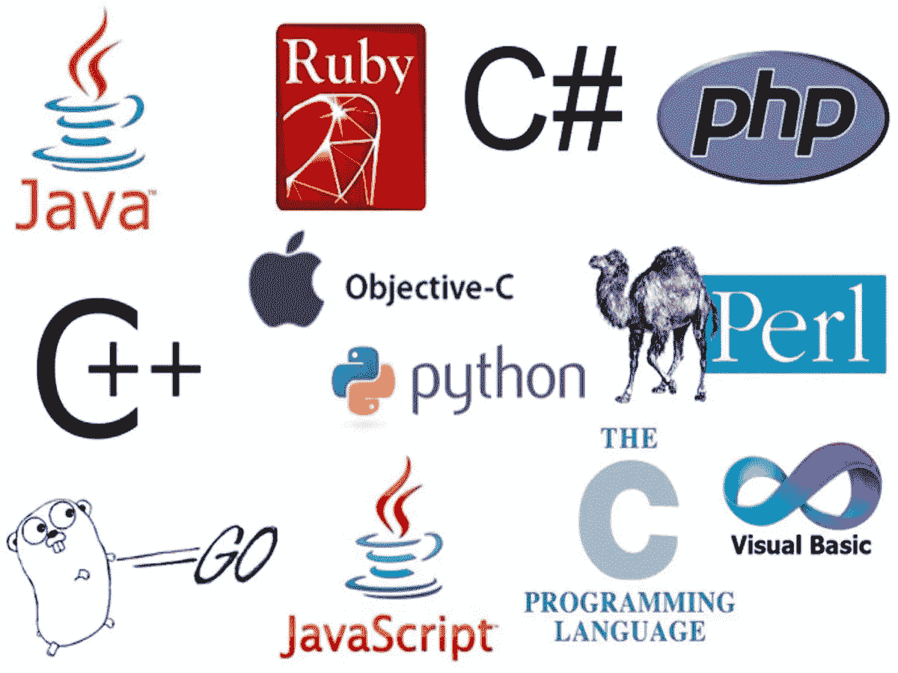
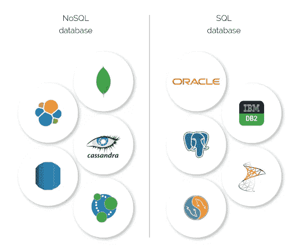

# 后端 101:从 noob 到 pro 工程师(简介)

> 原文：<https://medium.com/geekculture/backend-101-from-noob-programmer-to-pro-engineer-introduction-355428d149b9?source=collection_archive---------0----------------------->

这个系列将为你们成为专业后端工程师提供大量的基础知识(和一些进步)。

Photo by [Christin Hume](https://unsplash.com/@christinhumephoto?utm_source=medium&utm_medium=referral) on [Unsplash](https://unsplash.com?utm_source=medium&utm_medium=referral)

我想写这个系列的原因很简单。几年前，在花了几个小时搜索后，我找不到任何涵盖后端主题所有必要技能的具体帖子。我真的很失望。所以我很想做一个，并帮助其他人学习真正的后端技能。

声明:我目前不是高级工程师，所以该系列可能会遇到错误。我希望你们指出来，我们可以一起讨论。

先从系列介绍开始吧。

# 你会学到什么

本系列中分享的大部分内容都来自这个[后端路线图](https://roadmap.sh/backend)。我发现它非常全面和直接，因为它有按照正确的顺序学习的步骤。

我会将每个主题分成一篇文章，并在这篇介绍文章中更新链接索引。接下来的帖子也没有任何顺序(我喜欢自发写作)

我说不清我会写多少确切的技巧和问题。所以，我只是列出几个必须涵盖的重要内容。

## 互联网如何工作(HTTP、域名、浏览器……)

Photo by [NASA](https://unsplash.com/@nasa?utm_source=medium&utm_medium=referral) on [Unsplash](https://unsplash.com?utm_source=medium&utm_medium=referral)

涵盖许多互联网概念的一般知识。作为一名后端工程师，你将主要与网络环境打交道，所以需要了解这些东西

## 基本操作系统(进程、线程、内存……)

Photo by [Alexandre Debiève](https://unsplash.com/@alexkixa?utm_source=medium&utm_medium=referral) on [Unsplash](https://unsplash.com?utm_source=medium&utm_medium=referral)

后端工程师开发的应用程序总是在服务器上运行。因此，您应该了解服务器和您的应用程序是如何工作的，这是合理的。理解这些将有助于你编写一个高效的后端程序，帮助你避免许多 CPU 问题，解决高级问题，并定义你为专业工程师。

内容包括:该过程如何工作，计算机如何管理内存…

## 如何学习“后端语言”

Some popular languages used in backend development

我不会尝试写一系列所有的语言，因为有太多的语言，会浪费时间。有数百个博客和免费课程，你可以找到学习一个。我会分享一些正确挑选和学习的见解和技巧(也许还有一些有用的资源)。

内容包括:如何挑选和学习一门语言，一些关键概念必须理解…

## 数据库ˌ资料库

是的，我最喜欢的部分。数据库是每个后端工程师都应该了解和掌握的最重要的话题。

工程师为企业开发要启动的程序，因此需要应用程序来包含和处理数据。例如，电子商务网站会有客户和产品的列表。数据库的目标就是存储这些信息，并在用户需要时提供给他们。这听起来并不复杂:我们只是存储它并在用户需要时检索，对吗？是的，没错，但不是所有的情况都是这样。复杂程度取决于业务逻辑。其他功能将需要不同的方式来处理和遇到许多意想不到的问题(更多细节在另一个帖子)。

有两种类型的数据库:SQL 和 NoSQL。每一个也包含许多数据库类型。你可以看到下面两种类型的数据库。

NoSQL database vs SQL database

每种类型都有其优点和缺点。工程师通常根据技术问题选择数据库。

内容包括:SQL 与 NoSQL 的主要区别，如何编写 SQL，如何设计数据库…

## 应用程序接口

API(应用编程接口)是使应用程序能够与其他应用程序通信的协议。这是一个基本概念。运行在服务器上的大多数应用程序的任务是处理繁重的任务，然后将结果传输到用户的浏览器(通常称为前端)。所以它需要 API 作为在这两者之间进行请求和响应的方法。

内容包括:编写高效 API 的最佳实践、命名约定、处理错误…

有更多的话题和先进的概念。我会根据我的兴趣和好奇心经常更新这些。

我会写并上传关于我上面列出的主题的帖子。请继续关注我的精彩分享。

Grumpy cat wants to say a thank you