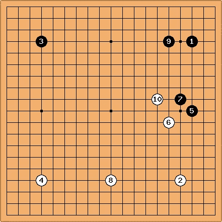

# 后端设计— Actix-web 项目层次结构

> 原文：<https://medium.com/geekculture/backend-design-actix-web-project-hierarchy-7fc229bd830c?source=collection_archive---------0----------------------->

我使用 Actix-web 作为我的后端 web 框架。借用 Django 的想法，我认为在实现一个稍微中等规模的后端应用程序时，分享一些我对源代码层次的想法是一个好主意。

# 介绍

目前，我有机会帮助实现一个名为 [healyou](https://www-staging.healyou.io/) 的后端服务。

[Healyou](https://www-staging.healyou.io/) 是一项帮助人们轻松安排与心理咨询师远程会面的服务。

我的职责是实现一系列 REST APIs，以便服务可以记录顾问、患者和预约状态。

## 我们将在这篇文章中讨论什么

在这篇文章中，我将尝试浏览以下主题

*   源代码层次的重要性
*   模型/控制器

# 源代码层次的重要性

在开发项目时，源代码层次扮演着非常重要的角色。

当项目越来越大，其他人试图理解你的代码时，首先要做的是(1)阅读文档，(2)追踪你的源代码。

在跟踪代码时，良好的源代码层次结构可以帮助其他开发人员更快地赶上您的代码。

在 Django，有一个 [manage.py](https://docs.djangoproject.com/en/3.2/ref/django-admin/) 可以帮助你在你的项目中创建项目和应用。

Just like [fuseki (布局)](https://en.wikipedia.org/wiki/Fuseki) in go, based on the experiences of other developer, the source code files are well organized and for other people familiar with Django, it surely improve the time to understand the entire project.



另一方面，Actix-web 没有这样的工具来帮助你组织你的项目和应用。

此外，没有官方的指导方针来讨论如何正确地放置你的代码。

因此，我决定借鉴 Django 的思想，设计源代码层次结构以获得更好的可维护性。

# 设计的目标

我想要实现的是，当添加或修改一个端点(/api/v1/consultant)时，唯一要更改的代码将是与该端点相关的代码。

像 Python 一样，在 Rust 中，我们可以将代码组织成一个模块。

下面是源代码层次结构的一个片段。

```
src/
├── app
│   ├── mod.rs
│   ├── consultant
│   │   ├── errors.rs
│   │   ├── mod.rs
│   │   ├── models.rs
│   │   ├── tests.rs
│   │   ├── urls.rs
│   │   └── views.rs
│   ├── patient
│   │   ├── errors.rs
│   │   ├── mod.rs
│   │   ├── models.rs
│   │   ├── tests.rs
│   │   ├── urls.rs
│   │   └── views.rs
│   └── utils.rs
├── db.rs
└── main.rs
```

在源文件夹中，有

*   主模块
*   数据库模块
*   app::顾问模块
*   app::患者模块
*   app::utils 模块

## 1.主模块

主模块负责设置 actix_web:app 并初始化整个服务的主循环。

在修改 API 实现内容时，main.rs 不太可能改变。

## 2.数据库模块

数据库模块负责为需要访问数据库的 API 模型建立数据库连接池。

## 3.应用模块

对于 app::mod.rs 文件，我需要提到的一点是 register_urls 函数。

我将 url 注册逻辑分离到应用程序模块中，这样无论何时修改路由，main.rs 都不需要更改。

## 4.app::utils 模块

utils 模块是一组实用函数和结构，将被其他 API 实现使用。

# 模型/控制器

因为服务是 REST API 服务器，这意味着这个项目没有视图。

因此，在设计源代码层次结构时，我只考虑以下指标。

*   途径
*   控制器
*   模型
*   错误代码
*   试验

每个 app::$function 模块代表一个独立的服务功能。

例如 app::顾问负责处理顾问 CRUD。

```
│   ├── consultant
│   │   ├── errors.rs
│   │   ├── mod.rs
│   │   ├── models.rs
│   │   ├── tests.rs
│   │   ├── urls.rs
│   │   └── views.rs
```

## 1.途径

**urls.rs** 负责定义 API 端点的路由。

## 2.控制器

**views.rs** 是服务端点的核心控制器业务逻辑。

## 3.模型

**models.rs** 负责实现 db 相关的操作和结构。

在 Django 中，它使用 ORM 来表示数据库数据。

但是在我当前的实现中，我使用了 trait 中的 [sqlx](https://github.com/launchbadge/sqlx) 和一些自定义 struct with Rust [来尝试实现相同的效果。](https://doc.rust-lang.org/std/convert/trait.From.html)

## 4.错误

当试图缩小问题的根本原因时，错误代码非常重要。

**errors.rs** 负责定义当前端点的错误代码，由控制器本身使用。

## 5.试验

最后是测试部分。

**测试。rs** 负责验证控制器和模型是否工作正常。

# 结论

这篇文章简要分享了我在使用 actix-web 开发 REST API 服务时的一些想法和经验。

通过使用这一理念，整个项目可以更具可读性和可维护性。