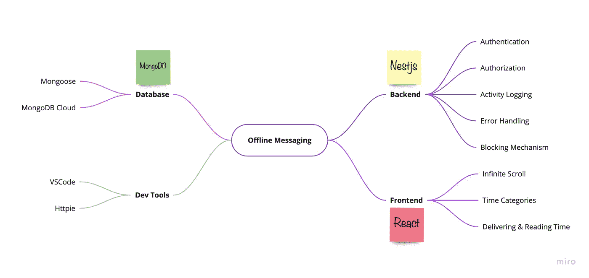
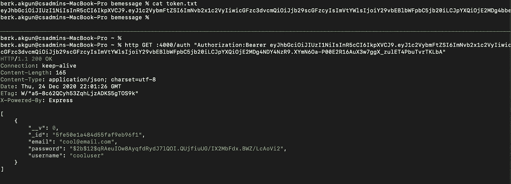
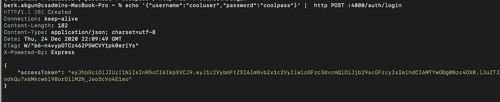

# 前端开发人员的后端视角—创建全栈离线消息应用程序

> 原文：<https://medium.com/geekculture/backend-perspective-of-a-frontend-developer-creation-of-a-full-stack-offline-messaging-app-3f5341cfc11?source=collection_archive---------0----------------------->

在我的上一篇文章中，我试图为前端开发人员提供一个简单的解决方案，这些开发人员不想花费后端工作来验证和授权他们的 web 应用程序。如果你有兴趣，欢迎你去看看。

[](https://labs.armut.com/create-easy-login-page-with-google-oauth-in-your-mongodb-realm-app-7022f8889712) [## 在您的 MongoDB Realm 应用程序中使用 Google OAuth 创建简单的登录页面

### 如果时间有限，注册和登录页面有时可能会很麻烦。

labs.armut.com](https://labs.armut.com/create-easy-login-page-with-google-oauth-in-your-mongodb-realm-app-7022f8889712) 

这一次，通过一个全栈项目，一个离线消息应用程序，我将尝试学习并分享我在中型系列中的经验。这个系列背后的动机是学习后端框架，并分享我作为前端开发人员学习后端框架的观点。我希望它能给那些想学习后端但不想做临时工作的前端开发人员一些启发。此外，我将感谢后端开发人员的任何反馈，以更好地理解自己的概念。

我将在这个项目中使用的技术列表如下所示。老实说，我是根据我想要学习的技术和获得的实践经验列出这个列表的，因为我没有任何与性能相关的问题或其他限制。



Technologies, Features and The Tools Used in the Application

规划完项目后，我们终于可以写一些代码了。为了清楚起见，我将从设置 NestJs 项目开始，并将其连接到 MongoDB cloud。然后，将与 JWT 实施授权。首先，我强烈推荐遵循文档，阅读下面的 medium 文章，并遵循使用 nest 创建新项目的说明。之后，安装*HTTP pie*，用户友好的命令行 HTTP 客户端，用于在这个项目中轻松测试我们的 api。

[](/better-programming/getting-started-with-nestjs-a4e8b0b09db4) [## NestJS 入门

### 为什么您应该在下一个项目中考虑 NestJS

medium.com](/better-programming/getting-started-with-nestjs-a4e8b0b09db4) [](https://httpie.io/) [## API 时代的命令行 HTTP 客户端

### hello World:$ https httpie.io/hello 自定义 HTTP 方法，HTTP 头和 JSON 数据:$ HTTP PUThttpbin.org/put…

httpie.io](https://httpie.io/) 

在使用说明创建了您的 nest 项目并安装了 *httpie* 之后，打开您的终端并使用 nest-cli 在项目开始时提供的 *httpie* 点击端点。

使用`http GET :3000`,如果你在终端上看到`Hello World!`,我们就可以开始了！快点，我们要学的东西太多了！

要在你的应用程序中添加 mongoose，你应该首先安装必要的包，并在你的应用程序中添加你需要的 nest config 服务。

```
npm i --save @nestjs/config
npm install --save @nestjs/mongoose mongoose @types/mongoose
```

创造。env 文件并添加您的 mongoDB 云 url。

```
MONGODB_URI=mongodb+srv://<username>:<password>[@sometext.mongodb.net](mailto:27182575@ilkadim.dnzm7.mongodb.net)/<database>?retryWrites=true&w=majority
```

在你的 app.module 中，我们会注入 Nest 提供的 config 模块和 MongoDB 模块。

> 与 in Nest 不同的是， [Angula](https://angular.io/) r 提供方在全球范围内注册。一旦定义，它们在任何地方都可以使用。但是，Nest 将提供者封装在模块范围内。*这就是为什么我们将为模块创建一个全球模块，并在应用程序的任何地方注入我们可能需要的服务。*

```
nest g mo global
```

@ Global()“decorator”使得该模块可以在应用程序中的任何地方使用。在我们的全局模块中，我们导入了 nest 的内置猫鼬模块，并从。env 文件并添加了 JWT 模块，因为我们可能会在应用程序的任何地方使用 JWT 实例。此外，您可能会注意到模块中的 BcryptService。我在那个文件中收集了 jwt 需要的所有加密方法。您可以在下面的要点中看到方法。

Bcrypt Services

Nest 使用与 Angular 几乎相同的结构，所以如果您熟悉 Angular，您会更快地了解它。在嵌套中，您的模块使用与 Angular、DI 和依赖注入相同的设计模式。您将为您的端点和实现逻辑创建模块、服务和控制器，并将其导入其他模块。所以，在导入模块时要小心，除非您想被循环依赖错误所捕获。为了更好地了解嵌套结构，您可以查看文档中的细节。然而，为了更加清晰和节省时间，我将直接开始实现 Nest 文档中解释的认证逻辑。

[](https://docs.nestjs.com/security/authentication) [## 文档| NestJS -一个进步的 Node.js 框架

### 身份验证是大多数应用程序的重要组成部分。有许多不同的方法和策略来处理…

docs.nestjs.com](https://docs.nestjs.com/security/authentication) 

```
npm install --save @nestjs/passport passport passport-local
npm install --save-dev @types/passport-local
npm install --save @nestjs/jwt passport-jwt
npm install --save-dev @types/passport-jwt
npm install --save bcrypt @types/bcrypt
```

添加必要的包后，我们将创建两个模块，即*验证*和*用户。*

```
nest g mo auth && nest g co auth && nest g s auth
nest g mo users && nest g co users && nest g s users
```

对于身份验证，我们的身份验证模块中有两种身份验证策略，即“本地”和“JWT”策略。经过一番研究和分析，我想出了一个认证的主意。由于 JWT 将用于大多数端点，除了注册和登录端点之外，我将为所有应用程序创建一个 jwt-auth-guard，并且我将通过添加 SetMetadata 方法 Nest 为我们提供的 is_Public 元数据来排除注册和登录端点。为了方便起见，我将创建“@Public”和“@ UseLocalStrategy”自定义装饰器，用于注册和登录控制器。

Custom Decorators

策略可以像下面这样添加到应用程序中。

在该策略中，validate 被用作嵌套验证的默认方法。验证后，使用加密服务对密码进行加密。

这是 auth-guard，它扩展了 jwt auth-guard，允许带有 isPublic 元数据的请求通过，并强制其他人为我们进行 jwt 授权。我会为您将这些策略和授权导入到 app.module 中。这里需要注意的是，在本地策略中，您可能希望使用电子邮件而不是用户名进行验证。默认情况下，它在 PassportStrategy 中使用用户名。但是，您可以将 userNameField 更改为您想在 super()中使用的任何字段。

这是我们的嵌套应用程序的认证机制。我们还需要填写用户模块和认证模块和控制器进行测试。为了简单明了，你可以看看用户模块和 dto 等。来自 github 的知识库将在故事的底部分享。用户模块包括我们验证用户所需的数据库服务。您可以在下面的 gist 中看到使用 nest auth.controller 定义端点是多么容易。

是时候测试我们的终点了！首先，让我们从终端用 httpie 注册我们的用户，并将 auth token 存储在 token.txt 文件中。

`echo '{"username":"cooluser","password":"coolpass","email":"cool@email.com"}' | http POST :4000/auth/register > token.txt`

`cat token.txt`希望能给我们授权令牌🙏

然后点击端点，这将为我们展示数据库中的所有用户。

`http GET :4000/auth "Authorization:Bearer <your-auth-token>"`

哒哒！Jwt 管用！



Password is encrypted in Mongo

让我们尝试使用本地策略的登录端点。在这个策略中，我们从数据库中获取加密的密码，并使用 bcryptService 中的 comparePassword 方法，我们为 jwt 定义并返回 auth token，这样我们就可以在应用程序的前端使用它作为 cookie，我们将在本系列的后续部分中实现该应用程序。



Access token after logging the user in

所以我们到目前为止所做的，对我来说是一大步，但对后端开发人员来说是一小步！

*   粗略地计划了我们的应用程序。
*   创建了我们的 nest 项目。
*   创建了用于注入 MongoDB、ConfigService 和 JWT 的全局模块。
*   创建了基本的端点，甚至我们的第一个定制装饰器！
*   实施本地策略和 JWT 策略进行身份验证。
*   测试成功！

到目前为止一切顺利！TBH，对我来说，作为一名前端开发人员，理解这一点并不容易，阅读和谷歌搜索了大量文档，但这是值得的。了解了这么多，我将尝试使用最流行的消息队列之一 RabbitMQ 来实现活动日志。下次见！

[](https://github.com/akgunberk/offline-messaging) [## akgun Berk/离线消息

### 一个渐进式 Node.js 框架，用于构建高效且可伸缩的服务器端应用程序。嵌套框架类型脚本…

github.com](https://github.com/akgunberk/offline-messaging)