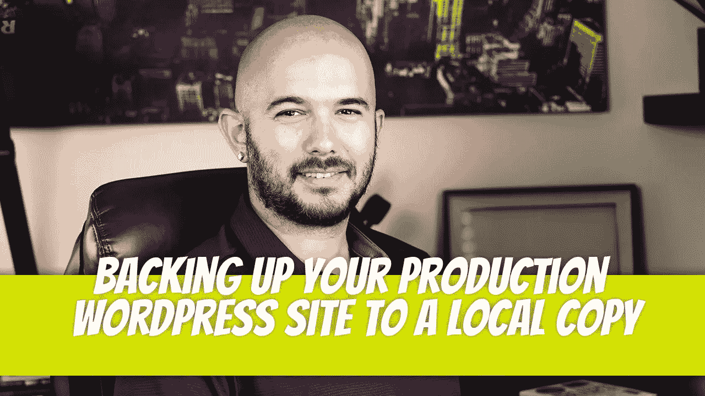

# 将你的生产 Wordpress 站点备份到本地副本

> 原文：<https://medium.com/geekculture/backing-up-your-production-wordpress-site-to-a-local-copy-bbad3a04b517?source=collection_archive---------13----------------------->

我自己也去过。你在 Wordpress 托管主机上启动一个 Wordpress 站点，并让它运行。很好，直到有些东西停止工作，你不能访问你的管理部分。你希望你有一个网站的本地工作副本，甚至更好的是，在其他地方运行一个备份来快速指向你的 DNS。