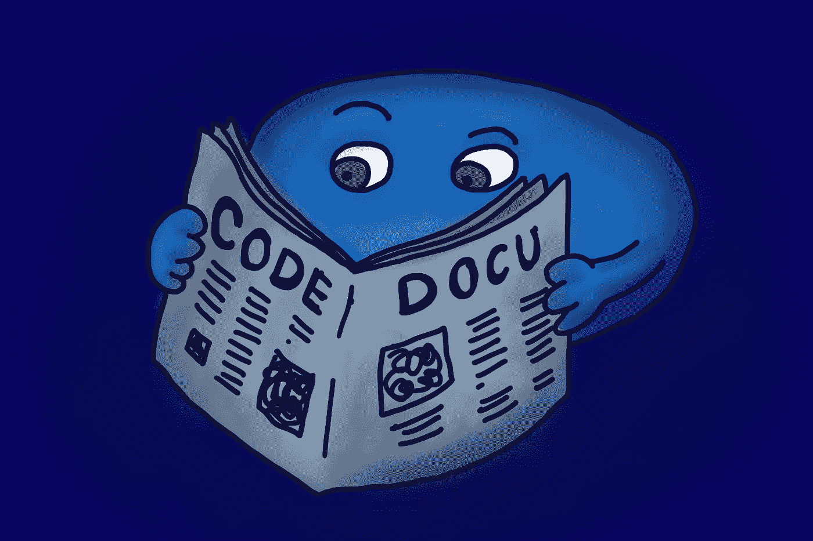

# 坏消息，初级开发人员:你将被你的文档所评判

> 原文：<https://medium.com/geekculture/bad-news-junior-developers-you-will-be-judged-by-your-documentation-dc8982cbb0bf?source=collection_archive---------0----------------------->

## 最糟糕的事最重要

The quality of your documentation might be the defining factor in your career.

  D 开发者之所以成为开发者，是因为他们喜欢编码。许多人在十几岁的时候，放学后，或者下班后从事编程工作。他们意识到他们可以从 IDE 和命令行中获得多大的能力，并对此上瘾。