# 银行查询意图检测器

> 原文：<https://medium.com/geekculture/banking-query-intent-detector-bbbb20c973bb?source=collection_archive---------18----------------------->

这个项目是一个端到端的案例研究，研究先进的深度学习技术如何帮助我们在没有任何人工干预的情况下对银行客户提出的查询意图进行分类。这种情况有助于聊天机器人在理解消息的意图后决定应该给客户回复什么消息。

[https://blog.talla.com/how-to-implement-a-support-chatbot-the-right-way](https://blog.talla.com/how-to-implement-a-support-chatbot-the-right-way)

**目录:**

1.  商业问题
2.  对数据科学的需求
3.  数据来源
4.  探索性数据分析
5.  使用手套首次切割溶液
6.  使用最先进技术的深度学习模型
7.  模型比较
8.  使用 Streamlit 进行部署
9.  结论
10.  未来的工作
11.  轮廓
12.  参考

# 1.商业问题

我们正在研究的业务问题给出了一个文本格式的银行客户的文本查询，我们必须将文本分类到其中一个意图类中。此外，我们需要得到一个模型，在这个任务中提供高性能和重量轻的大小。

# **2。对数据科学的需求**

为什么我们需要数据科学来解决这个问题？

*   现有的方法是使用人工来获得意图，这是呼叫中心工作人员所做的。
*   但对于简单的查询，我们只需给出一个选择的答案，机器可能是有用的，这对于呼叫中心的工作人员来说，每当他们可以回答高层次的查询时，都是令人讨厌的。
*   此外，该机器可以全天候运行。

使用哪个指标来验证我们的模型性能？

*   银行数据有 77 类意向
*   数据是不平衡的，因为这 77 个类别的样本数量在训练数据中是不同的。

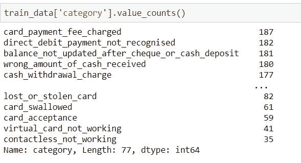

*   **准确性**不能用于不平衡数据，因此对我们的情况没有帮助。
*   **Precision** 将告诉我们所有预测为正的点，实际上有多少，这对我们的情况很重要。
*   **回忆**很重要，因为它将告诉所有实际上为正的点，其中有多少被预测为正。
*   **F1-得分**是精确度、召回率和精确度的几何平均值，如果召回率和精确度高，则得分高。
*   **回想一下**和**精度**在我们的场景中都应该很高，我们可以将 **F1 分数**作为我们的衡量标准。
*   由于我们的数据不平衡，我们将考虑**加权 F1 分数**，它将在计算 **F1 分数**时考虑级别权重。

# 3.数据来源

数据脚本由 Poly-AI 公司提供，它包含文本列和文本所属的类别。

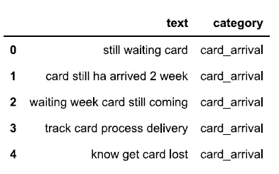

banking data

# 4.探索性数据分析

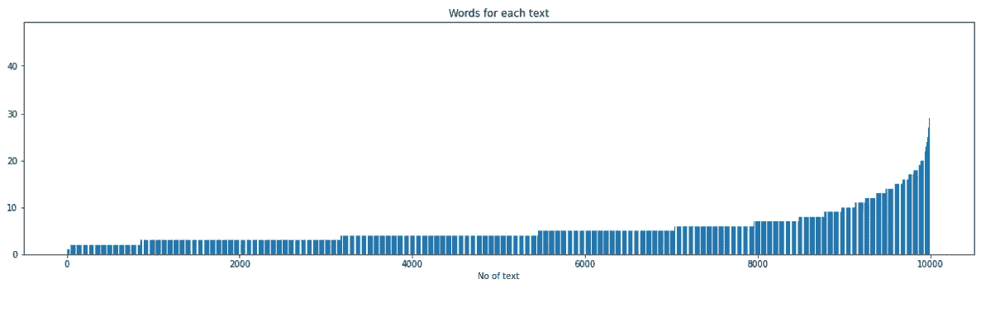

count of words present in each text

该图将帮助我们确定给予模型的输入句子的最大长度，主要考虑 90–95%的句子的最大长度。

**字云**

一、类别:卡 _ 支付 _ 手续费 _ 已收

结论

*   人们通常用“费用”、“收取的”、“额外的”等词来表示信用卡支付的意图。
*   这通常发生在使用信用卡或借记卡的时候。

二。类别:丢失或被盗卡

结论

*   丢失或被盗卡的意图通常由词语“卡”、“丢失”、“被盗”、“帮助”来识别。

三。类别:收到的现金金额错误

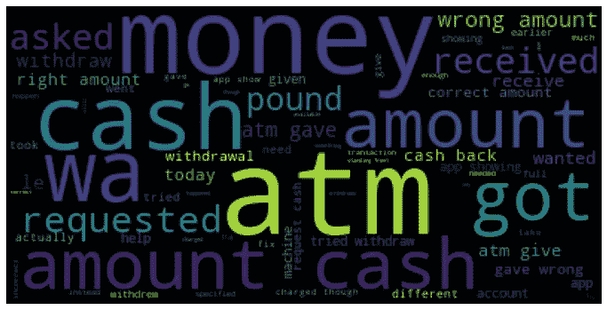

结论

*   当 atm 机不能正常工作时，通常会出现错误的收款意图。
*   常见的词有“atm”、“现金”、“钱”。

# 5.第一次切割溶液

作为第一个解决方案，我们尝试使用手套算法

> GloVe 是一种无监督学习算法，用于获取单词的矢量表示。在来自语料库的聚集的全局单词-单词共现统计上执行训练，并且所得的表示展示了单词向量空间的有趣的线性子结构。

正在创建数据管道:

模型架构:

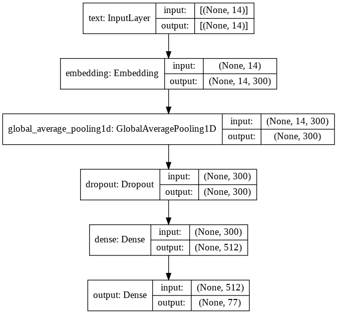

尝试了一些组合，

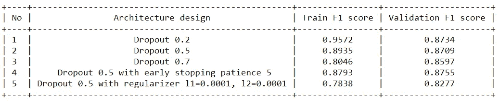

最小的过度拟合出现在模型 4 退出 0.5，提前停止耐心 5 训练 F1 得分 0.8793，验证 F1 得分 0.8755

# 6.使用最先进技术的深度学习模型

1.  **BERT(来自变压器的双向编码器表示):**

有关 BERT 的更多信息，请参考该网站，

 [## 有插图的伯特、埃尔莫等人(NLP 如何破解迁移学习)

### 讨论:黑客新闻(98 分，19 条评论)，Reddit r/MachineLearning (164 分，20 条评论)翻译…

jalammar.github.io](http://jalammar.github.io/illustrated-bert/) 

我们已经使用预训练的 Bert 模型(Bert _ en _ wwm _ cased _ L-24 _ H-1024 _ A-16)来获得嵌入:

模型架构:

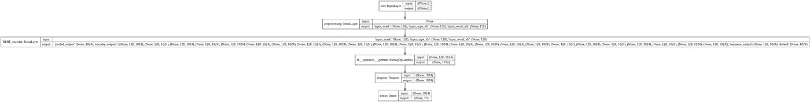

用 BERT 模型的最终结果，训练 f1-得分 0.8452，验证 f1-得分 0.7802。伯特模型似乎过度拟合了数据，而且模型的规模非常大。伯特模型不能比手套表现更好。

**2。通用语句编码器:**

通用句子编码器是一种双编码器模型，它将文本编码成高维向量，这些向量可用于文本分类、语义相似性、聚类和其他自然语言任务。

模型架构:

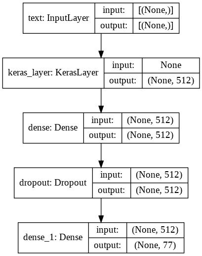

使用模型的最终结果，训练 f1-得分 0.9350，验证 f1-得分 0.9314。与 GloVe 和 BERT 模型相比，这些是获得的最佳结果。与 GloVe 和 BERT 相比，它的过度拟合最少，而且模型的尺寸也较小。

**3。转换(来自变形金刚的会话表示):**

ConveRT 是一个双语句编码器**，**它是有效的，负担得起的，快速训练，并且 ConveRT 模型的大小比 BERT 模型小。根据开发 PolyAI 的公司进行转换，该公司接受了 Reddit 对话数据(上下文、响应)培训。但遗憾的是，ConveRT 在 Tensorflow 中没有实现。所以我尝试在 TensorFlow 中从头构建 ConveRT，并用 Reddit 对话数据对其进行训练。

模型架构；

I .位置编码

关于位置编码的详细理解，请参考这个博客，

 [## 变压器架构:位置编码

### 变压器架构是由 Vaswani 等人提出的一种新颖的纯注意力序列到序列架构

kazemnejad.com](https://kazemnejad.com/blog/transformer_architecture_positional_encoding/) 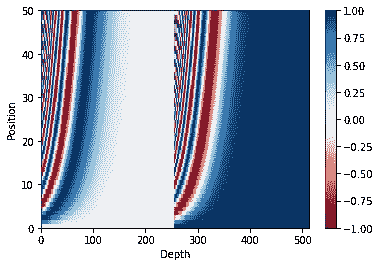

Positional Encoding

二。编码器层

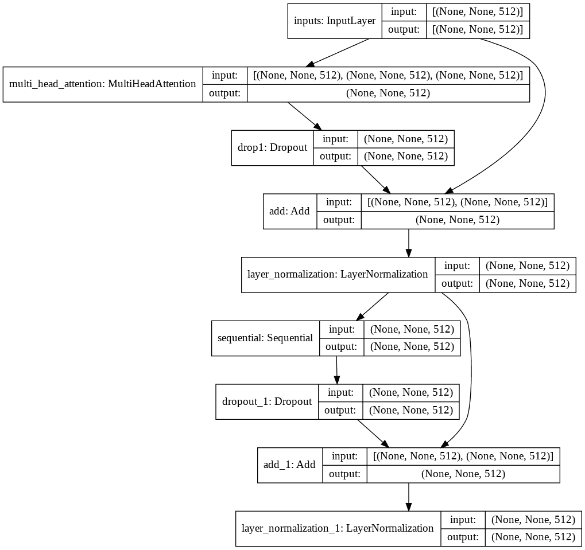

三。带编码器层的完整编码器

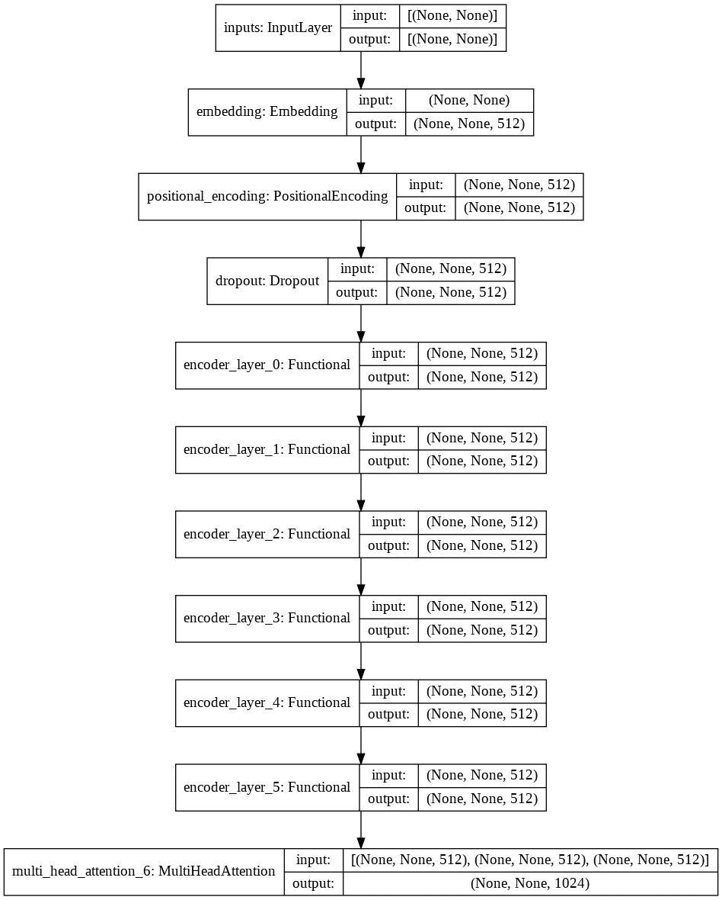

四。最终转换模型

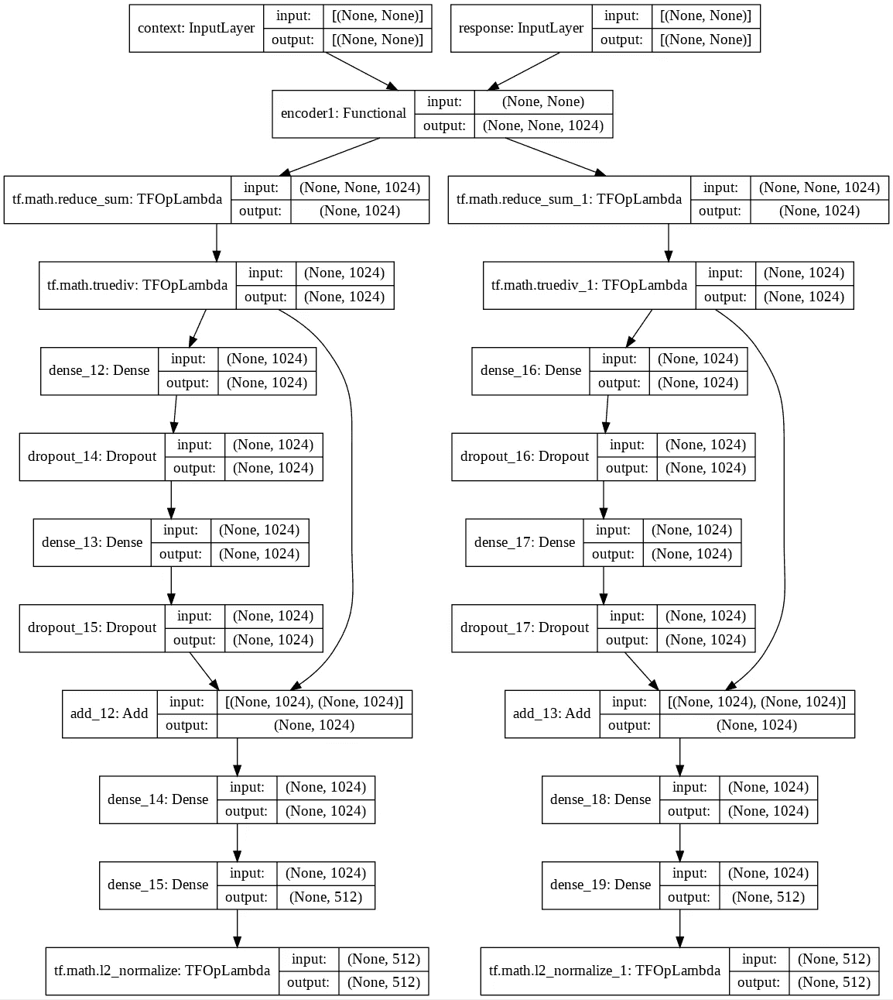

使用的损耗实现:

I .基于转换纸张的损失

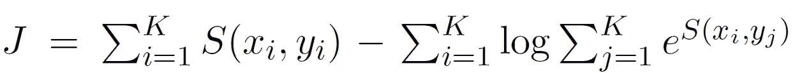

ConveRT Loss

s(，yi)=语境间的相似性及其对应的反应

S(xi，yj)=上下文和其他响应之间的相似性

ConveRTloss

二。三重损失

**三重损失**是用于机器学习算法的**损失**函数，其中基线(锚)输入与正(真)输入和负(假)输入进行比较。

三重损失=最大值(正距离+负距离+余量，0)

Triplet loss

当用 Reddit 数据训练时，问题是损失没有更新。我们尝试了切换损失、更改批处理大小、更改输入的最大长度、检查直方图是否更新等选项，但我们找不到出路，而且我们还有时间限制，因此我们暂停了转换部分的研究。但我希望尽快恢复。

# 7.模型比较

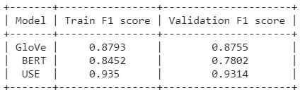

# 8.使用 Streamlit 进行部署

**使用 Stream-lit 库创建并在 Stream-lit 上部署的模型的最终部署。**

> [*Streamlit*](https://streamlit.io/) *是一个开源的 Python 库，可以轻松创建和共享漂亮的、定制的机器学习和数据科学 web 应用。*

Streamlit logo

链接到 web 应用程序:

[https://share . streamlit . io/wins 999/query _ intent _ detector/main/main _ app . py](https://share.streamlit.io/wins999/query_intent_detector/main/main_app.py)

# 9.结论

我们已经尝试了不同的基于语言的模型来解决我们关于银行查询意图检测的问题。我们发现，在这种情况下，像通用语句编码器这样的双语句编码器模型比现有技术模型 BERT 的性能更好。此外，通用语句编码器模型比 BERT 模型重量轻。

# 10.未来的工作

我们试图用 GloVe、BERT 和 USE 等模型来解决我们的问题。我们还构建了 ConvRT 模型架构，阅读其研究论文，同时培训存在一个问题，即由于时间限制，损耗没有更新。我暂停了 ConveRT 部分的研究。但我希望尽快恢复。

> 对于代码，只要从下面提到的 github 链接中叉出我的项目，如果有任何问题或改进，您可以建议我发表评论或在 LinkedIn 或 mail 上联系我。
> 
> 邮件:winston23fernandes.wf@gmail.com

# 11 个人资料

 [## 温斯顿·费尔南德斯-甲骨文应用程序技术顾问- LNT 信息技术| LinkedIn

### 📌所执行的 Oracle 电子商务活动:✅Defining 并发程序、可执行文件和请求集。创建了 XML、RDF…

www.linkedin.com](https://www.linkedin.com/in/winston-fernandes-a14a89145/)  [## wins 999/查询意图检测器

### 这个项目检测文本查询的意图。-wins 999/查询意图检测器

github.com](https://github.com/wins999/Query_intent_detector) 

# 12 篇参考文献

*   [https://www.appliedaicourse.com/](https://www.appliedaicourse.com/)
*   [https://kazemnejad . com/blog/transformer _ architecture _ positional _ encoding/](https://kazemnejad.com/blog/transformer_architecture_positional_encoding/)
*   【https://arxiv.org/abs/1911.03688 
*   [https://github.com/codertimo/ConveRT-pytorch](https://github.com/codertimo/ConveRT-pytorch)
*   Span-ConveRT:对具有预先训练的会话表示的对话的少量镜头跨度提取，[https://arxiv.org/abs/2005.08866](https://arxiv.org/abs/2005.08866)
*   使用双语句编码器进行有效的意图检测，[https://arxiv.org/abs/2003.04807](https://arxiv.org/abs/2003.04807)
*   [http://jalammar.github.io/illustrated-bert/](http://jalammar.github.io/illustrated-bert/)
*   [https://nlp.stanford.edu/projects/glove/](https://nlp.stanford.edu/projects/glove/)
*   伯特:语言理解深度双向转换器的预训练，[https://arxiv.org/abs/1810.0480](https://arxiv.org/abs/1810.04805)
*   通用语句编码器，[https://arxiv.org/abs/1803.11175](https://arxiv.org/abs/1803.11175)
*   转换:来自《变形金刚》的高效准确的对话表达，[https://arxiv.org/abs/1911.03688](https://arxiv.org/abs/1911.03688)
*   [https://www.reddit.com/dev/api/](https://www.reddit.com/dev/api/)