# 印度的破产——第一部分

> 原文：<https://medium.com/geekculture/bankruptcy-in-india-part-1-5eaf748623e7?source=collection_archive---------13----------------------->

分析印度破产数据以发现有趣的模式。

## 摘要

在一个收购和破产相互关联的世界里，我正在研究宏观经济波动对企业退出的影响。我的目标是弄清楚决定破产和收购的机制是如何受到印度经济环境的影响的。

## 介绍

破产是指企业或个人无力偿还债权人的债务。准确预测企业破产对于投资者和企业管理者提前采取适当的行动至关重要。2008 年的经济灾难引发了一场关于市场可持续性和预测市场可持续性的方法的讨论。为了避免未来发生类似的灾难性灾难，需要更强的预测模型。

更好地理解破产，以及预见破产的能力，将对全球贷款机构的盈利能力产生影响。因此，在该领域已经进行了许多研究，其中大多数研究集中在从具有良好预测能力的财务报表中寻找有效的财务比率，并且最近集中在基于新发现的统计或数据挖掘模型开发具有高预测能力的强大模型。公司和企业的破产对金融市场有许多影响，因此通过监视几个特征来预测组织间破产的必要性变得更加重要。破产预测模型的性能由两个主要因素控制:选择的解释变量和用于捕捉解释变量之间关系的方法。

这篇博客是我正在进行的整个研究的第一部分。在这里，我使用各种数据分析技术分析从不同合法数据源/网站收集的宏观经济数据。在第二部分中，我将尝试一些机器学习模型，以找出我们如何使用财务因素成功预测一个组织的破产。

## 方法学

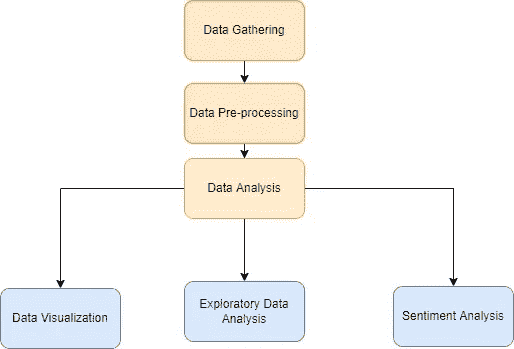

Methodology Adopted

为了提高项目效率并实现目标，任务被分成不同的小部分，这些小部分易于实现，也有助于实现项目的主要目标。上图解释了整个过程。

## 数据收集

根据我们分析所需的数据类型以及我们研究的重点行业，我们可以从多种来源获取数据。

在我的研究中，以下数据来源用于收集经济数据

*   [*CMIE 神威*](https://unemploymentinindia.cmie.com/)
*   [*Reorg 网站*](https://reorg.com/)
*   [*IBBI 网站*](https://www.ibbi.gov.in/)
*   [*世界银行网站。*](https://www.worldbank.org/en/home)
*   [*打点网站。*](https://www.rbi.org.in/scripts/PublicationsView.aspx?id=19872)
*   [*统计与计划执行部网站。*](https://www.mospi.gov.in/)

分析时考虑的宏观经济变量

*   印度的实际 GDP 增长率
*   印度的通胀率
*   印度消费价格指数
*   工业生产指数
*   印度卢比的汇率
*   失业率。

## 使用的工具

*   附加电源装置（Supplementary Power Supply Set 的缩写）
*   微软优越试算表
*   （舞台上由人扮的）静态画面
*   计算机编程语言

## 通过数据可视化进行数据分析

在开始之前，让我们探讨一下公司在申请破产之前和之后经历的不同破产阶段。

破产阶段

**履约授信:**中期不付款风险上升的情况。

**有压力的/不良的:**尚未进入法院监管的重组程序、重组前仍有 24 个月时间的公司，以及即将重组的公司。

**重组/清算:**已经启动并正在进行法院重组程序的所有情况。

**重组后/关闭:**已经完成并处于法院程序中的情形，可能在重组后股权或其他担保之后。也可能关注并购后或其他诉讼。

企业破产解决程序(“CIRP”)是企业债务人的债权人收回资金的一种机制。对债权人负有债务的公司或有限责任合伙企业(“LLP”)被称为公司债务人。2016 年《破产和破产法》(IBC)规定了个人、合伙企业、有限责任合伙企业和公司进行破产或破产程序的程序。但是，如果最低违约金额为 10 亿卢比，则适用《IBC》规定的企业债务人破产和清算程序。

以下是从 IBBI 网站收集的 2017 年 3 月至 2021 年 3 月提交的企业破产解决程序(CIRPs)数量的可视化数据。

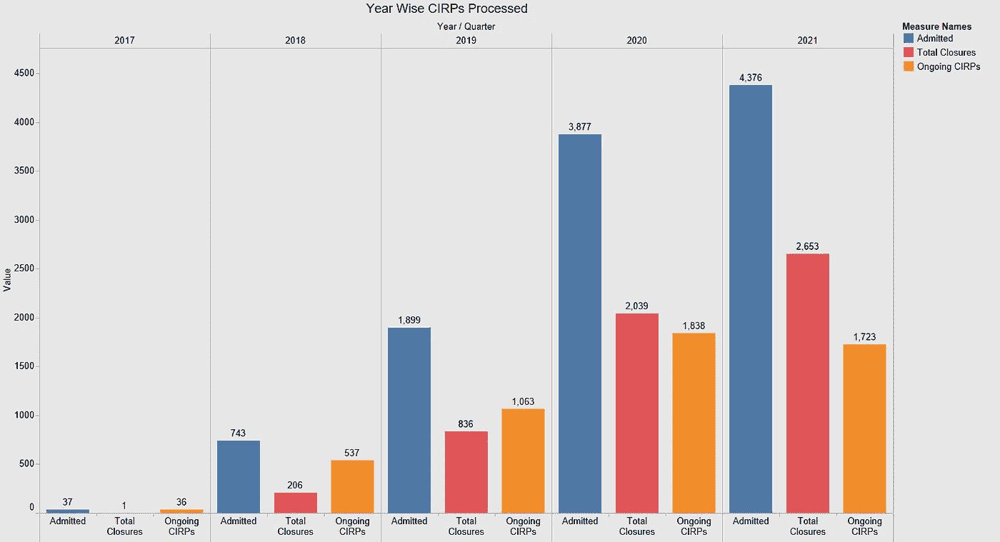

Year-wise total CIRPs admitted, closed, and carried forward to the next year

*   从上述形象化的数据中，我们可以推断，申请 CIRP 的公司数量在不断增加。该图还显示，被接纳的 CIRP 人数大约是被关闭总数的两倍。
*   从 2017 年到 2020 年，全部关闭和正在进行的 CIRPs 大致相同。
*   然而，到 2021 年，与正在进行的 CIRPs 相比，关闭总数将显著增加。
*   自 2016 年《无力偿债和破产法典》出台以来，被承认的 CIRPs 数量急剧增加。2021 年，正在进行的流程减少，导致关闭总数上升。

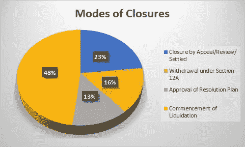

Percentage of closures through different modes

这里我们看到清算的开始几乎占据了 CIPRs 关闭模式的一半。

此外，我们分析数据，以找出哪个行业最容易破产，即过去几年中哪个行业的公司申请了 CIRPs。

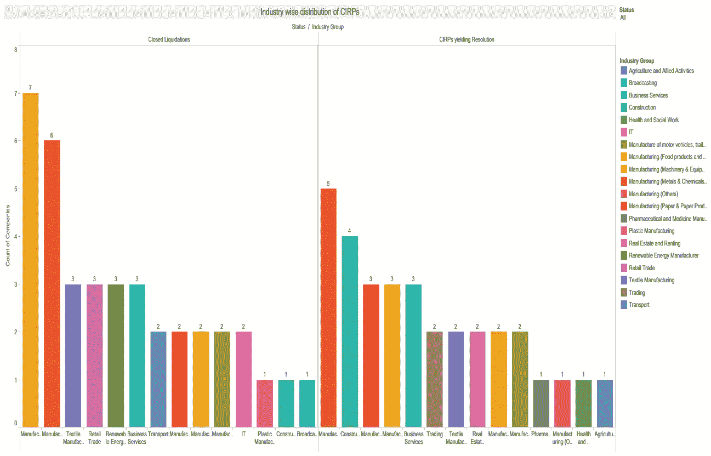

Industry-wide distribution of CIRP

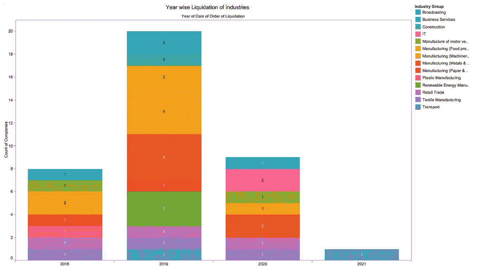

Year-wise Liquidation of Industries

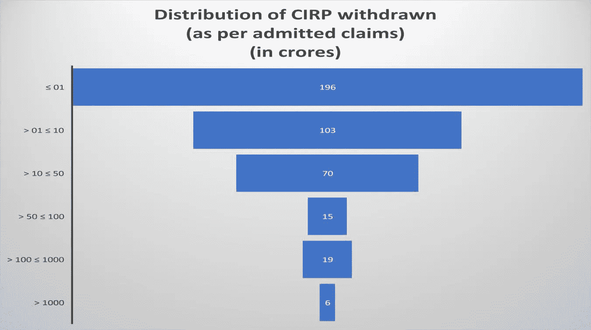

Distribution of CIRP withdrawn

从上面的形象化描述中，我们可以推断，在所有被撤销的 cirp 中，有 196 个 cirp 的金额低于 1 亿，只有 6 个 cirp 的金额超过 1000 亿。

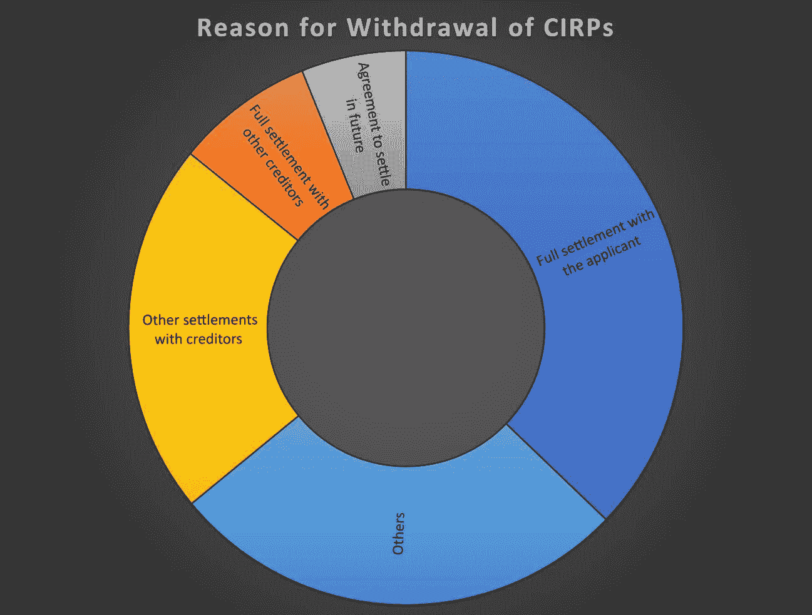

The reasons for the Withdrawal of CIRPs till March 31, 2021.

这里我们看到，在各种各样的撤诉理由中，“与申请人全额结算”是最受欢迎的理由。

**自愿清算:**在公司股东同意的情况下，当公司决定根据自己的条件进行清算时，就发生了自愿清算。当一家公司认为它不再有经营的理由或这样做不再可行时，通常会作出这一决定。

以下图表显示了印度无力偿债和破产委员会认可的自愿清算的状况。

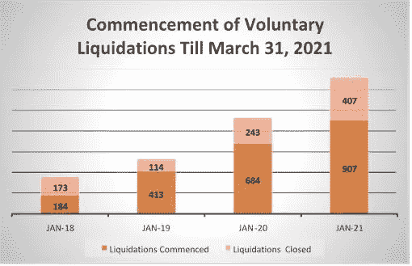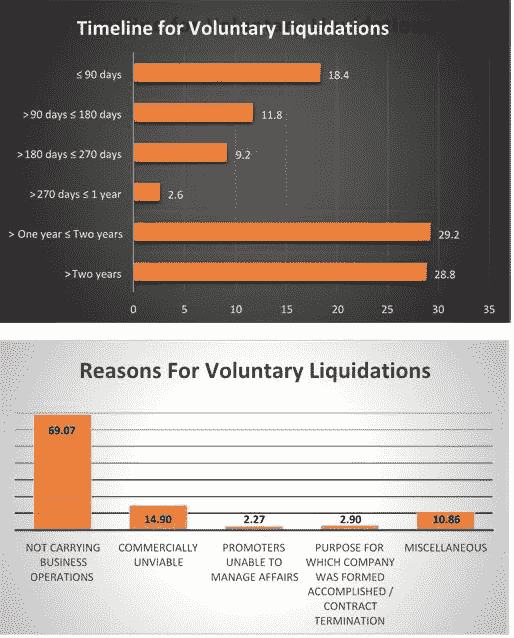

从 2017 年到 2021 年，处于清算阶段(破产的最后阶段)的公司数量与印度失业率之间的关系如下图所示。

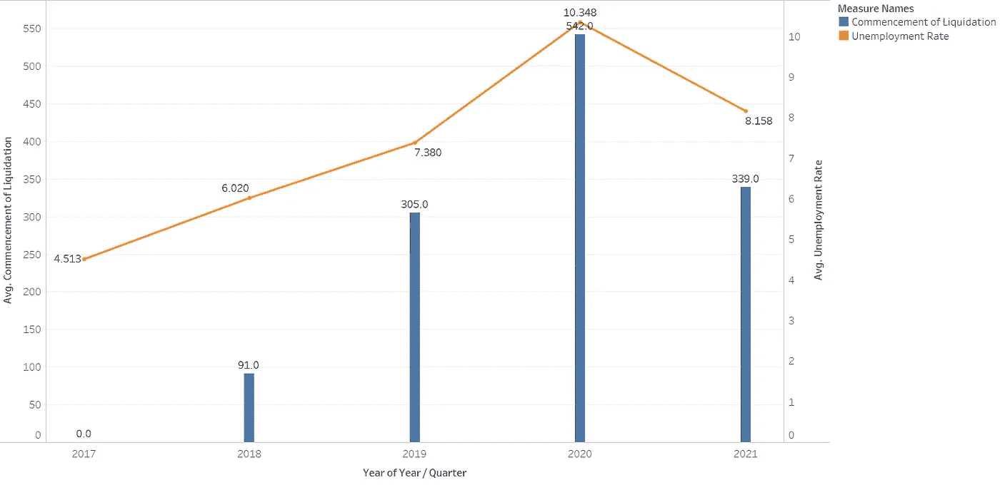

我们可以看到两者之间的正比关系。根据 IBBI 报告，在失业率较高的年份，我们有更多的公司开始清算。

## 探索性数据分析

使用 SPSS 我们可以找出数据集不同特征之间的相关性。在我们的分析中，我们创建了一个关联矩阵来分析每年开始清算的公司数量与影响印度经济的宏观经济变量之间的关系。

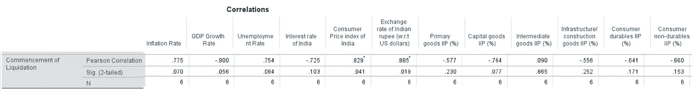

Correlation matrix between the Number of Companies commencing for liquidation and Macroeconomic Variables affecting India’s Economy

*   清算开始与通货膨胀率呈 77%的正相关，显著性水平为 0.07
*   清算开始与 GDP 增长率负相关 80%,显著性水平为 0.05
*   清算开始与失业率呈 75%的正相关，显著性水平为 0.08
*   清算的开始与印度的消费者价格指数正相关 82%,显著性水平为 0.04
*   清算的开始与印度卢比的汇率呈 88%的正相关，显著性水平为 0.01
*   清算开始与资本货物的工业生产指数负相关 76%,显著性水平为 0.07

## 情感分析

另一种分析印度破产状况的方法是探索周围的传言。对从 twitter 上获得的关于“印度破产”的推文进行词汇云和情感分析，会给我们一个非常清晰的画面。

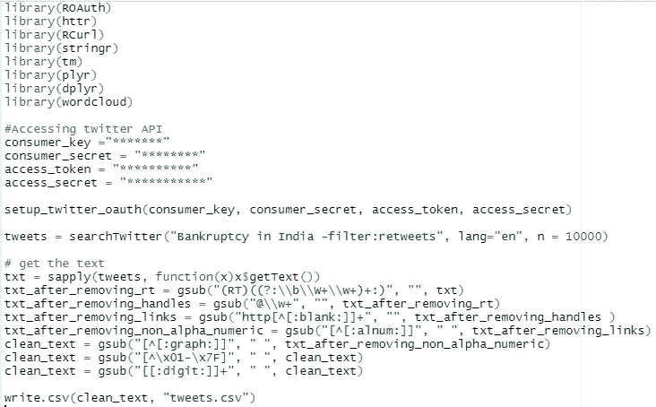

R code to get tweets on Bankruptcy from Twitter

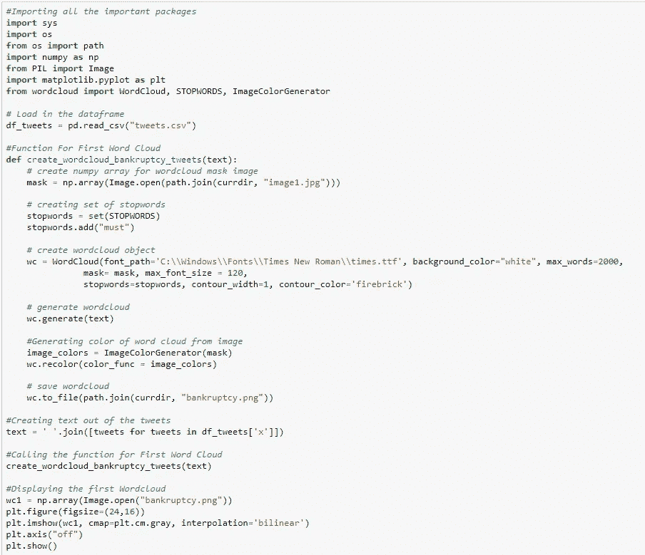

Python code for creating the wordcloud

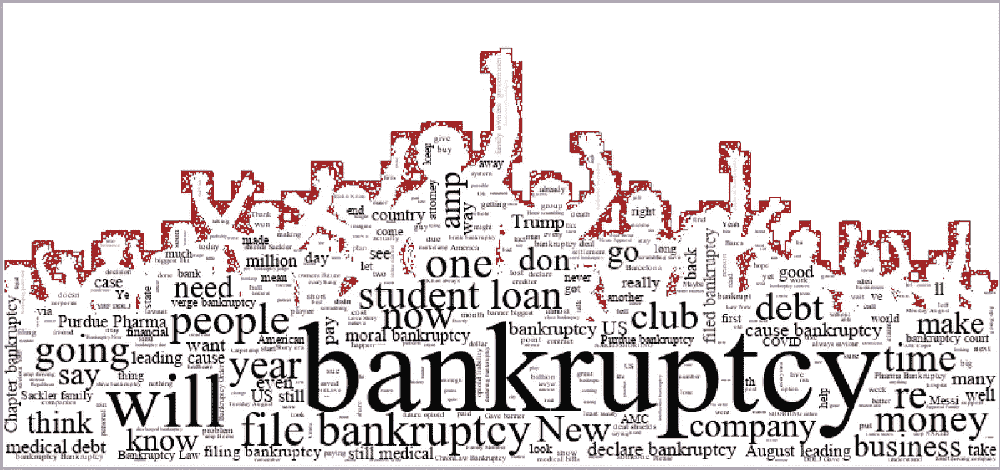

Wordcloud from Tweets collected on “Bankruptcy in India”

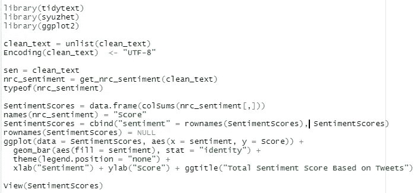

R code to create bar chart for sentiments acquired from the tweets.

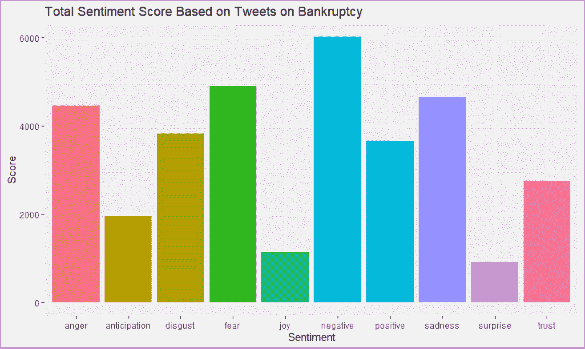

Sentiment analysis on the topic of bankruptcy

## 结论

我们从数据可视化中得出结论，被承认的 cirp 数量正在稳步增加，制造业是受影响最大的行业，196 个 cirp 的金额低于 1 亿卢比，只有 6 个超过 1000 亿卢比，处于清算阶段(破产的最后阶段)的公司数量与印度的失业率成正比。通过探索性的数据分析，我们发现清算的开始与印度的通货膨胀率、失业率、消费者价格指数和印度卢比汇率密切相关。通过文本分析，我们能够更深入地了解印度公众对破产的看法。

***第二部*** 即将到来…..

***参考文献***

[https://public . tableau . com/app/profile/RUP sha . kar 8461/viz/CorporateInsolvencyResolutionProcess/story 1](https://public.tableau.com/app/profile/rupsha.kar8461/viz/CorporateInsolvencyResolutionProcess/Story1)