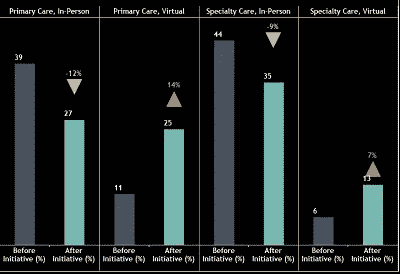
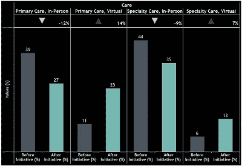
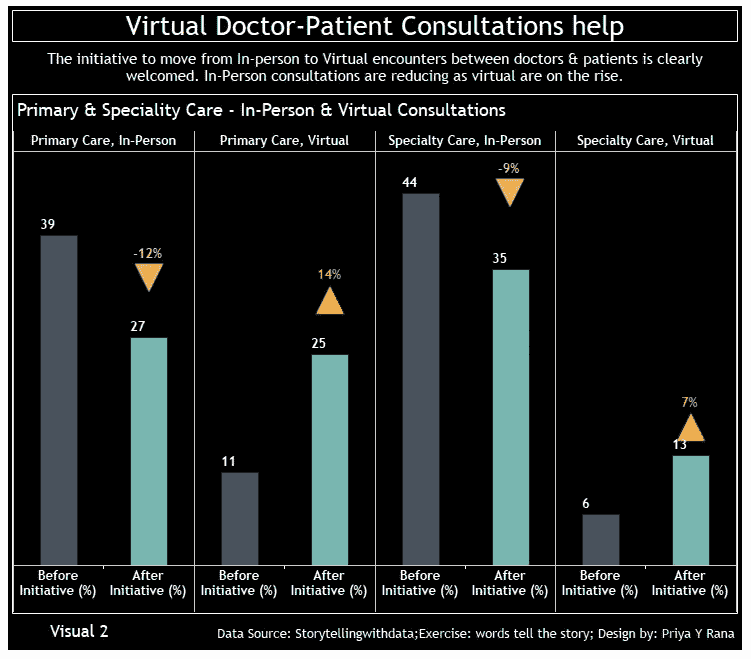
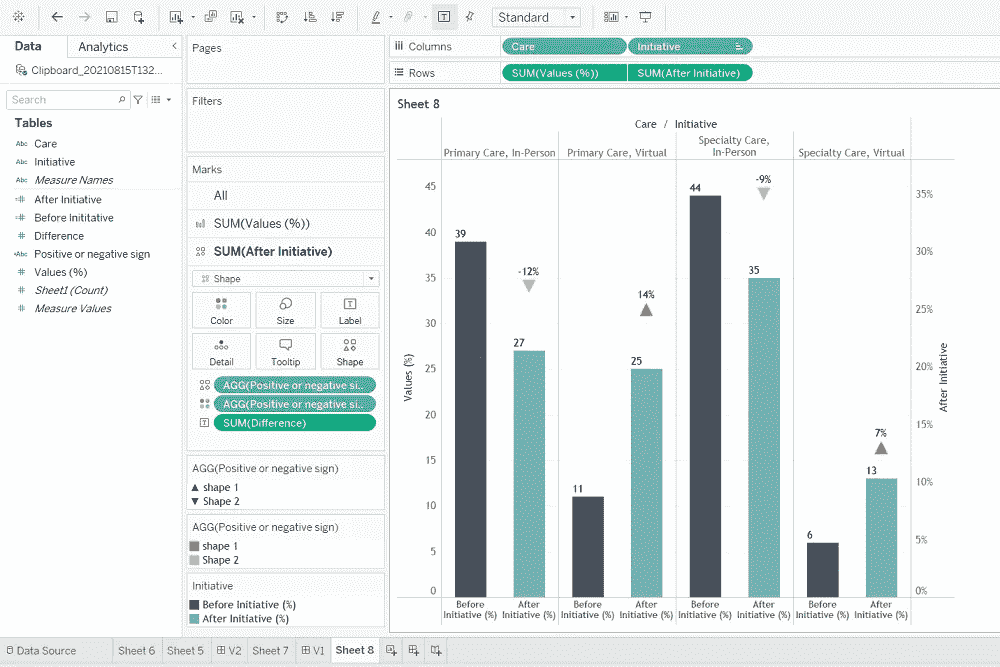
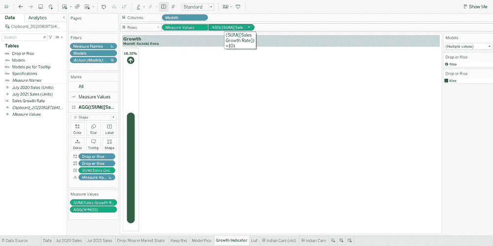
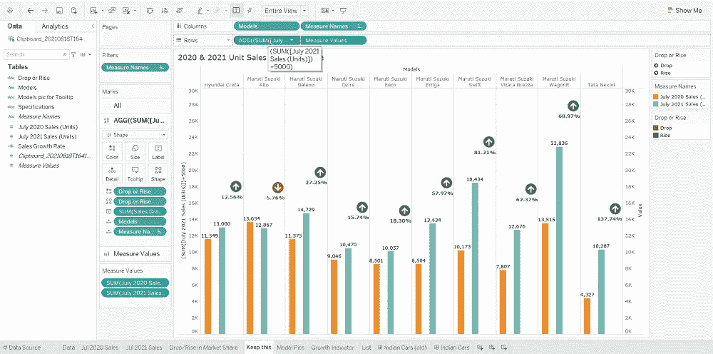
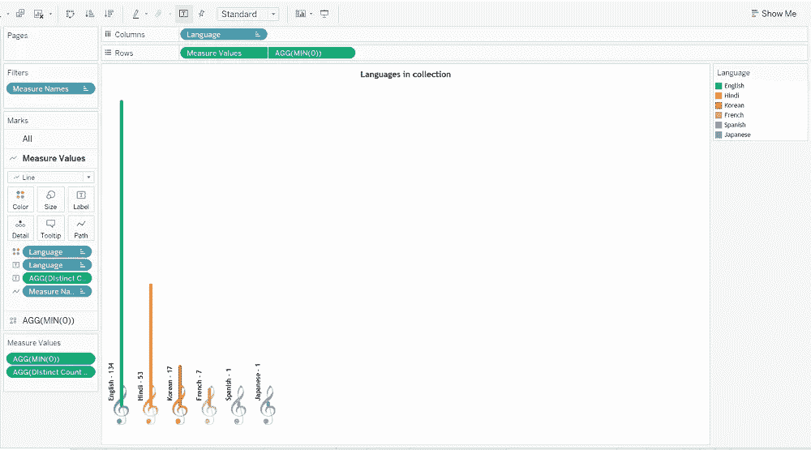

# 条形图—在 Tableau 中试验最小()、最大()、AVG()

> 原文：<https://medium.com/geekculture/bar-charts-experimenting-with-min-max-avg-ca3f80ba60e8?source=collection_archive---------40----------------------->

许多 Tableau 开发人员已经知道 0 和 1 在行或列栏中的 AVG()、MIN()和 MAX()函数中的用法。我的目标不是在这里深入讨论工作细节，而是讨论我用 0 或 1 以外的值使用它们**的例子，这样我们可以减少用户的认知负担。话虽如此，你觉得标题上方左边的视觉效果比右边的更吸引人吗？**

让我们理解为什么和如何。

根据我从加州大学戴维斯分校在 Coursera 上的课程“Tableau 的数据可视化”中收集到的信息；我们应该努力减少用户在视觉/仪表板上的眼球运动。此外，用户的关键外卖是那些不需要用户花费太多时间处理的外卖。这被称为内在认知负荷。通过在柱状图上清楚地显示数值的变化，可以降低眼球运动，从而降低认知负荷。

我首先在一个“[用数据讲故事](https://community.storytellingwithdata.com/)”练习中使用了这个— **用文字讲故事**。背景是，由于预算和资源的限制，一个社区的卫生管理者鼓励虚拟医患咨询的倡议。为了确定倡议的成败，绘制了倡议前后的咨询次数。<参考图 1 >查看最终视觉。

Fig 1 (Pic by Author)

我不想用一张单独的表格来显示下降或上升的百分比。更确切地说，我希望百分比变化能够立即显示在“行动后”字段栏的上方。因此，在绘制了“计划前(%)”和“计划后(%)”后，我将“计划后(%)”字段放置在上面的行栏中的“值(&)”字段旁边，并选中了双轴。然后，在“After Initiative (%)”字段的标记卡中，我将下拉值从条形更改为箭头形状，并选择相关的方向(正或负)和颜色。计算字段用于显示箭头形状。*注意*我没有在这里选择“同步轴”。<参见图 2 >。

Fig 2 (Pic by Author)

**但是**你知道吗，你可以在测量字段中添加一个特定的值来放置你的形状，或者像这样，在 X 或 Y 轴上的百分比变化符号<参考图 3 >？

Fig 3 (Pic by Author)

在这个例子中，我在度量值上加了值 10，这样符号看起来比横条的终点高一点。这样做的好处是形状的位置会随着测量值的变化而变化。这有助于减少图表的混乱。你可以选择你喜欢的任何数字。[点击](https://public.tableau.com/app/profile/priya.yogendra/viz/Top10HighestSellingCarsinIndiaJuly2021/IndianCars)可以更好的了解原因。

您也可以将标志放在酒吧的侧面，也可以放在比酒吧尽头高一点的位置<refer fig="">。</refer>

Fig 4 (Pic by Author)

我简单地放置了最后一个条形的度量，并添加了 5000，以便更好地放置符号(形状)，并确保它不会扰乱图表。

现在，让我们转到更非正式的上下文。

在我的一个视觉作品中，我想要一个非正式的外观，因为它是基于我的个人数据集并且与音乐有关。如果你不熟悉如何有一个圆边条形图和条形图+形状，那么请阅读这个[帖子](https://priya-yogendra.medium.com/bar-chart-with-round-edge-s-in-tableau-f45c5362520a)。我还在圆形条形图上添加了一个形状。这是 MIN(0)函数<的一个非常简单的用法，参见图 5 >。

Fig 5 (Pic by Author)

我还试验了圆条形图下面的一个形状。在本例中，我在<refer fig="">上方的行栏中使用了 MIN(-7)。</refer>

Fig 6 (Pic by Author)

最初，我用 0 尝试了一下，但是当你把这样的图表放在仪表板上时，由于空间有限，它看起来很混乱。所以，在你缩小到一个之前，尝试各种各样的数字。

简而言之，不要把自己限制在 MIN()、MAX()和 AVG()函数中的 0 或 1。也可以尝试其他数字。只要保证在尝试新事物的过程中数据不被篡改就可以了。当然，这并不适用于所有使用条形图的地方。这很大程度上取决于业务场景/情况、视觉/仪表板布局和设计。

如果我不提供关于如何使条形图和仪表板更具视觉吸引力的链接，这篇文章将是不完整的。我推荐的第一本是凯文·弗莱格写的。[在这里](https://www.flerlagetwins.com/2021/07/a-little-design-makes-world-of.html)，他强调一点点的设计可以带来更大的影响，无论是条形图还是其他图表。另外，请[阅读](https://priyankadobhal.medium.com/?p=d402ab52d039)更多 Priyanka Dhobal 关于 AVG(0)、最小(0)和最大(0)函数各种用法的例子。最后但同样重要的是，我将推荐塞缪尔·帕森斯准备的视觉。在这个[视觉](https://public.tableau.com/app/profile/sparsonsdataviz/viz/FinessingBarCharts-arethinkonchartdesign/0_Introduction)中，他会带你通过各种方式来完善和使你的条形图在仪表盘上更有吸引力。如果你对 Tableau 社区有些熟悉或了解的话，我非常确定上述作者都不需要任何介绍。

上面所有的链接将帮助你改善你的条形图和其他图表的视觉效果，这样你的目标就是让你的用户记住要点。

最后，我将鼓励所有开发人员创造他们自己的经历和故事，如果时间允许，分享它们，这样我们就可以建立一个知识库。记住: ***点子产生点子*** 。