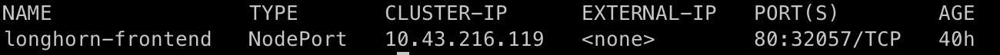
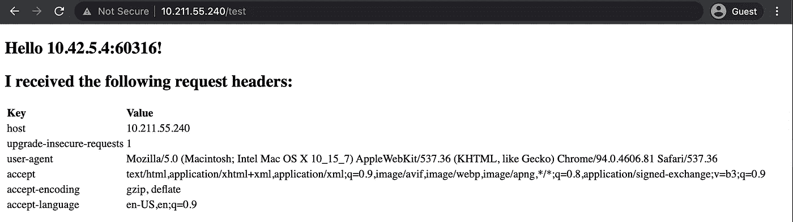

# 裸机 Kubernetes 有 MetalLB、HAProxy、Longhorn 和 Prometheus

> 原文：<https://medium.com/geekculture/bare-metal-kubernetes-with-metallb-haproxy-longhorn-and-prometheus-370ccfffeba9?source=collection_archive---------0----------------------->


几年前，我写了一篇关于用 Rook/Ceph 创建 Kubernetes 集群的博客文章。我当时的主要目标是看看我们是否可以使用 Kubernetes 作为边缘软件栈的集群解决方案。虽然 k3s 工作得很好，但其他一切仍然有一些粗糙的边缘。

首先，许多依赖项仍然缺乏 ARM 支持，并且 [MetalLB](https://github.com/metallb/metallb) 仍然处于早期阶段。HAProxy 不可用于 Kubernetes，因此唯一的选择是使用 Traefik 和 [k3s](https://k3s.io) (这并不意味着 Traefik 不是一个好的选择，只是我们广泛使用 HAProxy，并且知道它与我们的堆栈配合得很好)。

不过，从那以后，事情发展得很快！安装 MetalLB 非常简单，HAProxy 现在也支持 Kubernetes 。此外，牧场主的人们已经发展出长角牛，这是鲁克/Ceph 的绝佳替代品。

所以，让我们把一切都旋转一下，看看它是如何工作的。我们将在基于 ARM 的 7 节点集群上部署 k3s 以及 MetalLB、HAProxy、Prometheus 和一个测试 echo 服务器。

# 准备集群节点

我们将创建一个 7 节点集群，其中 3 个节点作为控制器，4 个节点作为工作节点。在每个节点上，我们将安装 Ubuntu Server 20.04 LTS，为了帮助我们安装其他的东西，我们将使用 Ansible。

我们从以下内容开始:

```
+----------+--------------+------------+
| Hostname |      IP      |    Role    |
+----------+--------------+------------+
| node1    | 10.211.55.12 | controller |
| node2    | 10.211.55.13 | controller |
| node3    | 10.211.55.14 | controller |
| node4    | 10.211.55.15 | worker     |
| node5    | 10.211.55.16 | worker     |
| node6    | 10.211.55.17 | worker     |
| node7    | 10.211.55.18 | worker     |
+----------+--------------+------------+
```

为了方便起见，在每个节点上创建一个用户`admin`:

```
$ sudo groupadd -g 1000 admin
$ useradd -u 1000 -d /home/admin -s /bin/bash -m -g admin admin
$ echo my-secret-pw | sudo chpasswd 
```

对于密码，我使用了`my-secret-pw`，但你应该使用任何适合你的。为了让你的生活简单，请确保每个主机都是一样的。浏览完本指南后，如果您愿意，您可以更改或完全禁用它。

# 节点 1 集群管理

我们将使用`node1`来引导我们的集群。以用户`admin`的身份登录`node1`，在上面安装 Ansible:

```
$ sudo apt-add-repository ppa:ansible/ansible
$ sudo apt-get update
$ sudo apt-get install ansible
```

接下来，如果还不存在密钥对，在`node1`上为用户`admin`创建一个密钥对，您可以用它来发送到所有其他节点进行登录:

```
$ ssh-keygen
```

现在使用`ssh-copy-id`将用户`admin`的密钥复制到所有其他节点:

```
$ ssh-copy-id admin@node2
$ ssh-copy-id admin@node3
$ ssh-copy-id admin@node4
$ ssh-copy-id admin@node5
$ ssh-copy-id admin@node6
$ ssh-copy-id admin@node7
```

现在创建一个名为`hosts`的文件，内容如下:

```
[control]
node1  ansible_connection=local
node2
node3[workers]
node4
node5
node6
node7[nodes:children]
control
workers
```

让我们测试一下所有的东西:

```
$ ansible -i hosts nodes -m ping
```

在`node1`上的 Ansible 应该能够没有问题地 ping 所有其他节点。通过 Ansible 的工作，我们现在可以完成 k3s 安装节点的初始准备工作。

首先删除一些我们不需要的软件，以节省一些资源:

```
$ ansible -i hosts nodes \
    -b -K -m shell \
    -a "snap remove lxd && snap remove core18 && snap remove snapd"
```

为了更好地测量，请将每个节点上的软件更新到最新版本:

```
$ ansible -i hosts nodes \
     -b -K -m apt \
     -a "upgrade=yes update_cache=yes"
```

# 安装 k3s

我们的节点现在可以安装 k3s 了。在`node1`上安装 k3s，如下所示:

```
$ curl -sfL [https://get.k3s.io](https://get.k3s.io) | K3S_TOKEN=my_super_secret \
     sh -s - server --cluster-init \
                    --disable servicelb \
                    --disable traefik
```

这将安装一个 kubernetes 控制器，没有 k3s 提供的`servicelb`和`traefik`。对于负载平衡器，我们将使用 MetalLB，对于入口，我们将使用 HAProxy 而不是 Traefik。对于`K3S_TOKEN`，我用了一个不那么秘密的`my_super_secret`。稍后将使用这个令牌将其他节点连接到 Kubernetes 集群，因此可以根据需要更改这个令牌。

现在`node1`运行第一个控制器，我们可以将 Kubnernetes 配置文件复制到`admin`的主目录，这样我们就不需要使用`sudo`来运行`kubectl`:

```
$ mkdir ~/.kube
$ sudo cp /etc/rancher/k3s/k3s.yaml ~/.kube/k3s-config 
$ sudo chown $USER: ~/.kube/k3s-config 
$ export KUBECONFIG=~/.kube/k3s-config
```

您可以将`export KUBECONFIG=~/.kube/k3s-config`添加到`~/.profile`中，这样就可以用每个新的 shell 来设置环境变量。

这样一来，我们可以在`node2`和`node3`上安装剩余的控制器。我们可以使用 Ansible:

```
$ ansible -i hosts node2,node3 -b -K \
     -m shell \
     -a "curl -sfL [https://get.k3s.io](https://get.k3s.io) | K3S_TOKEN=my_super_secret sh -s - server --server [https://10.211.55.12:6443](https://10.211.55.12:6443) --disable servicelb --disable traefik"
```

如你所见，我们使用了与之前定义的`node1`相同的`K3S_TOKEN`。对于`server`，我们现在使用一个 URL 指向`node1`上的控制器。作为。通过`node1`，我们还禁用了`servicelb`和`traefik`。

我们现在可以安装工人:

```
$ ansible -i hosts workers -b -K \
    -m shell \
    -a "curl -sfL [https://get.k3s.io](https://get.k3s.io) | K3S_URL=[https://10.211.55.12:6443](https://10.211.55.12:6443) K3S_TOKEN=my_super_secret sh -"
```

检查一切是否按预期运行:

```
$ kubectl get nodes -A
```

你应该看看所有的管理员和工人。从输出中，您将看到控制器有一个角色，但是工人没有。让我们通过给工人 a 适当的角色来解决这个问题:

```
$ kubectl label nodes node4 kubernetes.io/role=worker
$ kubectl label nodes node5 kubernetes.io/role=worker
$ kubectl label nodes node6 kubernetes.io/role=worker
$ kubectl label nodes node7 kubernetes.io/role=worker
```

为了控制我们可以在哪些节点上部署什么，我们还将添加另一个名为`node-type`的标签，我们可以在部署规范中使用它:

```
$ kubectl label nodes node4 node-type=worker
$ kubectl label nodes node5 node-type=worker
$ kubectl label nodes node6 node-type=worker
$ kubectl label nodes node7 node-type=worker
```

您可以检查给予所有节点的所有标签，如下所示:

```
$ kubectl get nodes --show-labels
```

# 安装舵

现在 Kubernetes 已经在我们所有的节点上运行了，请按照这里的说明进行操作:[https://helm.sh/docs/intro/install](https://helm.sh/docs/intro/install/)

我建议使用脚本安装方法。

# 安装金属 1b

现在安装了 Helm，我们可以使用 Helm 安装 MetalLB:

```
$ helm repo add metallb [https://metallb.github.io/metallb](https://metallb.github.io/metallb)
```

添加了 MetalLB repo 后，我们可以安装 MetalLB，但在此之前，需要创建一个名为`metallb-values.yaml`的配置值文件，其内容如下:

```
configInline:
  address-pools:
   - name: default
     protocol: layer2
     addresses:
     - 10.211.55.240-10.211.55.250
```

上述配置将指示 MetalLB 使用 IP 范围`10.211.55.240`到`250`来服务标记为`LoadBalancer`类型的服务。当然，您应该将其更改为对您的环境有意义的值。

现在让我们安装 MetalLB:

```
helm install metallb metallb/metallb -f metallb-values.yaml
```

太棒了。MetalLB 现已安装。我们现在可以安装 HAProxy 了。

# 安装 HAProxy

和 MetalLB 一样，我们可以使用 Helm 来安装 HAProxy。首先添加回购:

```
$ helm repo add haproxytech [https://haproxytech.github.io/helm-charts](https://haproxytech.github.io/helm-charts)
```

然而，在我们安装 HAProxy 之前，有一个正在进行的问题(`[#222](https://github.com/haproxytech/kubernetes-ingress/issues/222)`)当在 ARM 硬件上安装时，您需要使用以下命令:

```
$ helm install haproxy haproxytech/kubernetes-ingress --set defaultBackend.image.repository=gcr.io/google_containers/defaultbackend-arm64
```

如果您使用 AMD 硬件，您可以使用以下软件:

```
$ helm install haproxy haproxytech/kubernetes-ingress
```

安装 HAProxy 后，您可以将服务类型从`NodePort`改为`LoadBalancer`。您可以通过如下方式编辑服务规范来实现这一点:

```
$ kubectl edit service/haproxy-kubernetes-ingress
```

这将打开 HAProxy 服务规范。寻找当前设置为`NodePort`的`type`。把这个改成`LoadBalancer`。更改后，保存更改并退出编辑器。

# 安装长角牛

我们现在可以安装名为 Longhorn 的共享存储服务。在我们安装它之前，我们需要确保我们的集群已经安装了所有必要的需求。首先在所有节点上安装`iscsi`:

```
$ ansible -i hosts nodes -b -K \
    -m apt \
    -a "name=open-iscsi state=present"
```

接下来在所有节点上安装`nfs-common`:

```
$ ansible -i hosts nodes -b -K \
    -m apt \
    -a "name=nfs-common state=present"
```

现在检查我们的集群是否准备好了:

```
sudo apt install jq
curl -sSfL [https://raw.githubusercontent.com/longhorn/longhorn/v1.2.2/scripts/environment_check.sh](https://raw.githubusercontent.com/longhorn/longhorn/v1.2.2/scripts/environment_check.sh) | bash
```

该脚本将检查我们的集群是否满足所有要求。如果出现问题，查看 [Longhorn 安装指南](https://longhorn.io/docs/1.2.2/deploy/install)了解如何修复。如果您遵循了本指南，那么脚本应该已经成功完成。

现在我们准备安装 Longhorn:

```
$ helm repo add longhorn [https://charts.longhorn.io](https://charts.longhorn.io)
$ helm repo update
$ kubectl create namespace longhorn-system
$ helm install longhorn longhorn/longhorn --n longhorn-system
```

你可以查看[长角牛头盔安装](https://longhorn.io/docs/1.2.2/deploy/install/install-with-helm)页面了解更多信息。

检查 Longhorn 是否正常运行:

```
$ kubectl -n longhorn-system get pod
```

如果 Longhorn 运行正常，将`longhorn-frontend`的`type`从`ClusterIP`改为`NodePort`:

```
$ kubectl edit service longhorn-frontend -n longhorn-system
```

检查`longhorn-system`服务，查看 longhorn-frontend 应用程序分配了什么端口号:

```
$ kubectl get service longhorn-frontend -n longhorn-system
```

您应该会看到类似这样的内容:



从输出中我们可以看到`longhorn-frontend`正在每个集群节点上的端口`32057`上运行。这意味着我们可以使用任何节点 IP 来访问它，例如:`[http://10.211.55.12:32057](http://10.211.55.12:32057)`

# 安装普罗米修斯

现在我们已经通过 Longhorn 提供了集群块设备服务，我们可以部署 Prometheus 了。为什么？因为我们将让 Prometheus 将其数据库放在群集块设备上，这样，如果 Prometheus 在一个节点上出现故障，它可以在另一个节点上安全地重启，而不会(严重)丢失数据。

让我们首先创建一个名称空间`monitoring`，我们将在其中部署 Prometheus:

```
$ kubectl create namespace monitoring
```

接下来，我们需要为 Prometheus 创建一个集群角色。创建一个名为`prometheus-role.yaml`的文件，内容如下:

```
apiVersion: rbac.authorization.k8s.io/v1
kind: ClusterRole
metadata:
  name: prometheus
rules:
- apiGroups: [""]
  resources:
  - nodes
  - nodes/proxy
  - services
  - endpoints
  - pods
  verbs: ["get", "list", "watch"]
- apiGroups:
  - extensions
  resources:
  - ingresses
  verbs: ["get", "list", "watch"]
- nonResourceURLs: ["/metrics"]
  verbs: ["get"]
---
apiVersion: rbac.authorization.k8s.io/v1
kind: ClusterRoleBinding
metadata:
  name: prometheus
roleRef:
  apiGroup: rbac.authorization.k8s.io
  kind: ClusterRole
  name: prometheus
subjects:
- kind: ServiceAccount
  name: default
  namespace: monitoring
```

创建 RBAC 角色:

```
$ kubectl create -f prometheus-role.yaml
```

现在创建一个名为`prometheus-config-map.yaml`的文件，内容如下:

这将配置 Prometheus 从部署、服务等中获取指标。参见 [Prometheus Kubernetes 的例子](https://github.com/prometheus/prometheus/blob/release-2.30/documentation/examples/prometheus-kubernetes.yml)了解更多关于上述内容的信息。

为普罗米修斯创建配置图:

```
$ kubectl create -f prometheus-config-map.yaml
```

现在为 Prometheus 创建一个存储索赔。创建一个名为`prometheus-pvc.yaml`的文件，内容如下:

```
apiVersion: v1
kind: PersistentVolumeClaim
metadata:
  name: prometheus-pvc
  namespace: monitoring
spec:
  accessModes:
    - ReadWriteOnce
  storageClassName: longhorn
  resources:
    requests:
      storage: 1Gi
```

我们将只分配 1G 的数据，因为这只是一个测试集群，所以应该足够了。在生产中，你肯定会想要更多。

创建存储索赔:

```
$ kubectl create -f prometheus-pvc.yaml
```

现在我们准备为 Prometheus 创建部署规范。使用以下内容创建一个名为`prometheus-app.yaml`的文件:

```
apiVersion: apps/v1
kind: Deployment
metadata:
  name: prometheus-deployment
  namespace: monitoring
  labels:
    app: prometheus-server
spec:
  replicas: 1
  selector:
    matchLabels:
      app: prometheus-server
  template:
    metadata:
      labels:
        app: prometheus-server
    spec:
      securityContext:
        runAsUser: 65534
        runAsGroup: 65534
        fsGroup: 65534      
      containers:
        - name: prometheus
          image: prom/prometheus
          args:
            - "--storage.tsdb.retention.time=12h"
            - "--storage.tsdb.retention.size=500MB"
            - "--config.file=/etc/prometheus/prometheus.yml"
            - "--storage.tsdb.path=/prometheus/"
            - "--web.external-url=[http://10.211.55.240/prometheus](http://10.211.55.241/prometheus)"
            - "--web.route-prefix=/"
          ports:
            - containerPort: 9090
          resources:
            requests:
              cpu: 500m
              memory: 250M
            limits:
              cpu: 1
              memory: 500M
          volumeMounts:
            - name: prometheus-config-volume
              mountPath: /etc/prometheus/
            - name: prometheus-storage-volume
              mountPath: /prometheus/
      volumes:
        - name: prometheus-config-volume
          configMap:
            defaultMode: 420
            name: prometheus-server-conf

        - name: prometheus-storage-volume
          persistentVolumeClaim:
            claimName: prometheus-pvc
```

您应该注意这里的一些事情。我们正在使用一个持久存储卷，我们将把它安装在容器中的`/prometheus`下。为了确保这个挂载获得正确的权限，我们设置了`securityContext` (prometheus 作为用户`nobody`运行，该用户的 UID 是 65534，GID 是 65534)。我们还将 Prometheus 配置为仅保留 12 小时的数据，并且永远不会超过 500MB。在生产中，您应该对此进行更改(确保它与您为永久卷声明提供的大小相匹配！).最后，我们定义了`web.external-url`来匹配 HAProxy 的`LoadBalancer` IP，因为我们希望 HAProxy 在它前面(我们将在普罗米修斯的入口规范中进一步定义)。在生产中，您可能会使用 DNS 名称。

在集群上创建 prometheus 部署:

```
$ kubectl create -f prometheus-app.yaml
```

接下来创建服务来公开 prometheus 端口，并告诉它也清理自己。使用以下内容创建一个名为`prometheus-service.yaml`的文件:

```
apiVersion: v1
kind: Service
metadata:
  name: prometheus-service
  namespace: monitoring
  annotations:
      prometheus.io/scrape: 'true'
      prometheus.io/port:   '9090'
spec:
  selector: 
    app: prometheus-server
  ports:
    - port: 8080
      targetPort: 9090
```

创建服务:

```
$ kubectl create -f prometheus-service.yaml
```

现在我们有了一个服务，我们可以创建一个入口。使用以下内容创建一个名为`prometheus-ingress.yaml`的文件:

```
apiVersion: networking.k8s.io/v1
kind: Ingress
metadata:
    name: prometheus-ingress
    namespace: monitoring
    annotations:
        haproxy.org/path-rewrite: /prometheus/?(.*) /\1
        kubernetes.io/ingress.class: haproxy
spec:
    rules:
    - http:
        paths:
        - path: /prometheus
          pathType: Prefix
          backend:
            service:
              name: prometheus-service
              port:
                number: 8080
```

在这里，我们指示哈普洛克西为普罗米修斯处理入口。HAProxy 收到的任何以路径`/prometheus`开始的请求都将被转发到我们在端口 8080 公开的 prometheus 服务。该服务将依次将其转发到容器内部运行的端口 9090。

部署入口配置:

```
$ kubectl create -f prometheus-ingress.yaml
```

现在您应该可以通过以下 URL 访问 Prometheus:[http://10 . 211 . 55 . 240/Prometheus](http://10.211.55.240/prometheus.)。

太棒了。现在，我们有了一个使用集群块存储的正在运行的 prometheus 服务器。尽管它已经收集了关于我们的集群的信息，但它还没有收集节点本身生成的任何指标(例如 CPU 利用率等)。为此，我们需要安装普罗米修斯节点导出器。

# 普罗米修斯节点导出器

使用以下内容创建一个名为`node-exporter-daemon.yaml`的文件:

```
apiVersion: apps/v1
kind: DaemonSet
metadata:
  labels:
    app.kubernetes.io/component: exporter
    app.kubernetes.io/name: node-exporter
  name: node-exporter
  namespace: monitoring
spec:
  selector:
    matchLabels:
      app.kubernetes.io/component: exporter
      app.kubernetes.io/name: node-exporter
  template:
    metadata:
      labels:
        app.kubernetes.io/component: exporter
        app.kubernetes.io/name: node-exporter
    spec:
      containers:
      - args:
        - --path.sysfs=/host/sys
        - --path.rootfs=/host/root
        - --no-collector.wifi
        - --no-collector.hwmon
        - --collector.filesystem.ignored-mount-points=^/(dev|proc|sys|var/lib/docker/.+|var/lib/kubelet/pods/.+)($|/)
        - --collector.netclass.ignored-devices=^(veth.*)$
        name: node-exporter
        image: prom/node-exporter
        ports:
          - containerPort: 9100
            protocol: TCP
        resources:
          limits:
            cpu: 250m
            memory: 180Mi
          requests:
            cpu: 102m
            memory: 180Mi
        volumeMounts:
        - mountPath: /host/sys
          mountPropagation: HostToContainer
          name: sys
          readOnly: true
        - mountPath: /host/root
          mountPropagation: HostToContainer
          name: root
          readOnly: true
      volumes:
      - hostPath:
          path: /sys
        name: sys
      - hostPath:
          path: /
        name: root
```

以前 spec 的`kind`对于其他人通常是`Deployment`，这里我们将使用`[DaemonSet](https://kubernetes.io/docs/concepts/workloads/controllers/daemonset/)`。这将确保节点导出器可以在所有节点上运行，即使我们向群集中添加新节点也是如此。

创建守护进程集:

```
$ kubectl create -f node-exporter-daemon.yaml
```

现在创建一个服务，这样 Prometheus 就可以从节点导出器中获取数据。使用以下内容创建一个名为`node-exporter-service.yaml`的文件:

```
apiVersion: v1
kind: Service
apiVersion: v1
metadata:
  name: node-exporter
  namespace: monitoring
  annotations:
      prometheus.io/scrape: 'true'
      prometheus.io/port:   '9100'
spec:
  selector:
      app.kubernetes.io/component: exporter
      app.kubernetes.io/name: node-exporter
  ports:
  - name: node-exporter
    protocol: TCP
    port: 9100
    targetPort: 9100
```

将其部署到群集:

```
$ kubectl create -f node-exporter-service.yaml
```

很好！现在，Prometheus 还将为我们提供集群中每个节点的所有指标。接下来，让我们为新创建的集群部署一个测试应用程序。

# 测试回显服务器

为了测试我们的集群，我们将部署一个简单的测试 [echo 服务器](https://github.com/fdeantoni/echo-server)。我们将把它部署在自己的名为`test`的名称空间中:

```
$ kubectl create namespace test
```

现在创建一个名为`echo-server-app.yaml`的文件，内容如下:

```
apiVersion: apps/v1
kind: Deployment
metadata:
  labels:
    run: echo
  name: echo
  namespace: test
spec:
  replicas: 3
  selector:
    matchLabels:
      run: echo
  template:
    metadata:
      labels:
        run: echo
    spec:
      nodeSelector:
        node-type: worker    
      containers:
      - name: echo
        image: fdeantoni/echo-server
        ports:
        - containerPort: 9000
        readinessProbe:
          httpGet:
            path: /
            port: 9000
          initialDelaySeconds: 5
          periodSeconds: 5
          successThreshold: 1
```

这里需要注意几点:

*   属性`replicas`被设置为 3，因此我们将创建 3 个 echo 服务器实例
*   定义了一个`selector`来确保 echo 服务器只部署在`worker`节点上。
*   我们添加了一个`readinessProbe`，它将测试根路径上的每个实例，以查看服务是否启动。

让我们将应用程序部署到集群:

```
$ kubectl apply -f echo-server-app.yaml
```

现在我们需要创建一个向集群公开 echo 服务器服务的服务。使用以下内容创建一个名为`echo-server-service.yaml`的文件:

```
apiVersion: v1
kind: Service
metadata:
    name: echo-service
    namespace: test
    annotations:
        prometheus.io/scrape: 'true'
        prometheus.io/port:   '9000'
        prometheus.io/path:   '/metrics'    
spec:
    selector:
      run: echo
    ports:
    - name: http
      protocol: TCP
      port: 9000
      targetPort: 9000
```

这里还需要注意一些事情:

*   我们指示 Prometheus 也在端口`9000`上的路径`/metrics`从 echo 服务器抓取指标。
*   我们打开集群上的端口`9000`来公开容器内部也运行在端口`9000`上的服务。

创建服务:

```
$ kubectl apply -f echo-server-service.yaml
```

现在定义一个入口配置，允许 HAProxy 为我们的 echo 服务器代理请求。使用以下内容创建一个名为`echo-server-ingress.yaml`的文件:

```
apiVersion: networking.k8s.io/v1
kind: Ingress
metadata:
    name: echo-ingress
    namespace: test
    annotations:
        haproxy.org/path-rewrite: /test/?(.*) /\1
        kubernetes.io/ingress.class: haproxy
spec:
    rules:
    - http:
        paths:
        - path: /test
          pathType: Prefix
          backend:
            service:
              name: echo-service
              port:
                number: 9000
```

将其部署到群集:

```
$ kubectl apply -f echo-server-ingress.yaml
```

现在测试一下！当我们的 HAProxy 在`10.211.55.240`运行时，我们应该能够在`[http://10.211.55.240/test](http://10.211.55.240/test)`访问 echo 服务器:



# 有用的来源

为了帮助我创建这个指南，我使用了以下资源，你也应该看看:

*   [Raspberry Pi 集群](https://rpi4cluster.com)——在 Raspberry Pi 集群上安装 kubernetes 的一个非常好的指南。
*   [如何在 Kubernetes 集群上设置 Prometheus 监控](https://devopscube.com/setup-prometheus-monitoring-on-kubernetes)
*   [如何在 Kubernetes](https://devopscube.com/node-exporter-kubernetes) 上设置普罗米修斯节点导出器

感谢阅读！