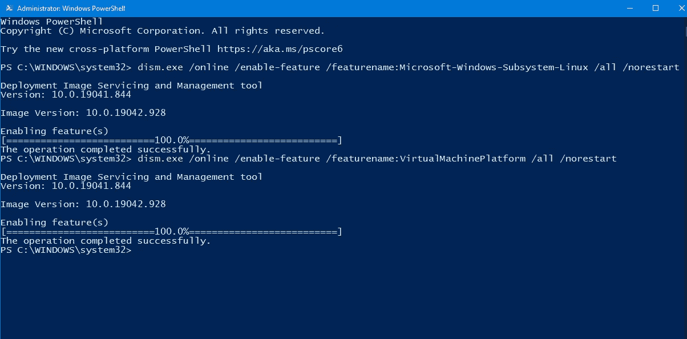
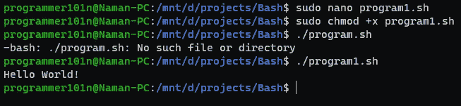
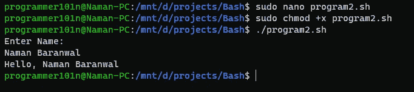
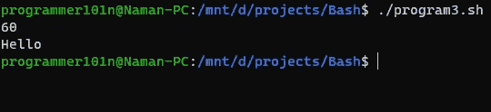
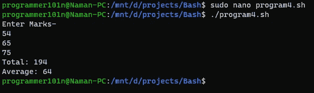

# 面向初学者的 Bash 脚本编写第 1 部分

> 原文：<https://medium.com/geekculture/bash-scripting-for-beginners-part-1-6aa9ea68654c?source=collection_archive---------23----------------------->

在这篇博客中，我们将学习面向初学者的 Bash 脚本。您将能够使用 bash 在您的 linux 发行版中创建脚本。


## 本教程我们需要的是

*   最新的 Windows(如果你安装了 ubuntu，跳到命令部分)
*   WSL 或 WSL2
*   从 Windows 商店安装的 Ubuntu 子系统。
*   你需要知道基本的 linux 命令。

## 在 Windows 上安装 WSL

要在 Windows 上安装 WSL(Windows Subsystem for Linux ),您需要确保您运行的是最新版本的 Windows。

通过使用管理员权限打开`powershell`并键入以下命令来安装 WSL。

```
dism.exe /online /enable-feature /featurename:Microsoft-Windows-Subsystem-Linux /all /norestart
```

此命令将在 Windows 上启用 WSL 功能。您现在可以重新启动系统并跳过下一步。

## 升级到 WSL2

在本教程中，我们将安装 WSL2，因此需要额外的步骤。

要启用 WSL2，您需要通过在具有管理员权限的`powershell`窗口中键入该命令来启用另一个功能。

```
dism.exe /online /enable-feature /featurename:VirtualMachinePlatform /all /norestart
```

**启用此功能后，重启系统。**



现在从这个链接下载 wsl2 包，[从这里下载](https://wslstorestorage.blob.core.windows.net/wslblob/wsl_update_x64.msi)并安装它。

现在，让我们使用管理员权限在`powershell`中输入这个命令，将 wsl 默认版本设置为 2。

```
wsl --set-default-version 2
```

现在 WSL2 已经安装在我们的系统上了。

## 安装 Linux 发行版

在本教程中，我将安装 **Ubuntu** (你也可以安装其他 linux)。去微软商店下载 **Ubuntu** 。

我还打算安装**Windows terminal**。您也可以从 Windows 应用商店下载。


下载后，启动它。它将要求创建一个新用户。


现在你已经成功地在 Windows 上安装了 Ubuntu。

## 什么是 Bash？

Bash 是 Brian Fox 为 GNU 项目编写的 Unix shell 和命令语言，作为 Bourne shell 的免费软件替代品。它于 1989 年首次发布，一直被用作大多数 Linux 发行版的默认登录 shell

## 如何在 Bash 中创建和开始编写脚本？

首先你需要创建一个扩展名为`.sh`的文件，你可以通过键入`sudo nano <filename.sh>`来创建它。

现在您已经创建了第一个 bash 文件。现在来说说社邦线。

什么是社邦线？

一个符号是一个字符序列，由字符的数字符号和感叹号组成。它也被称为 sha-bang，hashbang，pound-bang，或 hash-pling。

这告诉系统，使用哪个解释器来运行这个文件。默认是`/bin/sh`，不过这样写就好了。



## 打印“Hello World！”的脚本

我将通过键入`sudo nano program1.sh`来创建`program1.sh`文件，并开始编写这段代码。

```
#!/bin/bashecho "Hello World!";
```

按`CTRL+X`和`ENTER`保存。

要运行它，首先你需要给它执行许可，输入`sudo chmod +x program1.sh`。现在，如果您在终端中键入`./program1.sh`，您的文件将会运行。

## 从终端输入姓名并打印“你好，姓名”的脚本

创建一个文件`program2.sh`并开始编写这段代码。

为了从终端读取，我们使用`read variable_name`语句，这里`variable_name`可以是任何东西。

```
#!/bin/bashecho "Enter Name: ";
read name; # This is command to read value from terminal and store it in `name` variable.
echo "Hello, $name"; # $name is used to get the data from the variable.
```



此处`#`后的行是除第一行以外的注释。

您也可以通过以下语法创建变量。`<variable_name>=<value>;`

## 条件语句

基本 if 语句是一个当且仅当给定表达式为真时才执行的语句。

句法

:#您可以通过组合使用多个表达式`[expression1] && [expression2]`或`[expression1] || [expression2]` if [expression1] then 语句 elif [expression2] then 语句 else 语句 fi

例如:让我们创建一个程序，该程序从用户 a 输入一个数字，如果该数字大于 50，则打印“Hello ”,否则打印“Good bye”

```
#!/bin/bashread number;if [ $number -gt 50 ]
then
    echo "Hello"
else
    echo "Good bye"
fi
```



这里`-gt`检查左侧值是否大于右侧值。下面还有更多。

运算符描述-eq 检查两个操作数的值是否相等；如果是，那么条件变为真。-ne 检查两个操作数的值是否相等；如果值不相等，则条件为真。-gt 检查左操作数的值是否大于右操作数的值；如果是，那么条件变为真。-lt 检查左操作数的值是否小于右操作数的值；如果是，那么条件变为真。-ge 检查左操作数的值是否大于或等于右操作数的值；如果是，那么条件变为真。-le 检查左操作数的值是否小于或等于右操作数的值；如果是，那么条件变为真。让我们创建一个程序，获得 3 个科目的分数，并计算平均分和总分。

创建一个名为`program4.sh`的文件，并编写以下代码。

```
#!/bin/bashecho "Enter Marks-";
read marks1;
read marks2;
read marks3;((total = $marks1 + $marks2 + $marks3)); # To use math expression, we enclose them with parenthesis.
((avg = $total / 3));
echo "Total: $total";
echo "Average: $avg";
```



今天就到这里，下一部分再见。

## [访问我的网站](https://programmer101n.com)，我也在那里张贴这些东西。

## 在我的社交网站上关注我。